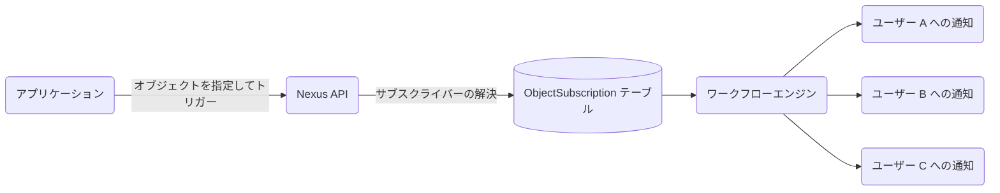

**オブジェクト（Objects）**は、Nexus における第一級のエンティティです（プロジェクト、ドキュメント、注文、あるいはユーザーが購読するあらゆるリソースを指します）。オブジェクトを受信者としてワークフローをトリガーすると、Nexus は自動的にすべての監視サブスクライバーを解決し、それぞれのユーザーに対してワークフローを実行します。

---

## オブジェクトが解決する課題

オブジェクト機能を使用しない場合、ファンアウト（拡散）トリガーを行うたびにバックエンドで以下を実行する必要があります。

1. 「このリソースを誰が監視しているか？」をデータベースに問い合わせる。
2. 受信者 ID のリストを構築する。
3. トリガー呼び出しのたびに、その全リストをパラメータとして渡す。

オブジェクト機能は、この購読関係を Nexus 側に移譲します。これにより、単一のトリガー呼び出しだけで、すべての監視者に自動的に通知が配信されます。



---

## 概念

| 用語                          | 説明                                                                                         |
| :---------------------------- | :------------------------------------------------------------------------------------------- |
| **コレクション (Collection)** | 論理的なグループ定義（例: `"projects"`、`"orders"`、`"channels"` など）。                    |
| **オブジェクト (Object)**     | コレクション内の単一のエンティティ。`externalId` によって識別されます。                      |
| **購読 (Subscription)**       | サブスクライバーとオブジェクトのマッピング定義。オプションでメタデータプロパティを持ちます。 |

---

## オブジェクトの作成または更新

オブジェクトの作成・更新は upsert です。既存の `externalId` に対して `set` を呼び出すと、そのフィールドが更新されます。

**Node SDK:**

```ts
await nexus.objects.set({
  collection: 'projects',
  externalId: 'proj_alpha',
  name: 'Project Alpha',
  properties: { status: 'active', owner: 'team-eng' },
});
```

**Management API（サーバー側、`sk_*` キーを使用）:**

```http
PUT /v1/management/objects/projects/proj_alpha
Authorization: Bearer sk_prd_…
Content-Type: application/json

{
  "name": "Project Alpha",
  "properties": { "status": "active", "owner": "team-eng" }
}
```

<Callout type="info">
  **変数に関する注意**:
  トリガー実行時に、オブジェクトは生のサブスクライバープロファイルに解決および重複排除されます。そのため、オブジェクト固有のプロパティはテンプレート変数コンテキスト内で自動的には利用できません。通知内にオブジェクトの詳細（プロジェクトの名前やステータスなど）を表示するには、トリガーリクエストの
  `data` ペイロードにそれらを含めて渡してください。
</Callout>

---

## 購読の管理

**オブジェクトにサブスクライバーを追加する:**

```ts
await nexus.objects.addSubscriptions('projects', 'proj_alpha', {
  recipients: ['user_alice', 'user_bob'],
  // または: recipients: [{ externalId: 'user_alice' }]
});
```

**オブジェクトからサブスクライバーを削除する:**

```ts
await nexus.objects.removeSubscriptions('projects', 'proj_alpha', ['user_bob']);
```

<Callout type="info">
  サブスクライバーをオブジェクトに追加する前に、対象の受信者が同じ環境に**サブスクライバー**としてすでに存在している必要があります。まだ作成していない場合は、まず
  `nexus.subscribers.identify()` を呼び出してください。
</Callout>

`recipients` フィールドは、プレーンな `externalId` 文字列の配列、または `{ externalId: string }` 形式のオブジェクトの配列を受け入れます。

---

## オブジェクトファンアウトによるトリガー

トリガー呼び出しで `{ collection, id }` を使用して、オブジェクトを受信者として指定します。

```ts
await nexus.workflows.trigger({
  workflowName: 'project.updated',
  recipients: [{ collection: 'projects', id: 'proj_alpha' }],
  data: { changeType: 'milestone_completed', updatedBy: 'sarah' },
});
```

ワークフローワーカーは `proj_alpha` のすべてのアクティブなサブスクライバーを解決し、サブスクライバーごとに1つのワークフロー実行を実行します。テンプレート内では、通常通りサブスクライバーコンテキスト（`subscriber.email`、`subscriber.locale` など）が利用可能です。

---

## オブジェクトと個別サブスクライバーの混在

1 回のトリガー呼び出しに、オブジェクトと個々のサブスクライバーの両方を含めることができます。

```ts
await nexus.workflows.trigger({
  workflowName: 'project.updated',
  recipients: [
    { collection: 'projects', id: 'proj_alpha' }, // すべての監視者にファンアウト
    { externalId: 'admin_user' }, // 明示的な個々のサブスクライバー
  ],
  data: { changeType: 'status_change' },
});
```

---

## オブジェクトごとの購読プロパティ

サブスクライバーを追加する際、購読レベルのメタデータを保存できます。

```ts
await nexus.objects.addSubscriptions('projects', 'proj_alpha', {
  recipients: ['user_alice'],
  properties: { role: 'owner', notifyOnAll: true },
});
```

---

## オブジェクトごとの環境設定

サブスクライバーは、他の通知を有効にしたまま、特定のオブジェクトのみをミュートすることができます。この設定は、サブスクライバーの環境設定マトリクスのオブジェクトキーの下にスコープされます。あなたのコードに変更を加える必要はありません。

---

## API 制限

| 制限事項                                        | 値                   |
| :---------------------------------------------- | :------------------- |
| 環境あたりの最大オブジェクト数                  | プランごとに構成可能 |
| オブジェクトあたねの最大購読数                  | プランごとに構成可能 |
| `addSubscriptions` 呼び出しあたりの最大受信者数 | 100                  |

---

## 関連リンク

- [オブジェクトファンアウトガイド](/docs/platform/guides/object-fanout)
- [オブジェクト API](/docs/api/objects)
