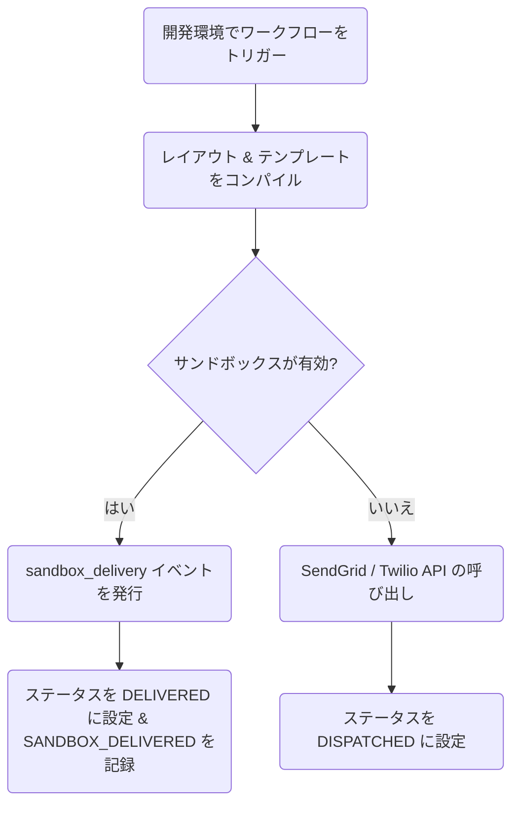

**サンドボックスモード（Sandbox Mode）**は、**Development（開発）**環境のすべての外部チャネルに対して自動的に有効になります。SendGrid や Twilio などのプロバイダーに対して送信 API リクエストを行う代わりに、Nexus は発送をインターセプトし、サンドボックスシミュレータを介してルーティングします。

---

## サンドボックスシミュレータの仕組み

1. ワークフローがチャネルステップ（例: メール、SMS、プッシュ通知、Webhook など）に到達すると、実行コンテキストが評価されます。
2. コンパイラーは、現在の環境名が `development` であること（`ctx.sandboxMode = true`）を検出します。
3. 外部への発送は、実際のプロバイダー統合ではなく、**サンドボックスプロバイダー（Sandbox Provider）**（`sandbox`）にルーティングされます。
4. シミュレータは、Redis の pub/sub チャネルに対して `sandbox_delivery` 型のリアルタイムイベントを発行します。
5. 実行ログは、ステータスを（`DISPATCHED` ではなく）直接 **`DELIVERED`** に更新し、`SANDBOX_DELIVERED` ライフサイクルステップを追加します。
6. コンパイルされたペイロード本文、件名、および生プロパティが、`sandbox: true` を伴って `responseMeta.outbound` に保存されます。



---

## ダッシュボード上のサンドボックスコンソール

ダッシュボードで、サンドボックスへの配信状況を表示・テストできます。

1. ダッシュボードの **Activities → Sandbox** に移動します。
2. ページは WebSocket 接続を確立し、`sandbox_delivery` イベントをリッスンします。
3. 以下のようなリアルタイムのモック表示を確認できます。
   - 生の本文を含む SMS の吹き出し表示。
   - コンパイルされたメールを表示する HTML フレーム。
   - プッシュ通知バナー。
   - Slack および MS Teams のペイロード。

これにより、実際のプロバイダー費用を一切かけることなく、タイポグラフィ、Handlebars の変数置換、レイアウトパーシャル、およびロジックのフローをリアルタイムでテストできます。

---

## カオスモード（障害テスト）

開発環境で直接 API プロバイダーのシステム障害をシミュレートし、障害に対するワークフローの挙動をテストします。

1. ダッシュボードの **Integrations** に移動します。
2. 任意の統合カードを選択し、**Chaos Mode** を `on` に切り替えます（これにより `environment.chaosMode = true` が設定されます）。
3. 開発環境でワークフローをトリガーすると、プロバイダーディスパッチャーは呼び出しをインターセプトし、擬似的に `503 Service Unavailable` エラーを発生させて以下を返します。
   ```json
   { "error": "Chaos mode simulated failure" }
   ```
4. これにより、ワークフローの[フェイルオーバー](/docs/platform/features/failover)パスやサーキットブレーカーが即座に起動し、監査ログでフォールバックブランチのデバッグを行うことができます。

---

## 環境別の動作

| チャネル                      | Development (Sandbox)          | Staging / Production                   |
| :---------------------------- | :----------------------------- | :------------------------------------- |
| **アプリ内インボックス**      | 実際の WebSocket 配信          | 実際の WebSocket 配信                  |
| **メール**                    | サンドボックス（シミュレート） | 実際の SMTP / API 発送                 |
| **SMS & WhatsApp**            | サンドボックス（シミュレート） | 実際の Twilio / Sinch 発送             |
| **モバイル & ウェブプッシュ** | サンドボックス（シミュレート） | 実際の FCM / APNs 発送                 |
| **Webhook & チャットツール**  | サンドボックス（シミュレート） | 実際の Slack / Discord / MS Teams 発送 |

---

## 関連リンク

- [環境設定](/docs/platform/getting-started/environments)
- [プロバイダーのフェイルオーバー](/docs/platform/features/failover)
- [クイックスタート](/docs/platform/getting-started/quickstart)
