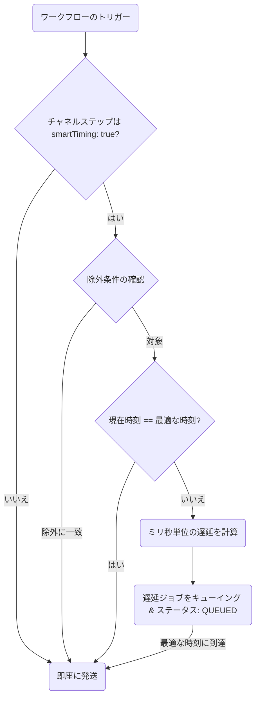

**Smart Send-Time** は、各サブスクライバーがメッセージを読んだり開封したりする可能性が最も高い時間を学習する機械学習（ML）機能です。サブスクライバーのローカルのピーク時間まで自動的に配信を遅らせることで、開封率を最大化し、通知疲れを最小限に抑えます。

---

## 仕組み

1. **エンゲージメントの追跡**: 各サブスクライバーの実行ログにおける `READ`（既読）および `OPENED`（開封）イベントを監視します（過去 60 日間の遡及ウィンドウを使用）。
2. **スコア行列の算出**: バックグラウンドのスコアリングサービスが、**6時間ごと**に、サブスクライバーのローカルタイムゾーンにおける1時間ごとのエンゲージメントマトリクス（24時間 × 7日間）を再計算します。
3. **Redis への保存**: 計算されたピークエンゲージメント時間が `engagement:scores:<subscriberId>` として Redis にキャッシュされます。
4. **送信時の評価**: スマートタイミングが有効化されたチャネルステップが実行される際：
   - 現在の時間がすでに最適な時間である場合、実行は即座に続行され、理由を `already_optimal` とした `SMART_TIMING_PASS` が記録されます。
   - 最適な時間ではない場合、Nexus はその時間に達するまでのミリ秒単位の遅延時間を計算し、BullMQ の遅延ジョブ `smartTiming:<logId>:<nodeId>` をスケジュールして、ログステータスを `QUEUED` に更新し、`SMART_TIMING_HOLD` を記録します。



---

## 除外基準とフォールバック

### フォールバック時間

サブスクライバーの十分なエンゲージメント履歴がない場合（**記録されたイベントが5未満**）、タイミングモデルはデフォルト値として**ローカル時間の午前 10:00** にフォールバックします（理由には `fallback` が記録されます）。

### 実行の除外ルール

スマートタイミングは、以下の場合に自動的に無効化（バイパス）されます。

- **除外チャネル**: アプリ内通知（`IN_APP`）および Webhook（`WEBHOOK`）ステップは即座に配信されます。
- **ワークフローの構造**: ワークフローグラフ内のどこかに [配信ウィンドウ（Delivery Window）](/docs/platform/features/delivery-windows) ノードが含まれているワークフローは、タイミング最適化から除外されます。
- **スケジュールトリガー**: スケジュールされた cron テンプレートから開始されたワークフロー。
- **適用済みフラグ**: 同じワークフロー実行の前のステップですでにスマートタイミングが適用されている場合。

---

## キャンバスでのセットアップ手順

スマートタイミングを有効にするには：

1. ワークフローキャンバス上の任意のチャネルノード（Email、SMS、Push、WhatsApp、Chat）をクリックします。
2. 右側のサイドバーで、**AI Send Time**（AI 送信時間）をアクティブに切り替えます。
3. ワークフローを保存します。

---

## Workflow-as-code

TypeScript 定義では、チャネル構成に `smartTiming: true` を渡します：

```ts
import { defineWorkflow } from '@nexus-signal/node';

defineWorkflow('marketing.newsletter')
  .addChannel('EMAIL', {
    smartTiming: true,
  })
  .toDefinition();
```

---

## 関連リンク

- [配信ウィンドウ](/docs/platform/features/delivery-windows) — 静的なサイレントアワーの設定（ワークフロー内に両方が定義されている場合は配信ウィンドウが優先されます）
- [コスト削減](/docs/platform/features/cost-reduction) — 送信タイミングとプレゼンス抑制の組み合わせ
- [サブスクライバー API](/docs/api/subscribers) — サブスクライバーのタイムゾーン設定
