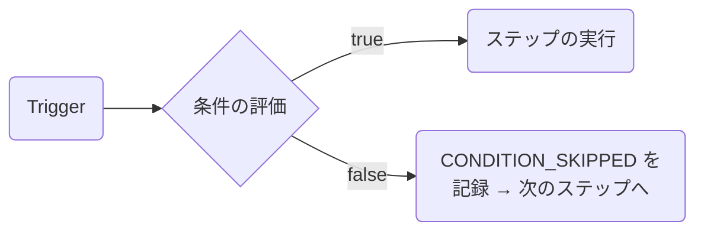

**ステップの条件**を使用すると、ワークフローキャンバス内の任意のノードにフィルタールールを適用できます。条件の評価結果が `false` になった場合、そのステップは**スキップ**され、次のノードの処理が続行されます。この際、エラーはスローされず、再試行も発生しません。

---

## 条件の仕組み

ワークフローエンジンが、条件の構成されたステップに到達すると、ステップを実行する**前**に、現在の実行コンテキストに対してすべてのルールを評価します。スキップされたステップは、実行ライフサイクルツリーに `CONDITION_SKIPPED` ステータスとして記録されます。



---

## 条件の構造

```json
{
  "logic": "AND",
  "rules": [
    { "variable": "data.amount", "operator": "greater_than", "value": 500 },
    { "variable": "subscriber.locale", "operator": "equals", "value": "ja" }
  ]
}
```

- `logic`: `"AND"`（すべてのルールが合格する必要がある）または `"OR"`（いずれか1つのルールが合格すればよい）
- `rules`: ルールオブジェクトの配列。各ルールは `variable`、`operator`、`value` を含みます。

---

## サポートされる変数名前空間

変数名は、ステップが実行される瞬間のライブ実行コンテキストから解決されます。つまり、前のステップによってエンリッチされたデータ（例: HTTP Fetch の応答出力など）も条件として使用できます。

| 名前空間       | 変数名の例                                                       | ソース                                           |
| :------------- | :--------------------------------------------------------------- | :----------------------------------------------- |
| `data.*`       | `data.amount`, `data.plan`, `data.status`                        | トリガーペイロード + HTTP Fetch / AI Node の出力 |
| `subscriber.*` | `subscriber.email`, `subscriber.locale`, `subscriber.externalId` | サブスクライバーレコード                         |
| `env.*`        | `env.name`                                                       | 現在の環境名（`development`、`production` など） |

<Callout type="warn">
  ステップの条件では `data.*`、`subscriber.*`、および `env.*` のみがサポートされます。`tenant.*` や
  `object.*` のような変数は、ステップの条件内では解決されません。
</Callout>

---

## サポートされる演算子

| 演算子                   | 対象のデータ型     | 説明                                               |
| :----------------------- | :----------------- | :------------------------------------------------- |
| `equals`                 | 文字列、数値       | 型変換後の厳密な文字列の一致                       |
| `not_equals`             | 文字列、数値       | `equals` の否定                                    |
| `greater_than`           | 数値               | `>` 比較                                           |
| `greater_than_or_equals` | 数値               | `>=` 比較                                          |
| `less_than`              | 数値               | `<` 比較                                           |
| `less_than_or_equals`    | 数値               | `<=` 比較                                          |
| `contains`               | 文字列             | 部分一致                                           |
| `not_contains`           | 文字列             | 部分一致の否定                                     |
| `starts_with`            | 文字列             | 接頭辞（前方）一致                                 |
| `ends_with`              | 文字列             | 接尾辞（後方）一致                                 |
| `is_empty`               | 文字列、配列、null | 値が `null`、`""`、または `[]` である              |
| `is_not_empty`           | 文字列、配列、null | 値が空ではない                                     |
| `in_list`                | 文字列             | 値がカンマ区切りまたは配列リスト内にある           |
| `not_in_list`            | 文字列             | 値がリスト内にない                                 |
| `regex_match`            | 文字列             | 正規表現パターンとの一致テスト                     |
| `is_true`                | ブール値           | 値が `true`、`"true"`、または `1` である           |
| `is_false`               | ブール値           | 値が `false`、`"false"`、`0`、または `null` である |

---

## キャンバスでの使用方法

1. ワークフローキャンバス上の任意のノードをクリックします。
2. 右側のサイドバーで **Conditions**（条件）パネルを開きます。
3. フィールドピッカー、演算子ドロップダウン、および値入力を使用してルールを追加します。
4. **AND** または **OR** ロジックを選択します。

ルールは、次回のワークフロートリガーから即座に有効になります（再デプロイは不要です）。

---

## 動的データを使用した条件の適用

**HTTP Fetch** または **AI Node** ステップの完了後、その出力データは下流の条件で `data.*` の下で利用可能になります。たとえば、HTTP Fetch ステップで `responseKey: "invoice"` を指定している場合、メールステップに `data.invoice.status` に基づく条件を設定できます。

```json
{
  "logic": "AND",
  "rules": [{ "variable": "data.invoice.status", "operator": "equals", "value": "overdue" }]
}
```

---

## Workflow-as-Code の例

```ts
import { defineWorkflow } from '@nexus-signal/node';

defineWorkflow('invoice.reminder')
  .addChannel('EMAIL')
  .addChannel('SMS', {
    conditions: {
      logic: 'AND',
      rules: [
        { variable: 'data.amount', operator: 'greater_than', value: 500 },
        { variable: 'subscriber.locale', operator: 'equals', value: 'ja' },
      ],
    },
  })
  .toDefinition();
```

`conditions` オプションは、すべてのステップビルダーメソッド（`addChannel`、`addDelay`、`addDigest`、`addThrottle`、`addHttpFetch`、`addAiNode`）で使用可能です。

---

## 関連リンク

- [ワークフロー](/docs/platform/concepts/workflows)
- [HTTP Fetch ノード](/docs/platform/features/http-fetch-node)
- [AI ワークフローノード](/docs/platform/features/ai-workflow-node)
- [ワークフロー・アズ・コード](/docs/sdk/workflow/workflow-as-code)
