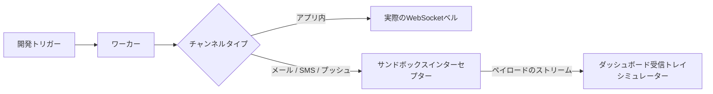
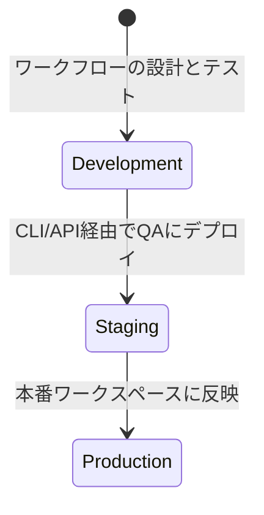

# 環境とスコープ

すべての Nexus Signal ワークスペースは、**Development**（開発）、**Staging**（ステージング）、および **Production**（本番）の **3つの完全に分離された環境**に分かれています。

それぞれの環境は独立した論理データベースパーティションとして動作します。つまり、ワークフロー、テンプレート、サブスクライバー、環境設定、トピック、およびテナント設定が**環境の境界を越えることはありません**。

---

## 環境マトリクス

| 機能                                | Development                                                 | Staging                                                     | Production                                                  |
| :---------------------------------- | :---------------------------------------------------------- | :---------------------------------------------------------- | :---------------------------------------------------------- |
| **API キー**                        | `pk_dev_*` / `sk_dev_*`                                     | `pk_stg_*` / `sk_stg_*`                                     | `pk_prd_*` / `sk_prd_*`                                     |
| **外部への発送**                    | **サンドボックスインターセプト**（模擬プロバイダーAPI）     | 実際のプロバイダー発送（Postmark、Twilio、SendGrid）        | 実際のプロバイダー発送（ライブユーザー）                    |
| **アプリ内配信**                    | アクティブなクライアントセッションへのライブ WebSocket 配信 | アクティブなクライアントセッションへのライブ WebSocket 配信 | アクティブなクライアントセッションへのライブ WebSocket 配信 |
| **データベーススコープ**            | 分離                                                        | 分離                                                        | 分離                                                        |
| **カオスモード (フェイルオーバー)** | 有効（プロバイダーのダウンタイムのシミュレーションが可能）  | 無効                                                        | 無効                                                        |

---

## 開発とサンドボックスモード

**Development** 環境は、ローカル統合および自動テスト用に設計されています。

開発中に通信事業者のクレジットを節約し、実際のユーザーへの誤送信を防ぐために、外部への送信ノード（Email、SMS、プッシュ通知、WhatsApp、チャットプラットフォーム）は外部 API を呼び出す代わりに、**仮想サンドボックス**に直接ルーティングされます。

- **受信トレイシミュレーター**: ダッシュボードで、ユーザーに表示されるのと同じコンパイル済みの HTML、SMS テキスト、または JSON ペイロードを確認できます。
- **サンドボックスのバイパス**: 開発環境で実際の配信をテストする必要がある場合（例：実際のメーラーでメールレイアウトを確認したい場合）、そのプロバイダーの **Integrations → Development Integrations → Bypass Sandbox** をオンにします。

---

## ワークスペースのプロモーションフロー

開発から本番に変更をデプロイするには、手動でレイアウトを複製する代わりに、プロモーションパイプラインを使用します。

### ワークフロー・アズ・コードによるプロモーション（推奨）

リポジトリ内でステップツリーを定義することで、Git ブランチを介して自動的にプロモーションパイプラインが処理されます。

1. **開発ブランチ**: ローカルワークスペース内で `npx nexus-signal sync --env dev` を実行します。
2. **メインブランチ**: マージ時に CI/CD パイプラインから `npx nexus-signal sync --env prd` をトリガーします。

詳細は [ワークフロー・アズ・コード](/docs/sdk/workflow/workflow-as-code) のドキュメントを参照してください。

---

## サブスクライバーの分離

サブスクライバーは完全にサンドボックス化されています。`sk_dev_*` を使用して作成された `externalId: usr_99` のサブスクライバーは、`sk_prd_*` 環境には**存在しません**。

- 環境を切り替える際は、サーバー側のオンボーディングトリガーがサブスクライバープロファイルを必ず登録または作成するようにしてください。
- 環境設定とトピックは、各ステージで個別にテストしてください。
