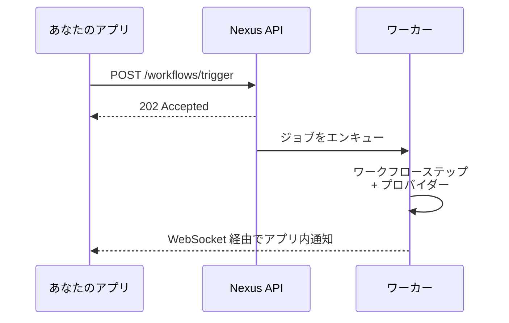

Nexus Signal へようこそ。このセクションでは、ゼロから動作するトリガーまでを3つのステップで説明します: **ワークスペース → プロバイダー → SDK トリガー**

<Cards>
  <Card
    title="クイックスタート"
    href="/docs/platform/getting-started/quickstart"
    description="5分以内に最初のトリガーを送信。"
  />
  <Card
    title="環境"
    href="/docs/platform/getting-started/environments"
    description="開発・ステージング・本番のキー。"
  />
  <Card
    title="認証"
    href="/docs/platform/getting-started/authentication"
    description="シークレットキー、公開キー、HMAC。"
  />
</Cards>

## 前提条件

- Nexus Signal アカウント（[無料登録](https://app.nexussignal.dev)）
- サーバー SDK 用の Node.js 18 以上
- 少なくとも1つのプロバイダーアカウント（SendGrid、Resend、Twilio など）

## 配信の仕組み

すべての配信はデバッグと分析のために完全なライフサイクル状態でログに記録されます。
