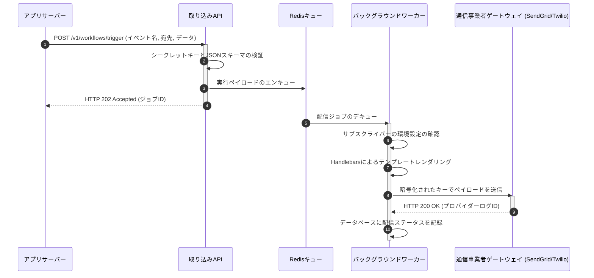

# はじめに

**Nexus Signal** へようこそ。このセクションでは、新しいアカウントの作成から、最初のマルチチャンネル通知ワークフローのトリガーまでの手順を案内します。

開始するには、次の3つの主要なステップを実行します。

1. **ワークスペースのセットアップ**: ワークスペースを作成し、環境キーを取得します。
2. **プロバイダーの構成**: ダッシュボードで通信事業者（SendGrid、Twilio、Resend など）のキーを接続します。
3. **イベントのトリガー**: SDK を使用して、バックエンドアプリケーションから POST ペイロードを送信します。

---

<Cards>
  <Card
    title="クイックスタートガイド"
    href="/docs/platform/getting-started/quickstart"
    description="最初のワークフローをトリガーし、5分以内に配信ログを検証します。"
  />
  <Card
    title="環境とスコープ"
    href="/docs/platform/getting-started/environments"
    description="開発（Development）、ステージング（Staging）、および本番（Production）の各段階で分離されたワークスペースを管理します。"
  />
  <Card
    title="認証とセキュリティ"
    href="/docs/platform/getting-started/authentication"
    description="サーバー側のシークレットキー、クライアント側のパブリックキー、および安全な HMAC 署名を構成します。"
  />
</Cards>

---

## 前提条件

統合を開始する前に、以下が準備されていることを確認してください。

- **Nexus Signal アカウント**: [Nexus ダッシュボード](https://app.nexussignal.dev)で無料で登録します。
- **Node.js 18+**（または互換性のあるバックエンド環境）：サーバー側 SDK を実行するために必要です。
- **アクティブなプロバイダーキー**: 少なくとも1つの配信チャンネルの資格情報（例: SendGrid 経由のメール、Twilio 経由のSMS、Firebase Cloud Messaging 経由のプッシュ通知）。

---

## 統合フロー

Nexus は非同期で動作します。アプリケーションはイベントを API に送信し、API はそれをバックグラウンド実行のために即座にキューに入れます。

```mermaid
sequenceDiagram
    autonumber
    participant App as アプリサーバー
    participant API as 取り込みAPI
    participant Q as Redisキュー
    participant Worker as バックグラウンドワーカー
    participant Carrier as 通信事業者ゲートウェイ (SendGrid/Twilio)

    App->>API: POST /v1/workflows/trigger (イベント名, 宛先, データ)
    activate API
    API->>API: シークレットキーとJSONスキーマの検証
    API->>Q: 実行ペイロードのエンキュー
    API-->>App: HTTP 202 Accepted (ジョブID)
    deactivate API

    Q->>Worker: 配信ジョブのデキュー
    activate Worker
    Worker->>Worker: サブスクライバーの環境設定の確認
    Worker->>Worker: Handlebarsによるテンプレートレンダリング
    Worker->>Carrier: 暗号化されたキーでペイロードを送信
    activate Carrier
    Carrier-->>Worker: HTTP 200 OK (プロバイダーログID)
    deactivate Carrier
    Worker->>Worker: データベースに配信ステータスを記録
    deactivate Worker
```

ライフサイクルの各ステージは、ダッシュボードの **Audit Logs（監査ログ）** および **Debugger（デバッガー）** ウィンドウからリアルタイムで監視できます。
