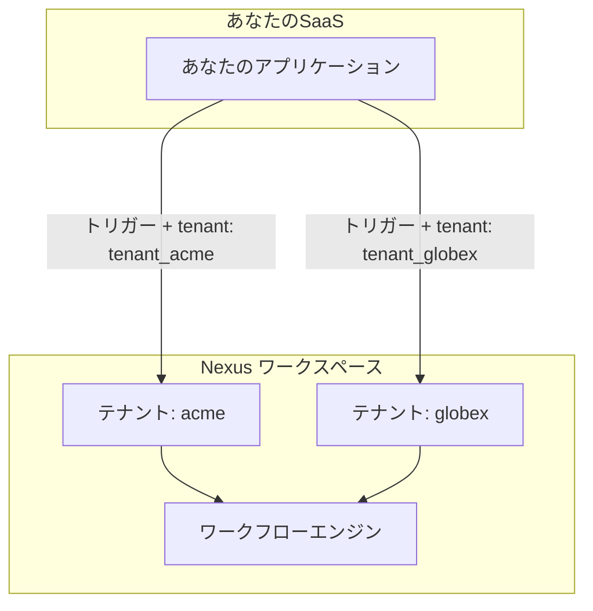

# B2B マルチテナントのセットアップ

製品が複数の異なる企業（顧客）にサービスを提供している場合、Nexus の**テナント**機能を使用することで、顧客ごとに個別のワークスペースを作成することなく、ブランド化された通知を送信できます。

---

## 仕組み



- **組織 (Organization)** = Nexus のワークスペース（製品ごとに1つ）。
- **テナント (Tenant)** = ワークスペース内の B2B 顧客の1社。

トリガーペイロードの `tenant` フィールドは、メッセージのコンパイル時にどの顧客のブランディングコンテキストを適用するかを Nexus に指示します。

---

## ステップ 1 — テナントの登録

アプリケーションで新しい企業がサインアップしたときに、Node SDK の `upsert` を呼び出します。

```ts
import { NexusClient } from '@nexus-signal/node';

const nexus = new NexusClient({ secretKey: process.env.NEXUS_SECRET_KEY });

await nexus.tenants.upsert({
  externalId: 'tenant_acme',
  name: 'Acme Corp',
  branding: {
    logo: 'https://cdn.acme.io/logo.png',
    primaryColor: '#2563eb',
    footerHtml: '<p>© Acme Corp · <a href="mailto:support@acme.io">support@acme.io</a></p>',
  },
  properties: {
    planTier: 'enterprise',
  },
});
```

**`branding` フィールド** — テンプレートからアクセスしたい任意の文字列キーと値のペア。一般的なキーの例：

| キー           | 値の例                         |
| :------------- | :----------------------------- |
| `logo`         | `https://cdn.acme.io/logo.png` |
| `primaryColor` | `#2563eb`                      |
| `companyName`  | `Acme Corp`                    |
| `footerHtml`   | `<p>© Acme Corp</p>`           |

> **注意:** `branding` オブジェクトはフリーフォームの `Record<string, string>` です。任意のキーを定義して、テンプレート内で `{{ branding.yourKey }}` のように参照できます。

---

## ステップ 2 — メールレイアウトでのブランディングの使用

テナントのブランディングキーを参照する [メールレイアウト](/docs/platform/features/email-layouts) を作成します。

```html
<header>
  
</header>

<main style="color: {{ branding.primaryColor }}">{{{ content }}}</main>

<footer>{{{ branding.footerHtml }}}</footer>
```

トリガーに `tenant` の値が含まれている場合、テンプレートコンパイラは自動的にそのテナントのブランディングオブジェクトを Handlebars コンテキストに注入します。

---

## ステップ 3 — テナントコンテキストを指定したトリガー

対象企業ユーザーのすべてのトリガーの `tenant` フィールドに、テナントの `externalId` を渡します。

```ts
await nexus.workflows.trigger({
  workflowName: 'invoice.sent',
  tenant: 'tenant_acme',
  recipients: [{ externalId: user.id }],
  data: {
    invoiceId: 'INV-001',
    amount: '$500',
  },
});
```

> `tenant` フィールドの値は、内部の UUID ではなく、`upsert` 呼び出しで使用した `externalId` 文字列と一致する必要があります。

---

## ステップ 4 — アプリ内通知フィードのスコープ制限

アプリ内でテナントにスコープされた通知センターを表示する場合、SDK フィードをテナントのデータベース UUID でフィルタリングします。

```http
GET /v1/sdk/notifications?subscriberExternalId=user_42&tenantId=<tenant-uuid>
x-nexus-public-key: pk_prd_your_public_key
```

<Callout type="info">
  SDK クエリの `tenantId` は、テナントの `externalId` 文字列ではなく、内部の
  **UUID**（リスト応答から取得）です。これらを取得するには、[Tenants API](/docs/api/tenants) または
  Management API を使用してください。
</Callout>

---

## ステップ 5 — 本番環境の前に2つのテナントでテストする

1. **Development**（開発）環境で、異なるブランディングの値を持つ2つのテスト用テナント（`tenant_acme`、`tenant_globex`）を作成します。
2. 同一のサブスクライバーに対し、同じワークフローをテナントごとに1回ずつ、計2回トリガーします。
3. ダッシュボードの Sandbox プレビューで、各メールが正しいロゴとフッターを表示していることを確認します。
4. ブランディングが正しくレンダリングされていることを確認した後にのみ、**Production**（本番）環境に昇格させます。

---

## チェックリスト

<Steps>
  <Step>
    顧客のサインアップ時に各テナントを登録します。`externalId` をデータベースの会社 ID
    と同期させます。
  </Step>
  <Step>
    ブランディングアセットを公開アクセス可能な HTTPS CDN にアップロードします。Nexus
    は画像をホストしません。
  </Step>
  <Step>
    対象企業ユーザーに対して送信されるすべてのトリガーに `tenant` フィールドを追加します。
  </Step>
  <Step>
    本番稼働する前に、開発環境で2つのテナントを使用してテストします。
  </Step>
</Steps>

---

## 関連リンク

- [テナントごとのブランディング機能ガイド](/docs/platform/features/tenants)
- [メールレイアウト](/docs/platform/features/email-layouts)
- [テナント API リファレンス](/docs/api/tenants)
