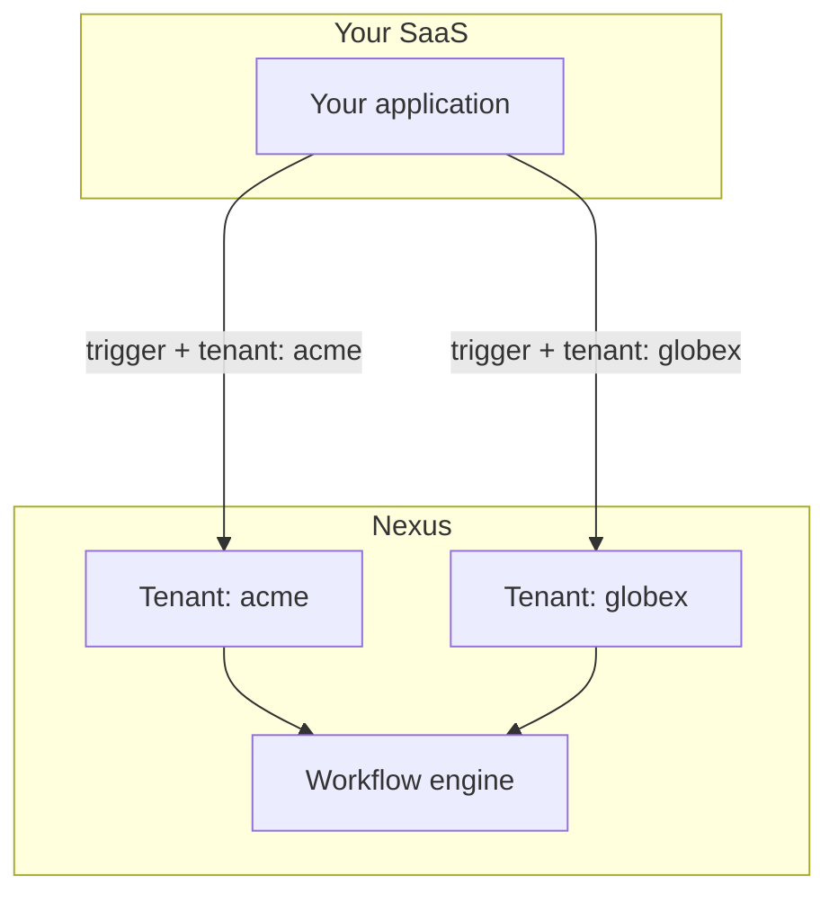

製品が複数の企業（テナント）にサービスを提供している場合、Nexus **Tenants** を使用すると、個別のNexusワークスペースを作成することなく、各顧客にブランド付きの通知を提供できます。

## アーキテクチャ



**組織** = あなたのNexusワークスペース。 **テナント** = そのワークスペース内の顧客の会社。

## ステップ 1 — テナントの作成

アプリに新しい顧客がサインアップしたとき：

```ts
await nexus.tenants.upsert({
  externalId: "tenant_acme",
  name: "Acme Corp",
  branding: {
    logoUrl: "https://cdn.acme.io/logo.png",
    primaryColor: "#2563eb",
    companyName: "Acme Corp",
    footerHtml: "<p>© Acme Corp · support@acme.io</p>",
  },
});
```

サポートされているブランディングフィールド： `logo`, `logoUrl`, `primaryColor`, `iconUrl`, `companyName`, `footerHtml`, `headerHtml`。

## ステップ 2 — メールレイアウトにブランドを適用する

ブランディングを参照する [メールレイアウト](/docs/platform/features/email-layouts) を作成します：

```html

<div style="color: {{ branding.primaryColor }}">{{{ content }}}</div>
<footer>{{{ branding.footerHtml }}}</footer>
```

トリガーに `tenant` が含まれている場合、コンパイラはそのテナントのブランディングを自動的に挿入します。

## ステップ 3 — テナントコンテキストでトリガーする

```ts
await nexus.workflows.trigger({
  workflowName: "invoice.sent",
  tenant: "tenant_acme",
  recipients: [{ externalId: user.id, email: user.email }],
  data: { invoiceId: "INV-001", amount: "$500" },
});
```

## ステップ 4 — テナントごとの設定（オプション）

テナントに `preferenceDefaults` を設定して、そのテナントの下の新しい購読者のデフォルトのオプトイン/オプトアウトを制御します。

## ステップ 5 — テナントでインappフィードをフィルターする

SDK通知は、クエリパラメータを介してテナントスコープをサポートしています：

```http
GET /v1/sdk/notifications?subscriberExternalId=user_42&tenantId=tenant_acme
```

アプリにテナントスコープの通知センターを表示する場合にこれを使用します。

## チェックリスト

<Steps>
  <Step>
    顧客のサインアップ時にテナントを作成します（データベースの `externalId`
    と同期）。
  </Step>
  <Step>
    ブランドアセットを保存します（ロゴのURLはHTTPSであり、パブリックにアクセス可能である必要があります）。
  </Step>
  <Step>その顧客のユーザーのすべてのトリガーで `tenant` を渡します。</Step>
  <Step>本番環境の前に、開発環境で2つのテナントを使用してテストします。</Step>
</Steps>

## 関連リンク

- [テナントごとのブランディング](/docs/platform/features/tenants)
- [メールレイアウト](/docs/platform/features/email-layouts)
- [Tenants API](/docs/api/tenants)
