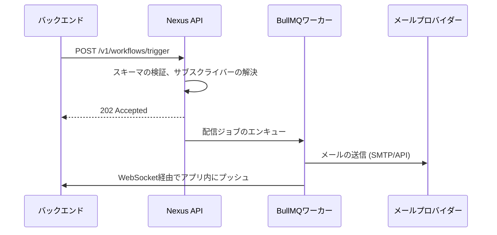

# 最初のワークフローの構築

このガイドでは、ユーザーが登録した瞬間にメールとアプリ内通知を送信するウェルカムワークフロー **`user.signup`** を構築する手順を説明します。

---

## 前提条件

- 少なくとも1つのアクティブな環境を持つ Nexus Signal ワークスペース
- インストールされ、シークレットキーで初期化された Node SDK (`@nexus-signal/node`)
- **Integrations** で接続された少なくとも1つのメールプロバイダー

---

## ステップ 1 — ワークフローの作成

ダッシュボードで、**Workflows** → **New Workflow** に移動します。

- **名前:** `user.signup`
- **チャネル:** **Email** ノードと **In-App** ノードを追加します。

キャンバスは以下のようになります。

```
Trigger → Email → In-App
```

> **ヒント:** ユーザーが現在アプリ内でアクティブな場合にメール送信をスキップしたい場合は、Email ノードの **Suppress when online**（オンライン時に抑制）を有効にします。

---

## ステップ 2 — テンプレートの作成

各チャンネルノードをクリックして、テンプレートエディタを開きます。

**メールテンプレート (HTML):**

```html
<h1>Welcome, {{ data.name }}!</h1>
<p>Thanks for joining. Your account ID is <strong>{{ subscriber.externalId }}</strong>.</p>
<p><a href="{{ data.dashboardUrl }}">Go to your dashboard →</a></p>
```

**アプリ内（In-App）テンプレート:**

```json
{
  "title": "Welcome, {{ data.name }}!",
  "body": "Your account is ready. Click to explore.",
  "redirect": "{{ data.dashboardUrl }}"
}
```

完了したら、テンプレートを **Production Active**（本番アクティブ）ステータスに昇格させます。

---

## ステップ 3 — テスト用サブスクライバーの作成

ダッシュボードで、**Subscribers** → **Add Subscriber** に移動します。

以下を入力します。

- `externalId`: `test_user_01`
- `email`: `you@example.com`

> サブスクライバーはトリガーする**前に**作成しておく必要があります。トリガーエンドポイントは `externalId` によって受信者を特定します。トリガー時に新しいユーザーをインラインで自動登録することはありません。

---

## ステップ 4 — バックエンドからのトリガー

Node SDK をインストールして初期化します。

```ts
import { NexusClient } from '@nexus-signal/node';

const nexus = new NexusClient({ secretKey: process.env.NEXUS_SECRET_KEY });
```

ユーザー登録後にトリガーを実行します。

```ts
await nexus.workflows.trigger({
  workflowName: 'user.signup',
  recipients: [{ externalId: 'test_user_01' }],
  data: {
    name: 'Test User',
    dashboardUrl: 'https://app.example.com/dashboard',
  },
});
```

> **注意:** `recipients` 配列は、対象を識別するために `externalId` または `subscriberId` を受け入れます。ここに `email` や `phoneNumber` などの生の連絡先情報を直接渡すことは**避けてください**。それらはトリガーペイロードではなく、サブスクライバープロファイルに属する情報です。

**Development**（開発）環境では、メールはダッシュボードの **Sandbox** タブにキャプチャされ、実際のメールは送信されません。

---

## ステップ 5 — フロントエンドへのアプリ内ベルの追加

React SDK をインストールします。

```bash
npm install @nexus-signal/react
```

アプリをプロバイダーでラップし、ベルコンポーネントを追加します。

```tsx
import { NexusProvider, NotificationCenterBell } from '@nexus-signal/react';

export function App() {
  return (
    <NexusProvider
      publicKey={process.env.NEXT_PUBLIC_NEXUS_PUBLIC_KEY!}
      subscriberId="test_user_01"
      hmacSignature={userSession.nexusHmac}
    >
      <NotificationCenterBell />
      {/* アプリの他のコンポーネント */}
    </NexusProvider>
  );
}
```

> **セキュリティ:** `hmacSignature` は、**シークレットキー**とサブスクライバーの `externalId` を使用してサーバー側で生成する必要があります。ブラウザで計算しないでください。HMAC の生成ロジックについては [認証とセキュリティ](/docs/platform/getting-started/authentication) を参照してください。

再度トリガーを実行すると、WebSocket を介してリアルタイムにベルのバッジ数がカウントアップされます。

---

## 内部の処理フロー



---

## 次のステップ

- 最適な開封率を実現するために、メールに [スマート送信時刻](/docs/platform/features/smart-send-time) を追加します。
- ユーザーの好みに応じた設定制御を可能にするために、このワークフローを [トピック](/docs/platform/features/topics) に割り当てます。
- 夜間の送信を避けるために [配信ウィンドウ](/docs/platform/features/delivery-windows) を設定します。
- ユーザーがモバイルを使用している場合にメール送信をスキップする [ステップの条件](/docs/platform/features/step-conditions) を追加します。
