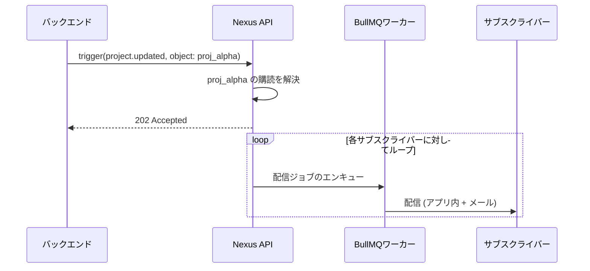

# オブジェクトファンアウト通知

このガイドでは、**Objects & Subscriptions**（オブジェクトと購読）の完全なフローを説明します。エンティティを登録し、ユーザーにそれを購読（監視）させ、単一のトリガー呼び出しで監視している全員に通知をファンアウト配信します。

---

## 解決される課題

オブジェクト機能を使用しない場合、バックエンドは以下を行う必要があります。

1. `watchers`（監視者）テーブルをクエリして、購読ユーザーのリストを取得する。
2. 取得したユーザーリストをループで回し、ユーザーごとに個別にワークフローをトリガーする。

オブジェクト機能を使用すると、Nexus が監視者のリストを管理します。オブジェクトの参照（参照キー）を指定して1回トリガーするだけで、Nexus が自動的にサブスクライバー全員を解決して配信を行います。

---

## シナリオ

アプリケーションにプロジェクト機能があるとします。プロジェクトのマイルストーンが完了したとき、そのプロジェクトを監視（ウォッチ）しているすべてのチームメンバーに即座に通知を送信します。このとき、バックエンドが自ら監視者テーブルをクエリすることはありません。

---

## ステップ 1 — オブジェクトの登録

アプリケーションで新しいプロジェクトが作成されたら、Nexus にそのオブジェクトを登録（保存）します。

```ts
import { NexusClient } from '@nexus-signal/node';

const nexus = new NexusClient({ secretKey: process.env.NEXUS_SECRET_KEY });

await nexus.objects.set({
  collection: 'projects',
  externalId: 'proj_alpha',
  name: 'Project Alpha',
  properties: {
    status: 'active',
    repo: 'acme/alpha',
    priority: 'high',
  },
});
```

- `collection`: 小文字の英数字とダッシュ/アンダースコア（例: `projects`、`issues`、`orders`）。これは API パスの一部になります。
- `externalId`: アプリケーション内でのエンティティの内部 ID（最大128文字）。
- `properties`: 任意のカスタムキー値メタデータ。テンプレート内で `{{ object.properties.key }}` としてアクセスできます。

---

## ステップ 2 — ユーザーの購読登録

ユーザーが UI で **Watch**（監視する）をクリックしたとき：

```ts
await nexus.objects.addSubscriptions('projects', 'proj_alpha', {
  recipients: [user.externalId],
  properties: { role: 'watcher' }, // オプション: 購読ごとのカスタムメタデータ
});
```

- `recipients`: サブスクライバーの `externalId` 文字列の配列。対象のサブスクライバーが環境にすでに登録されている必要があります。
- `properties`: 購読に保存されるオプションのキー値メタデータ（例: `role`、`notificationLevel`）。

ユーザーが **Unwatch**（監視解除）をクリックしたとき：

```ts
await nexus.objects.removeSubscriptions('projects', 'proj_alpha', [user.externalId]);
```

---

## ステップ 3 — ワークフローの作成

ダッシュボードで、**In-App** と **Email** チャネルノードを持つ `project.updated` という名前のワークフローを作成します。

テンプレートでオブジェクトコンテキスト変数を使用します。

**アプリ内テンプレート:**

```json
{
  "title": "{{ object.name }} was updated",
  "body": "Status changed to {{ object.properties.status }}",
  "redirect": "/projects/{{ object.externalId }}"
}
```

**メールテンプレート (HTML):**

```html
<h2>Update: {{ object.name }}</h2>
<p>The project status is now <strong>{{ object.properties.status }}</strong>.</p>
<p>Milestone reached: {{ data.milestone }}</p>
```

使用可能なオブジェクトコンテキスト変数：

- `{{ object.name }}` — オブジェクトの表示名
- `{{ object.externalId }}` — オブジェクトの外部 ID
- `{{ object.collection }}` — コレクション名
- `{{ object.properties.key }}` — カスタムプロパティ値

---

## ステップ 4 — オブジェクトを受信者とするトリガー

マイルストーンが完了したら、サブスクライバーリストの代わりにオブジェクトの参照を指定してトリガーを実行します。

```ts
await nexus.workflows.trigger({
  workflowName: 'project.updated',
  recipients: [{ collection: 'projects', id: 'proj_alpha' }],
  data: {
    changeType: 'milestone_completed',
    milestone: 'v1.0 Launch',
  },
});
```

Nexus は、`projects/proj_alpha` を監視しているすべてのアクティブなサブスクライバーを自動的に解決し、個別に配信ジョブを作成します。



---

## ステップ 5 — 配信の検証

ダッシュボードで **Audit Logs** を開きます。監視者ごとに個別のログ行が生成され、それぞれの配信ステータスとチャネル出力を確認できます。

---

## ヒント

- **インポート時のバッチ購読**: 既存のデータを移行する際は、`addSubscriptions` を使用して最大 100 人の受信者をまとめて一括登録します。
- **オブジェクトプロパティによるステップ条件の制御**: メールを高優先度のオブジェクトに対してのみ送信するように、[ステップの条件](/docs/platform/features/step-conditions)で `{{ object.properties.priority }}` を使用します。
- **トピックとの組み合わせ**: ユーザーが環境設定レベルでプロジェクト通知をオプトアウトできるように、ワークフローを [トピック](/docs/platform/features/topics) に割り当てます。
- **削除時のクリーンアップ**: プロジェクトが削除されたときは、`nexus.objects.delete('projects', 'proj_alpha')` を呼び出して、関連するすべての購読を自動的に削除します。

---

## 制限事項

| 制限事項                                             | 値     |
| :--------------------------------------------------- | :----- |
| 環境あたりの最大オブジェクト数                       | 5,000  |
| オブジェクトあたりの最大監視者（サブスクライバー）数 | 10,000 |
| 追加/削除の最大バッチサイズ                          | 100    |
| 最大カスタムプロパティキー数                         | 50     |

---

## 関連リンク

- [オブジェクトと購読機能の概要](/docs/platform/features/objects-subscriptions)
- [オブジェクト API リファレンス](/docs/api/objects)
- [ステップの条件](/docs/platform/features/step-conditions) — プロパティ駆動型の分岐
