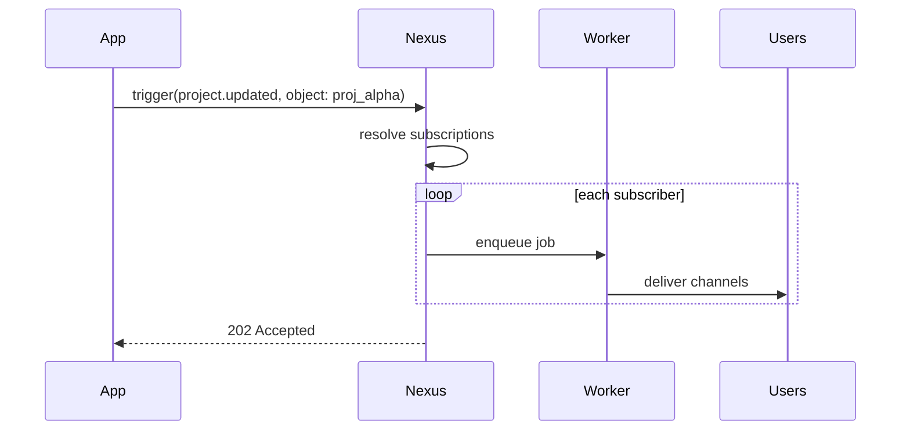

このガイドでは、オブジェクトと購読を最初から最後まで使用する方法を説明します：オブジェクトの作成、ユーザーの購読、ファンアウトのトリガー、およびテンプレートでのオブジェクトプロパティの使用。

## シナリオ

あなたのアプリケーションにはプロジェクトがあります。プロジェクトが更新されたとき、監視しているすべてのチームメンバーに通知する必要があります — バックエンドが `watchers` テーブルをクエリすることはありません。

## ステップ 1 — オブジェクトの作成

ダッシュボード： **Objects** → コレクション `projects` 、ID `proj_alpha` を作成します。

または Node SDK を使用：

```ts
await nexus.objects.set({
  collection: "projects",
  externalId: "proj_alpha",
  name: "Project Alpha",
  properties: { status: "active", repo: "acme/alpha" },
});
```

## ステップ 2 — ユーザーの購読

ユーザーがアプリで「プロジェクトを監視」をクリックしたとき：

```ts
await nexus.objects.addSubscriptions("projects", "proj_alpha", {
  recipients: [user.externalId],
});
```

購読を解除する場合：

```ts
await nexus.objects.removeSubscriptions("projects", "proj_alpha", [
  user.externalId,
]);
```

## ステップ 3 — ワークフローの作成

ダッシュボードで In-App + Email チャネルを持つ `project.updated` を作成します。テンプレート内でオブジェクトのプロパティを使用します：

```html
<p>Project <strong>{{ object.name }}</strong> was updated.</p>
<p>Status: {{ object.properties.status }}</p>
```

## ステップ 4 — オブジェクト宛先でのトリガー

```ts
await nexus.workflows.trigger({
  workflowName: "project.updated",
  recipients: [{ collection: "projects", id: "proj_alpha" }],
  data: { changeType: "milestone_completed", milestone: "v1.0" },
});
```

Nexusは自動的にすべての購読者を解決し、ユーザーごとに個別にワークフローを実行します。



## ステップ 5 — 配信の検証

ダッシュボードの **Audit Logs** を確認します。購読者ごとに個別の実行ログ行が表示されます。

## コツ

- 意味のある `collection` 名（`issues`、`orders`、`channels`）を使用します — これらはAPIパスに表示されます
- オブジェクトのプロパティは [ステップ条件](/docs/platform/features/step-conditions) の対象にできます： `object.properties.priority`
- ユーザーの優先設定制御のために [トピック](/docs/platform/features/topics) と組み合わせます

## 関連リンク

- [オブジェクトと購読](/docs/platform/features/objects-subscriptions)
- [Objects API](/docs/api/objects)
- [Workflows API](/docs/api/workflows)
