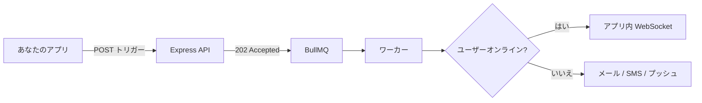

# Nexus Signal プラットフォーム

**Nexus Signal** は開発者ファーストの通知インフラです。1つの API とビジュアルワークフローキャンバスで、**あなた自身のプロバイダーキー**を保持しながら **10チャンネル**にメッセージをルーティング — メッセージごとの手数料なし、ロックインなし。

最初のワークフローから本番環境まで、Nexus を通知コントロールプレーンとして運用するためのすべて。

<Cards>
  <Card title="クイックスタート" href="/docs/platform/getting-started/quickstart" description="5分以内に最初の通知を送信。" />
  <Card title="はじめに" href="/docs/platform/getting-started" description="ワークスペース、環境、認証。" />
  <Card title="コンセプト" href="/docs/platform/concepts" description="アーキテクチャ、BYOP、ワークフロー、パイプライン。" />
  <Card title="機能" href="/docs/platform/features" description="スマートタイミング、プレゼンス、AI、コストツール。" />
  <Card title="インテグレーション" href="/docs/platform/integrations" description="SendGrid、Twilio、Slack、Webhook。" />
  <Card title="ガイド" href="/docs/platform/guides/first-workflow" description="最初のワークフローと本番チェックリスト。" />
</Cards>

## Nexus が異なる理由

| 機能 | メリット |
|------|--------|
| **プレゼンス抑制** | ユーザーがオンラインのときに冗長なプッシュ/SMS をスキップ — プロバイダー費用削減 |
| **AI スマート送信時刻** | 各サブスクライバーのエンゲージメントピーク時間に配信 |
| **BYOP** | あなたの SendGrid、Twilio、Resend キー — メッセージ手数料ゼロ |
| **コスト分析** | プロバイダー、チャンネル、ワークフロー別の支出と予算アラート |
| **ビジュアルワークフロー** | 遅延、ダイジェスト、スロットル、フェイルオーバー、A/B 分割、配信ウィンドウ |

## 10チャンネル、1つのトリガー

メール · SMS · Web プッシュ · モバイルプッシュ · アプリ内 · WhatsApp · Slack · Discord · Teams · Webhook

```ts
await nexus.workflows.trigger({
  workflowName: 'order.shipped',
  recipients: [{ externalId: 'user_42', email: 'alex@acme.io' }],
  data: { trackingNumber: '1Z999AA10123456784' },
});
```

即座に **202 Accepted** を返します — 配信は Redis + BullMQ を通じて非同期で実行されます。

## コアフロー



## 読むべきドキュメント

| やりたいこと | 読むドキュメント |
|------------|--------------|
| 最初の通知を送信 | [クイックスタート](/docs/platform/getting-started/quickstart) |
| 非同期パイプラインを理解 | [配信パイプライン](/docs/platform/concepts/delivery-pipeline) |
| プロバイダー費用を削減 | [コスト削減](/docs/platform/features/cost-reduction) |
| 開封率を向上 | [スマート送信時刻](/docs/platform/features/smart-send-time) |
| 安全に本番稼働 | [本番チェックリスト](/docs/platform/guides/production-checklist) |

<Callout type="info">
初めての方は [クイックスタート](/docs/platform/getting-started/quickstart) から始め、次に [アーキテクチャ](/docs/platform/concepts/architecture) をご覧ください。
</Callout>

## スタック

Node.js · PostgreSQL · Redis · React — 10ms 未満の取り込み API、観測可能な配信パイプライン。
