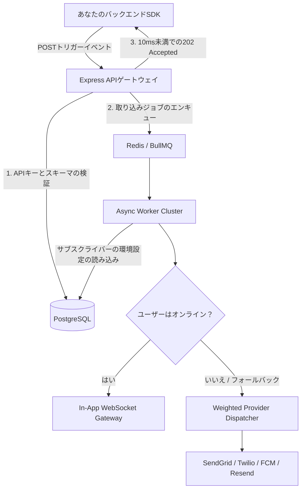

# Nexus Signal プラットフォーム

**Nexus Signal** は、開発者ファーストの通知インフラストラクチャです。1つの統合された API とビジュアルワークフローキャンバスを使用して、**独自のプロバイダーキー**を保持したまま **10のチャンネル**にメッセージをルーティングできます。これにより、メッセージごとのマークアップ手数料を回避し、ベンダーロックインを防ぐことができます。

Nexus は、初期のトリガーイベントから本番環境のコールバックにいたるまでの配信を調整する、中央集中型の通知コントロールプレーンと考えてください。

<Cards>
  <Card
    title="クイックスタート"
    href="/docs/platform/getting-started/quickstart"
    description="5分以内に最初の通知を送信します。"
  />
  <Card
    title="はじめに"
    href="/docs/platform/getting-started"
    description="ワークスペース、環境、および認証。"
  />
  <Card
    title="コンセプト"
    href="/docs/platform/concepts"
    description="アーキテクチャ、BYOP、ワークフロー、およびパイプライン。"
  />
  <Card
    title="機能"
    href="/docs/platform/features"
    description="オブジェクト、ブロードキャスト、AIノード、ガイドなど。"
  />
  <Card
    title="インテグレーション"
    href="/docs/platform/integrations"
    description="SendGrid、Twilio、Slack、Webhook。"
  />
  <Card
    title="ガイド"
    href="/docs/platform/guides"
    description="ワークフロー、ファンアウト、ブロードキャスト、マルチテナント。"
  />
</Cards>

## 主な違い

| 機能                         | 開発者およびビジネス上のメリット                                                                                                                                 |
| :--------------------------- | :--------------------------------------------------------------------------------------------------------------------------------------------------------------- |
| **プレゼンス抑制**           | ユーザーがアクティブなアプリ内 WebSocket セッションを持っている場合、冗長なプッシュ/SMS 送信をスキップし、通信事業者の費用を大幅に削減します。                   |
| **AI スマート送信時刻**      | ユーザーのアクティビティを自動的に分析し、エンゲージメントがピークに達する時間帯に通知ダイジェストまたはメッセージを配信します。                                 |
| **BYOP アーキテクチャ**      | SendGrid、Twilio、Resend、および SNS の資格情報を直接接続します。絶対的なコントロールのもと、実費で通信事業者に支払います。                                      |
| **コスト分析**               | プロバイダー、チャンネル、個々のワークフローイベントごとの支出を詳細に追跡し、自動化された予算しきい値アラートを設定します。                                     |
| **ビジュアルワークフロー**   | 遅延、スロットル、A/B テスト分割、条件付きフィルター、HTTP Fetch ノード、および LLM コンテンツジェネレーターを使用してステップツリーを構築します。               |
| **オブジェクトファンアウト** | 手動のデータベース検索クエリを実行することなく、単一のトリガーペイロードでプロジェクト、ドキュメント、チーム、または課題のすべてのサブスクライバーに通知します。 |
| **B2B マルチテナンシー**     | 顧客組織（テナント）ごとに、ホワイトレーベルのメールテンプレート、アプリ内ブランディング、および配信設定を適用します。                                           |
| **CLI & MCP ツール**         | バージョン管理下でワークフローをコードとして管理し、MCP サーバーを介して AI コーディングアシスタント（Cursor、Claude Code など）と統合します。                   |

---

## 10のチャンネル、1つのトリガー API

Email、SMS、Web Push、Mobile Push、アプリ内ベル、WhatsApp、Slack、Discord、Microsoft Teams、および Webhooks のカスタムインテグレーションを個別に管理する代わりに、Nexus に単一のイベントを送信します。

```ts
import { NexusClient } from '@nexus-signal/node';

const nexus = new NexusClient({ secretKey: process.env.NEXUS_SECRET_KEY! });

await nexus.workflows.trigger({
  workflowName: 'order.shipped',
  recipients: [{ externalId: 'user_42', email: 'alex@acme.io' }],
  tenant: 'tenant_acme_corp', // ブランディングと設定をこの顧客テナントに制限します
  data: {
    customerName: 'Alex',
    orderId: 'ord_990142',
    trackingNumber: '1Z999AA10123456784',
  },
});
```

トリガーエンドポイントは、10ms 未満で **HTTP 202 Accepted** ペイロードを返します。プラットフォームは、イベントを回復力のある Redis ベースのキューにエンキューし、そこでワーカーがステップルールを処理し、ローカライズされたテンプレートをコンパイルして、メッセージを通信事業者にルーティングします。

---

## 高レベルの実行フロー


```mermaid
flowchart TD
    App[あなたのバックエンドSDK] -->|POSTトリガーイベント| API[Express APIゲートウェイ]
    API -->|1. APIキーとスキーマの検証| DB[(PostgreSQL)]
    API -->|2. 取り込みジョブのエンキュー| Q[Redis / BullMQ]
    API -->|3. 10ms未満での202 Accepted| App
    Q --> Worker[Async Worker Cluster]
    Worker -->|サブスクライバーの環境設定の読み込み| DB
    Worker --> Presence{ユーザーはオンライン？}
    Presence -->|はい| InApp[In-App WebSocket Gateway]
    Presence -->|いいえ / フォールバック| Carriers[Weighted Provider Dispatcher]
    Carriers --> CarrierAPIs[SendGrid / Twilio / FCM / Resend]
```

---

## ドキュメントナビゲーションガイド

| やりたいこと...                                        | 推奨ページ                                                               |
| :----------------------------------------------------- | :----------------------------------------------------------------------- |
| 最初のワークフローを統合する                           | [クイックスタート](/docs/platform/getting-started/quickstart)            |
| Webhook または WebSocket 接続を保護する                | [認証と HMAC 署名](/docs/platform/getting-started/authentication)        |
| キューの再試行と実行パイプラインを理解する             | [配信パイプラインの概念](/docs/platform/concepts/delivery-pipeline)      |
| ユーザーのサブセットにアナウンスをブロードキャストする | [ブロードキャスト機能ガイド](/docs/platform/features/broadcasts)         |
| 顧客ごとのホワイトレーベルブランディングを構成する     | [B2B マルチテナントガイド](/docs/platform/guides/b2b-multi-tenant)       |
| プロバイダーのマージンとチャンネル指標を監視する       | [コスト削減戦略](/docs/platform/features/cost-reduction)                 |
| 環境を通じて変更を安全にデプロイする                   | [環境と API キーのスコープ](/docs/platform/getting-started/environments) |

<Callout type="info">
  初めて統合を行いますか？まずは [クイックスタート](/docs/platform/getting-started/quickstart)
  から始めて最初のイベントを送信し、次に [アーキテクチャ](/docs/platform/concepts/architecture)
  を読んで開発サーバーを構成してください。
</Callout>

## 技術スタック

Nexus Signal のホストは、標準的な高性能ウェブコンポーネントを使用して構築されています。

- **API Gateway**: Node.js & Express
- **Databases**: PostgreSQL (Prisma ORM 経由) & Redis (キャッシュおよび pub/sub)
- **Queue Manager**: BullMQ (バックプレッシャールーティング、遅延再試行)
- **Realtime**: Socket.IO (アプリ内ベル用の WebSocket 接続エンジン)
- **UI Components**: React & Tailwind CSS
