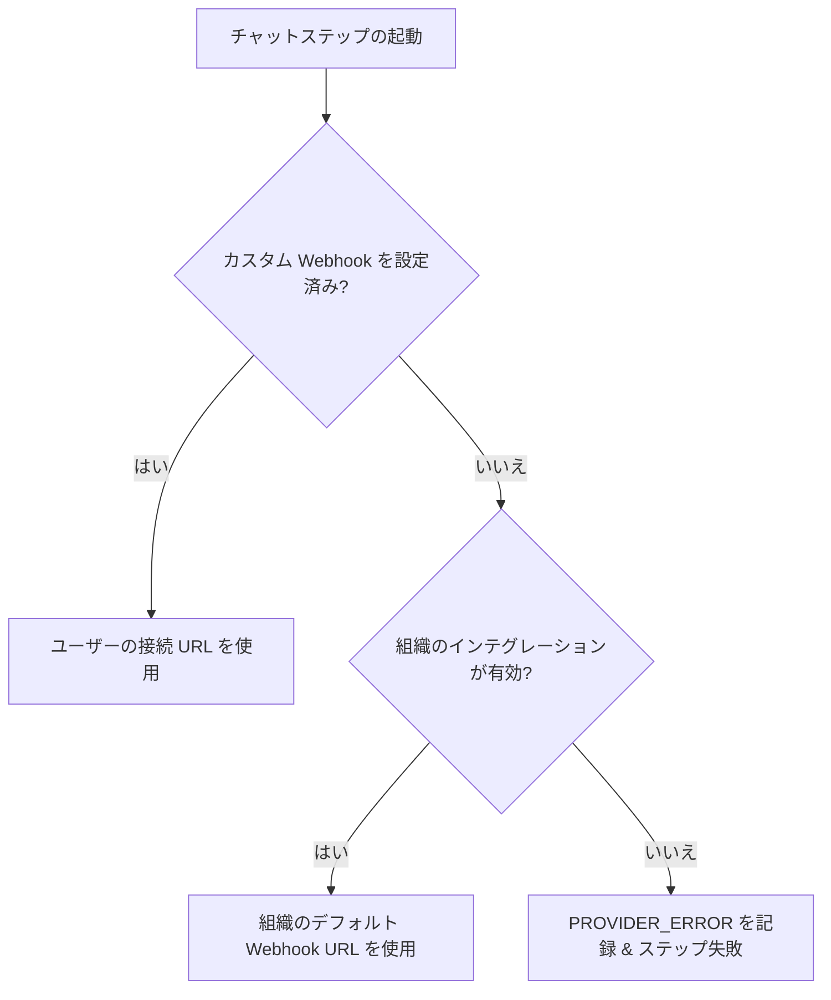

Nexus には、**Slack**、**Discord**、および **Microsoft Teams** 向けのネイティブチャネルノードが含まれています。組織レベルの共通チャネル（例: 自社の Slack にシステムのアラート通知を送信する）を構成することも、サブスクライバーごとに異なる独自のチャネル Webhook に通知をルーティングすることもできます。

---

## Webhook 認証情報の優先順位

チャット通知を発送する際、Nexus は以下の優先順位でどの Webhook URL を使用するかを決定します。

1. **サブスクライバー個別の Webhook**: サブスクライバーの `channelConnections` に登録されているカスタム接続用 URL（例: `slackWebhookUrl`）を確認します。
2. **組織全体の Webhook**: 個別設定がない場合、現在の環境のインテグレーション設定に保存されているデフォルトの認証情報にフォールバックします。



---

## サブスクライバー個別の Webhook ルーティング

サブスクライバー固有のチャネル（例: 個人の Slack DM チャネル、チーム開発用のワークスペースチャネルなど）に通知をルーティングするには、トリガーリクエストで一意の Webhook URL を指定して送信します。

```ts
await nexus.workflows.trigger({
  workflowName: 'billing.invoice',
  recipients: [
    {
      externalId: 'user_42',
      slackWebhookUrl: 'https://hooks.slack.com/services/{workspace_id}/{channel_id}/{token}',
      discordWebhookUrl: 'https://discord.com/api/webhooks/{channel_id}/{token}',
      teamsWebhookUrl:
        'https://your-org.webhook.office.com/webhookb2/{guid}@{tenant_id}/IncomingWebhook/{id}/{token}',
    },
  ],
  data: { amount: 150 },
});
```

### 自動保存と永続化

- トリガーのペイロードで Webhook URL が渡されると、Nexus はそれを自動的に抽出してデータベース内のサブスクライバーの `channelConnections` オブジェクトに保存します。
- そのサブスクライバーに対する今後のトリガーでは、キャッシュされた接続 URL が自動的に再利用されるため、このパラメータを渡すのは1回だけで済みます（通常、ユーザーがアプリケーションの設定画面等でチャットツール連携をリンクした際に行います）。

---

## 期待されるペイロード形式

Nexus は、各チャットプラットフォームのレイアウト仕様に適合するように、テンプレートのテキスト内容を自動的に適合させます：

| チャネル            | キー       | 形式 | アダプターの動作                                                                                     |
| :------------------ | :--------- | :--- | :--------------------------------------------------------------------------------------------------- |
| **Slack**           | `slack`    | JSON | ペイロードを `{ "text": "..." }` として発送します。標準の Slack markdown (mrkdwn) をサポートします。 |
| **Discord**         | `discord`  | JSON | ペイロードを `{ "content": "..." }` として発送します。                                               |
| **Microsoft Teams** | `ms_teams` | JSON | メッセージのタイトルと本文を含む Adaptive Card の JSON ブロックをコンパイルします。                  |

---

## ワークフローの構成手順

1. ワークフローを作成し、キャンバスに **Slack**、**Discord**、または **Teams** チャネルノードを追加します。
2. ノードの設定で、フォールバック先となるプロバイダーキーを選択します。
3. 保存し、ワークフローをトリガーします。

---

## 関連リンク

- [Node SDK クライアント](/docs/sdk/backend/node) — 宛先（recipient）スキーマのドキュメント
- [Webhook のインテグレーション](/docs/platform/integrations/webhooks) — カスタムペイロードの発送
- [翻訳ファイル](/docs/platform/features/translations) — チャットテキストのローカライズ
