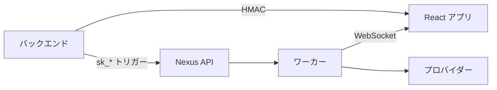

# Nexus Signal SDK

バックエンドからワークフローをトリガーし、ブラウザでアプリ内通知をレンダリングするための公式パッケージ。

<Cards>
  <Card title="Node.js SDK" href="/docs/sdk/node" description="トリガー、スケジュール、HMAC — サーバーサイド専用。" />
  <Card title="React SDK" href="/docs/sdk/react" description="ベル、受信箱、設定 — ブラウザ UI。" />
  <Card title="API リファレンス" href="/docs/api" description="生の HTTP をお好みの方向けの REST エンドポイント。" />
</Cards>

## 統合フロー



1. バックエンドは**シークレットキー** (`sk_*`) でワークフローをトリガー
2. バックエンドはログイン中ユーザーの **HMAC** を生成
3. フロントエンドは**公開キー + HMAC** で `NexusProvider` をアプリにラップ
4. アプリ内通知が `NotificationCenterBell` にストリーミング

## クイックトリガー例

```ts
import { NexusClient } from '@nexus-signal/node';

const nexus = new NexusClient({
  secretKey: process.env.NEXUS_SECRET_KEY!,
  baseUrl: 'https://api.nexussignal.dev',
});

await nexus.workflows.trigger({
  workflowName: 'order.shipped',
  recipients: [{ externalId: 'user_42', email: 'alex@acme.io' }],
  data: { trackingNumber: '1Z999AA10123456784' },
});
```

## 要件

| SDK | 必要条件 |
|-----|---------|
| Node | Node.js 18 以上 |
| React | React 18/19, `socket.io-client` ^4.8 |

## インストール

<Tabs items={['npm', 'pnpm', 'yarn']}>
  <Tab value="npm">

```bash
npm install @nexus-signal/node
npm install @nexus-signal/react socket.io-client
```

  </Tab>
  <Tab value="pnpm">

```bash
pnpm add @nexus-signal/node
pnpm add @nexus-signal/react socket.io-client
```

  </Tab>
  <Tab value="yarn">

```bash
yarn add @nexus-signal/node
yarn add @nexus-signal/react socket.io-client
```

  </Tab>
</Tabs>

<Callout type="info">
REST のみの統合をお望みですか？React SDK をスキップして、HTTP クライアントで [API リファレンス](/docs/api) をご利用ください。
</Callout>

<Callout type="warn">
ブラウザコードに `sk_*` シークレットキーを公開しないでください。SDK ルートには `pk_*` 公開キーのみを使用してください。
</Callout>
