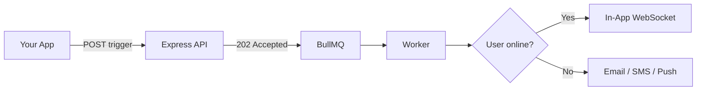

Everything about running Nexus Signal as your notification control plane — from first workflow to production.

<Cards>
  <Card title="Getting Started" href="/docs/platform/getting-started/quickstart" description="Workspace, providers, first trigger." />
  <Card title="Concepts" href="/docs/platform/concepts" description="Architecture, BYOP, workflows, pipeline." />
  <Card title="Features" href="/docs/platform/features" description="Smart timing, presence, AI, cost tools." />
  <Card title="Integrations" href="/docs/platform/integrations" description="SendGrid, Twilio, Slack, webhooks." />
  <Card title="Guides" href="/docs/platform/guides/first-workflow" description="First workflow and production checklist." />
</Cards>

## Core flow

## When to read what

| You want to… | Read |
|--------------|------|
| Send first notification | [Quickstart](/docs/platform/getting-started/quickstart) |
| Understand async pipeline | [Delivery pipeline](/docs/platform/concepts/delivery-pipeline) |
| Reduce provider spend | [Cost reduction](/docs/platform/features/cost-reduction) |
| Improve open rates | [Smart send-time](/docs/platform/features/smart-send-time) |
| Go live safely | [Production checklist](/docs/platform/guides/production-checklist) |
