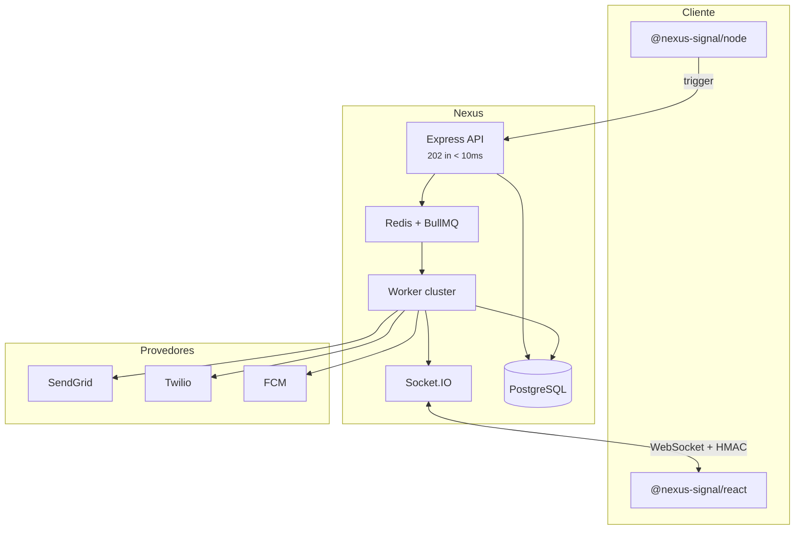

## Diagrama do sistema

## Componentes

| Camada | Tecnologia | Função |
| ------------- | ------------------- | ------------------------------------------- |
| API de Ingestão | Node.js + Express | Autenticar, validar, enfileirar, retornar 202 |
| Banco de dados | PostgreSQL + Prisma | Organizações, fluxos, inscritos e logs |
| Fila (Queue) | Redis + BullMQ | Tarefas assíncronas, atrasos, digests, disjuntor |
| Workers | Node.js | Executar etapas, compilar modelos e despachar |
| Tempo real | Socket.IO | In-app, sinc. de leitura, simulador sandbox |
| Painel | React SPA | Canvas, modelos (templates) e análises |

## Ingestão não-bloqueante

A API **nunca** faz chamadas de rede para operadoras de envio ou compila modelos pesados durante a solicitação HTTP. Ela apenas grava um log de status `INGESTED`, enfileira uma tarefa e responde imediatamente.

## Multi-inquilinato (Multi-tenancy)

Os recursos têm escopo limitado por **organização** → **ambiente** (Desenvolvimento, Homologação, Produção). Cada ambiente tem chaves, inscritos e fluxos de trabalho isolados.

<Callout type="idea">
  Desenvolvimento usa o **modo sandbox** — os canais externos são simulados para que você teste sem gastos com provedores. Consulte [Sandbox](/docs/platform/features/sandbox).
</Callout>

## Relacionado

- [Pipeline de entrega](/docs/platform/concepts/delivery-pipeline)
- [BYOP](/docs/platform/concepts/byop)
