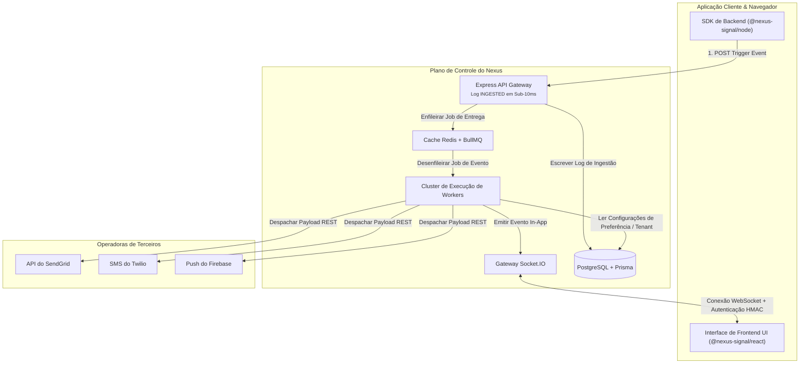

# Arquitetura do Sistema

O Nexus Signal foi projetado como um sistema de orquestração de notificações desacoplado e de alto rendimento. A plataforma consiste em cinco camadas principais para separar a ingestão de gatilhos da compilação e entrega real de notificações:

---

## Diagrama do Sistema

```mermaid
flowchart TB
  subgraph Client [Aplicação Cliente & Navegador]
    SDK["SDK de Backend (@nexus-signal/node)"]
    UI["Interface de Frontend UI (@nexus-signal/react)"]
  end

  subgraph Nexus [Plano de Controle do Nexus]
    API["Express API Gateway<br/><small>Log INGESTED em Sub-10ms</small>"]
    Q["Cache Redis + BullMQ"]
    W["Cluster de Execução de Workers"]
    WS["Gateway Socket.IO"]
    DB[(PostgreSQL + Prisma)]
  end

  subgraph Providers [Operadoras de Terceiros]
    SG[API do SendGrid]
    TW[SMS do Twilio]
    FCM[Push do Firebase]
  end

  SDK -->|1. POST Trigger Event| API
  API -->|Escrever Log de Ingestão| DB
  API -->|Enfileirar Job de Entrega| Q
  Q -->|Desenfileirar Job de Evento| W
  W -->|Ler Configurações de Preferência / Tenant| DB
  W -->|Despachar Payload REST| SG & TW & FCM
  W -->|Emitir Evento In-App| WS
  WS <-->|Conexão WebSocket + Autenticação HMAC| UI
```

---

## Componentes Arquiteturais

| Componente                      | Tecnologia                 | Responsabilidade                                                                                                                     | Desempenho                            |
| :------------------------------ | :------------------------- | :----------------------------------------------------------------------------------------------------------------------------------- | :------------------------------------ |
| **API de Ingestão**             | Node.js + Express          | Valida credenciais de autorização e esquemas de gatilhos; enfileira trabalhos (jobs); retorna confirmação imediata.                  | Tempos de resposta em sub-10ms.       |
| **Banco de Dados Relacional**   | PostgreSQL + Prisma        | Persiste configurações de workspace, credenciais de ambiente, estruturas de modelos, inscritos e logs de transação.                  | Caminho de leitura/gravação indexado. |
| **Mensageiro (Message Broker)** | Redis + BullMQ             | Gerencia canais de fila em tempo real, workflows atrasados, resumos em lote (digests) e agendamento de contrapressão (backpressure). | Desempenho em cache de memória.       |
| **Workers**                     | Pool de Workers do Node.js | Executa nós de workflow sequencialmente; lida com ajustes de fuso horário local, divisões A/B e despachos.                           | Escalonável horizontalmente.          |
| **Hub WebSocket**               | Gateway Socket.IO          | Mantém canais WebSocket persistentes com navegadores ativos para entregar alertas in-app instantâneos.                               | Pushes orientados a eventos.          |
| **Painel Web**                  | React + Next.js SPA        | Designer visual de modelos do tipo arrastar e soltar, logs de execução e simuladores de sandbox.                                     | Renderização estática no cliente.     |

---

## Ingestão de Eventos Não-Bloqueante

Para manter tempos de resposta sub-10ms nos gatilhos do seu backend, a API de Ingestão **nunca** executa as seguintes tarefas de forma síncrona:

- Compilação de mecanismos de modelos (templates).
- Avaliação de regras de ramificação de etapas condicionais.
- Realização de consultas de DNS ou solicitações HTTP REST para gateways de operadoras externas (por exemplo, SendGrid, Twilio).

Em vez disso, o gateway grava uma única linha no PostgreSQL com o estado `INGESTED`, publica os metadados do payload no BullMQ e responde imediatamente ao SDK do seu servidor com um código de status **HTTP 202 Accepted** contendo o ID da transação.

---

## Resiliência de Filas e Contrapressão (Backpressure)

Ao contar com o BullMQ, o Nexus protege seus sistemas de backend contra latências de rede e indisponibilidades de operadoras:

- **Tentativas de Trabalhos (Jobs)**: Se o Twilio ou o SendGrid retornar um erro HTTP 500 ou sofrer limitações de taxa (rate limits), o worker enfileira novamente o trabalho no Redis usando uma estratégia de **recuo exponencial** (exponential backoff).
- **Disjuntor (Circuit Breaking)**: Se uma operadora retornar falhas contínuas acima de um limite de janela, o despachador aciona um **Nó de Failover** para direcionar as notificações por um canal alternativo (por exemplo, fazendo fallback de SMS para Push).
- **Limitação de Taxa (Throttling)**: Os workers direcionam mensagens respeitando estritamente os limites de taxa configurados por integração de provedor.

---

## Gateway WebSocket Persistente

As notificações in-app (como sinos de notificação ou mensagens toast personalizadas) são direcionadas através do nosso gateway WebSocket Socket.IO dedicado.

- **Segurança**: Os handshakes exigem uma assinatura HMAC válida gerada pelo seu servidor, impedindo a falsificação de IDs de usuários (user ID spoofing).
- **Estado de entrega**: Se um usuário estiver ativamente conectado via WebSocket, o worker pode pular o despacho de canais externos como SMS ou Push (Supressão por presença), reduzindo os custos de mensagens.
