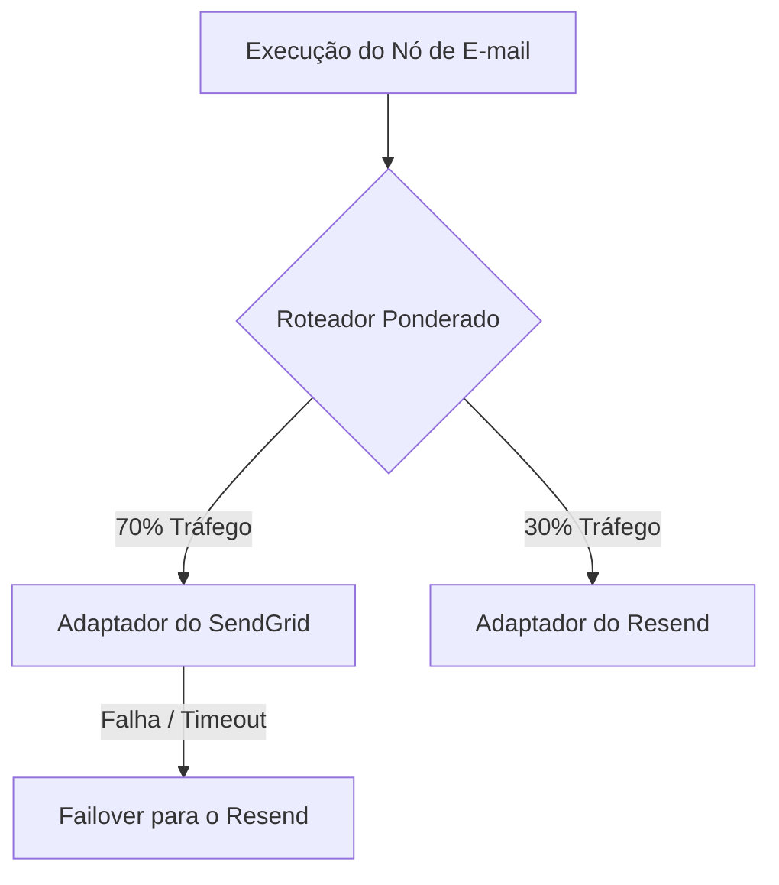

# Bring Your Own Provider (BYOP)

**BYOP (Bring Your Own Provider)** é a base do Nexus Signal. Ao contrário das plataformas de notificação tradicionais que atuam como intermediárias e cobram uma taxa adicional sobre cada e-mail ou SMS, o Nexus atua puramente como a camada de software de orquestração.

Você insere **suas próprias chaves de API** dos provedores e paga as tarifas de consumo diretamente a eles.

---

## Análise de Custo: Tradicional vs. BYOP

Os volumes de notificações costumam aumentar rapidamente, transformando as taxas adicionais por mensagem em uma grande despesa operacional:

| Métrica                         | SaaS de Notificação Tradicional                          | Nexus Signal (BYOP)                                                             |
| :------------------------------ | :------------------------------------------------------- | :------------------------------------------------------------------------------ |
| **Modelo de Cobrança**          | Assinatura + taxa de volume por mensagem.                | Assinatura de valor fixo da plataforma.                                         |
| **Markup (Margem de Lucro)**    | Frequentemente inflacionado de 50% a 200%.               | **0% de markup**. Você paga a operadora diretamente pelo custo real de consumo. |
| **Redundância de Operadoras**   | Preso à operadora selecionada pela plataforma.           | Roteamento ponderado e failover instantâneo entre seus provedores.              |
| **Controle de Entregabilidade** | Pools de reputação de IP compartilhados (pior inboxing). | Seleção de IP dedicado e configuração direta de remetente.                      |

---

## Criptografia Segura no Cofre (Vault)

Como você fornece suas próprias credenciais, proteger suas chaves de API é nossa prioridade máxima de segurança.

- **Criptografia AES-256**: As credenciais dos provedores são criptografadas no nível do banco de dados dentro do cofre `providerKeys` do seu workspace.
- **Escopo de Decodificação**: As chaves são decifradas em memória estritamente no momento do despacho para a operadora, dentro de processos isolados dos workers.
- **Exposição Zero nos Logs**: O registro de logs de payloads limpa automaticamente os detalhes de autenticação e tokens de API para evitar o vazamento de chaves nos logs de rastreamento de entrega.

---

## Roteamento e Redundância

Com o BYOP, você não depende de uma única operadora. Você pode configurar várias contas de provedores para um único canal (por exemplo, E-mail) e alocar o tráfego dinamicamente:

- **Roteamento Ponderado**: Aloque `70%` do tráfego de e-mail para o SendGrid e `30%` para o Resend para manter seus endereços de IP aquecidos (warm IPs) em múltiplos fornecedores.
- **Failover Instantâneo**: Se uma chamada de API do SendGrid expirar (timeout) ou retornar um erro de limite de taxa, o worker despacha a mensagem imediatamente através do Resend.

---

## Chaves de IA Também São BYOP

O Nexus Signal suporta **Nós de IA** no workflow visual (por exemplo, para verificação de traduções ou criação dinâmica de textos). Esses nós usam **suas próprias chaves de LLM** (OpenAI, Anthropic ou Cohere). O Nexus nunca executa tarefas de LLM em contas proxy compartilhadas. Você mantém o controle total sobre as políticas de privacidade de dados e limites de uso de tokens.
