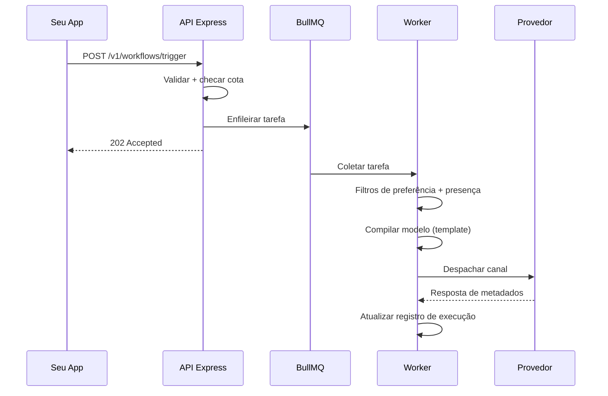

Quando você chama `workflows.trigger`, este pipeline é executado de forma assíncrona.

## Resumo das etapas

| Etapa | O que acontece |
|------|----------------|
| **Ingestão** | Valida a chave, resolve inscritos, cria o log e enfileira |
| **Worker pickup** | Carrega o fluxo de trabalho, modelo e contexto da organização |
| **Filtros (Gates)** | Preferências, supressão por presença, horário inteligente e janela de entrega |
| **Compilação** | Resolução do Handlebars + localidade + URLs de rastreamento de cliques |
| **Despacho** | Roteador de provedor ponderado → adaptador de operadora |
| **Telemetria** | WebSocket (in-app), rastreamento de cliques e callbacks de operadoras |

## Status do ciclo de vida

`INGESTED` (Ingerido) → `QUEUED` (Enfileirado) → `PROCESSING` (Processando) → `DISPATCHED` (Despachado) → `DELIVERED` (Entregue) → `READ` / `OPENED` / `FAILED` (Lido / Aberto / Falhou)

Especiais: `SKIPPED_BY_PREFERENCE` (Pulado por Preferência), `QUEUED_IN_DIGEST` (Enfileirado no Digest), `FAILED_PROVIDER_DOWN` (Falhou por Provedor Fora do Ar)

<Callout type="warn">
Gatilhos agendados e retenções de horário inteligente reentram na fila com um atraso — o status pode mostrar `QUEUED` durante a espera.
</Callout>

Veja a linha do tempo completa no detalhamento de **Audit Logs (Logs de Auditoria)**.
