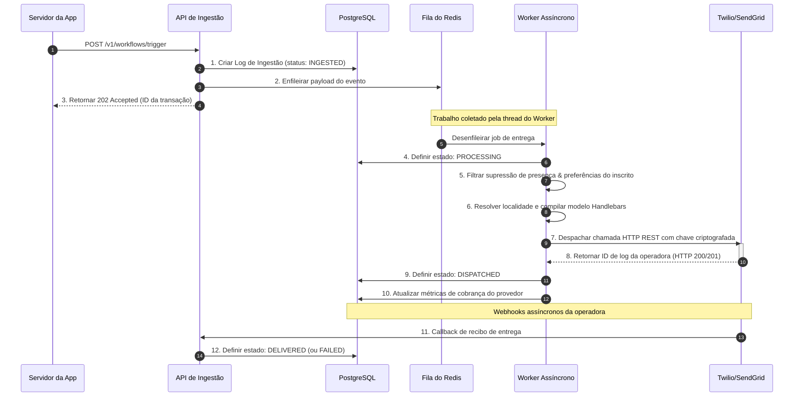

# Pipeline de Entrega

Quando o servidor da sua aplicação dispara um evento por meio de `nexus.workflows.trigger()`, o evento entra em um pipeline de execução de alta capacidade e observável. A entrega é executada de forma totalmente assíncrona dentro dos nossos pools de workers em segundo plano.

---

## Sequência Detalhada de Telemetria

O diagrama a seguir rastreia o caminho da transação desde a ingestão até os modelos, verificações de preferências, adaptadores de operadoras e relatórios de entrega das operadoras:

```mermaid
sequenceDiagram
    autonumber
    participant App as Servidor da App
    participant API as API de Ingestão
    participant DB as PostgreSQL
    participant Q as Fila do Redis
    participant W as Worker Assíncrono
    participant Carrier as Twilio/SendGrid

    App->>API: POST /v1/workflows/trigger
    API->>DB: 1. Criar Log de Ingestão (status: INGESTED)
    API->>Q: 2. Enfileirar payload do evento
    API-->>App: 3. Retornar 202 Accepted (ID da transação)

    Note over Q, W: Trabalho coletado pela thread do Worker
    Q->>W: Desenfileirar job de entrega
    W->>DB: 4. Definir estado: PROCESSING
    W->>W: 5. Filtrar supressão de presença & preferências do inscrito
    W->>W: 6. Resolver localidade e compilar modelo Handlebars
    W->>Carrier: 7. Despachar chamada HTTP REST com chave criptografada
    activate Carrier
    Carrier-->>W: 8. Retornar ID de log da operadora (HTTP 200/201)
    deactivate Carrier

    W->>DB: 9. Definir estado: DISPATCHED
    W->>DB: 10. Atualizar métricas de cobrança do provedor

    Note over Carrier, DB: Webhooks assíncronos da operadora
    Carrier->>API: 11. Callback de recibo de entrega
    API->>DB: 12. Definir estado: DELIVERED (ou FAILED)
```

---

## Fases do Pipeline de Execução

### 1. Fase de Ingestão

- **Autenticação**: Verifica o escopo da Chave Secreta Bearer (`sk_`).
- **Validação**: Confirma se o `workflowName` existe e valida os esquemas do array `recipients`.
- **Criação do Trabalho (Job)**: Gera um ID exclusivo e persistente para cada destinatário de destino, registra a linha inicial `INGESTED` no banco de dados, envia o contexto de execução para o BullMQ e libera a thread da API.

### 2. Portões de Preferência e Presença (Gates)

Antes de compilar os recursos de mensagem, os workers avaliam se a notificação deve prosseguir:

- **Verificação de Desativação (Opt-out)**: Lê o catálogo de preferências do destinatário. Se ele tiver desativado o tópico ou canal, o nó será ignorado com o estado `SKIPPED_BY_PREFERENCE`.
- **Interceptação de Presença Ativa**: Verifica se o destinatário possui uma sessão WebSocket ativa no gateway in-app. Se `suppressWhenOnline` estiver ativo no nó do canal, os despachos de saída serão ignorados.
- **Restrições de Horário Local**: Se um nó de `Delivery Window` estiver presente, o worker calcula o fuso horário local do inscrito. Se a hora atual estiver fora da janela, o trabalho é agendado para mais tarde no Redis.

### 3. Renderização de Modelos (Templates)

- **Busca de Localidade**: Resolve a localidade preferida do inscrito (`en`, `es`, `pt`, `ja`, etc.).
- **Compilação do Handlebars**: Compila as linhas de assunto, cabeçalhos e modelos HTML, mesclando as variáveis `data` do gatilho.
- **Injeção de Links de Rastreamento**: Substitui as URLs nos modelos por links personalizados de rastreamento de redirecionamento para medir as métricas de cliques.

### 4. Despacho da Operadora

- **Roteamento Ponderado**: O despachador resolve os adaptadores de provedores ativos e seleciona a operadora com base nos pesos de integração.
- **Handshake do Adaptador**: Descriptografa a chave de integração, compila o esquema de API específico do provedor e executa a chamada REST.

---

## Definições Detalhadas do Status do Ciclo de Vida

Cada trabalho de entrega transiciona por um conjunto de estados observáveis:

| Estado de Status        | Significado e Escopo                                                              |
| :---------------------- | :-------------------------------------------------------------------------------- |
| `INGESTED`              | A API aceitou o payload do evento de gatilho.                                     |
| `QUEUED`                | O trabalho está atualmente no Redis aguardando threads de workers.                |
| `PROCESSING`            | Um worker está executando a renderização do modelo e os portões do gateway.       |
| `DISPATCHED`            | A mensagem foi aceita pela API da operadora (SendGrid, Twilio, etc.).             |
| `DELIVERED`             | O webhook da operadora confirmou que o usuário recebeu o e-mail/SMS/push.         |
| `OPENED` / `READ`       | O usuário abriu o e-mail (pixel disparado) ou marcou a mensagem in-app como lida. |
| `FAILED`                | Ocorreu um erro durante a execução ou a operadora rejeitou a entrega.             |
| `SKIPPED_BY_PREFERENCE` | A entrega foi ignorada porque o inscrito cancelou a inscrição no tópico.          |
| `QUEUED_IN_DIGEST`      | O evento está suspenso aguardando o intervalo de agrupamento do nó digest.        |
| `FAILED_PROVIDER_DOWN`  | O gateway da operadora estava inacessível; enfileirado para failover automático.  |

---

## Retentativas e Recuperação de Erros

Se um despacho de operadora falhar devido a quedas de rede da operadora ou exceções HTTP 5xx temporárias, os workers executam as seguintes rotinas de recuperação:

1. **Fila de Reenvio**: O worker enfileira novamente o trabalho no Redis usando uma estratégia de **recuo exponencial** (exponential backoff).
2. **Máximo de Tentativas**: O trabalho é tentado novamente até 5 vezes (configurado em Integrações).
3. **Fila de Mensagens Mortas (DLQ - Dead-Letter Queue)**: Se todas as tentativas forem esgotadas, o estado é definido como `FAILED`, o rastreamento da pilha (stack trace) é salvo no log de auditoria e alertas de desenvolvedor são acionados.
