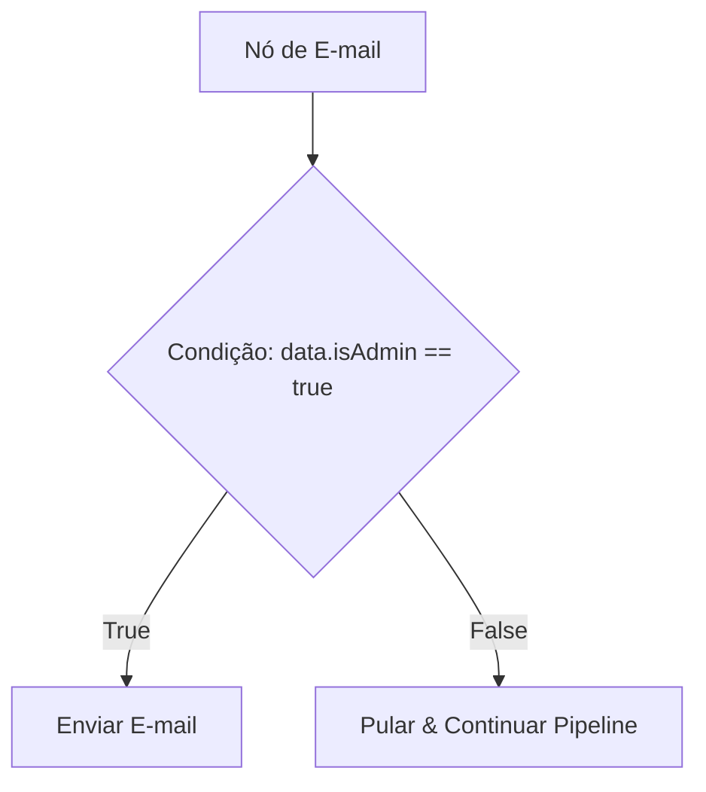

# Workflows Visuais e Modelos

Um **workflow** (fluxo de trabalho) é o plano de automação estrutural (`user.welcome`, `billing.payment_failed`) que lida com os gatilhos de seus eventos. Os workflows são compostos visualmente na tela do painel de controle como uma **árvore de etapas** (step tree) de nós funcionais.

---

## Gatilho de Eventos (Trigger Events)

Cada workflow começa com um único **Nó de Gatilho** (Trigger Node) que define o namespace do evento. Quando o servidor da sua aplicação dispara um evento usando o SDK, o parâmetro `workflowName` deve corresponder a este identificador visual:

```ts
await nexus.workflows.trigger({
  workflowName: 'user.welcome', // Corresponde ao namespace do nó de gatilho
  recipients: [{ externalId: 'user_12' }],
  data: { name: 'Alex' },
});
```

---

## Catálogo Detalhado de Nós

O construtor visual suporta dez classes de nós para controlar o tempo das mensagens, a lógica de execução e as escolhas de provedores:

| Classe do Nó             | Ícone           | Ação e Função                                                                                                                                                                                 |
| :----------------------- | :-------------- | :-------------------------------------------------------------------------------------------------------------------------------------------------------------------------------------------- |
| **Nó de Canal**          | `MessageSquare` | Despacha notificações por E-mail, SMS, Web Push, Mobile Push, sino In-App, Slack, Discord, Microsoft Teams, WhatsApp ou Webhooks.                                                             |
| **Nó de Atraso (Delay)** | `Clock`         | Pausa a execução por uma duração relativa (por exemplo, `24 hours` ou `3 days`) antes de executar a próxima etapa.                                                                            |
| **Nó Wait Until**        | `Calendar`      | Retém a execução até um timestamp ISO-8601 dinâmico enviado no payload do gatilho (por exemplo, `data.trialExpirationDate`).                                                                  |
| **Janela de Entrega**    | `Moon`          | Intercepta a entrega e retém as notificações para liberá-las estritamente durante horários adequados para o inscrito (por exemplo, `9:00 AM - 6:00 PM`) de acordo com seu fuso horário local. |
| **Nó Digest**            | `Archive`       | Agrupa alertas de alta frequência em um único resumo consolidado (por exemplo, agrupar 10 notificações de comentários ao longo de 30 minutos em um único digest).                             |
| **Nó Throttle**          | `Activity`      | Limita a taxa de envio de notificações para evitar o envio de spam aos inscritos (por exemplo, no máximo `1 email per hour` por inscrito).                                                    |
| **Nó de Failover**       | `RefreshCw`     | Tenta um canal primário, aguarda um callback de leitura (ou duração específica) e faz fallback automaticamente para canais secundários se não for lido.                                       |
| **Nó A/B Split**         | `Split`         | Divide o tráfego de execução em dois ramos (por exemplo, `50% Branch A`, `50% Branch B`) com métricas de abertura e clique rastreáveis para otimizar os textos.                               |
| **Nó HTTP Fetch**        | `Globe`         | Busca dados externos de APIs de terceiros no meio do workflow. Mescla as propriedades da resposta JSON diretamente nas variáveis de contexto do Handlebars.                                   |
| **Nó de IA**             | `Brain`         | Executa solicitações de LLM em tempo de execução (OpenAI/Anthropic) para classificar eventos recebidos ou redigir textos dinâmicos de acordo com o perfil dos inscritos.                      |

---

## Condições de Etapas

Você pode anexar regras booleanas a **qualquer nó** dentro da sua árvore visual. Se as regras de condição forem avaliadas como `false` em tempo de execução, o worker ignora esse nó (e seus nós filhos) completamente:



Exemplos de regras verificam parâmetros de:

- **Contexto do Payload do Gatilho**: `data.planType == 'enterprise'`
- **Perfil do Inscrito**: `subscriber.country == 'BR'`
- **Detalhes do Tenant B2B**: `tenant.brandingColor == '#ff0000'`

---

## Sintaxe de Modelos Handlebars

Os layouts de corpo de mensagem suportam **variáveis Handlebars (`{{ }}`)** para injetar propriedades dinâmicas em tempo de execução:

```html title="Email Template Body"
<h2>Olá {{ subscriber.firstName }},</h2>
<p>Seu pedido <strong>#{{ data.orderId }}</strong> foi enviado!</p>
<p>
  Você pode rastrear seu pacote usando: <a href="{{ data.trackingUrl }}">Link de Rastreamento</a>.
</p>

{{#if tenant}}
<p>Obrigado por comprar na {{ tenant.name }}.</p>
{{/if}}
```

### Variáveis de contexto disponíveis durante a renderização:

- `{{ subscriber }}`: Inclui campos do perfil (`externalId`, `email`, `phone`, `locale`).
- `{{ data }}`: Os metadatos brutos do payload JSON do gatilho.
- `{{ tenant }}`: Parâmetros delimitados da organização do cliente (`name`, `brandingColor`).
- `{{ steps }}`: Respostas mescladas de **Nós HTTP Fetch** anteriores (por exemplo, `{{ steps.fetch_product_data.title }}`).
