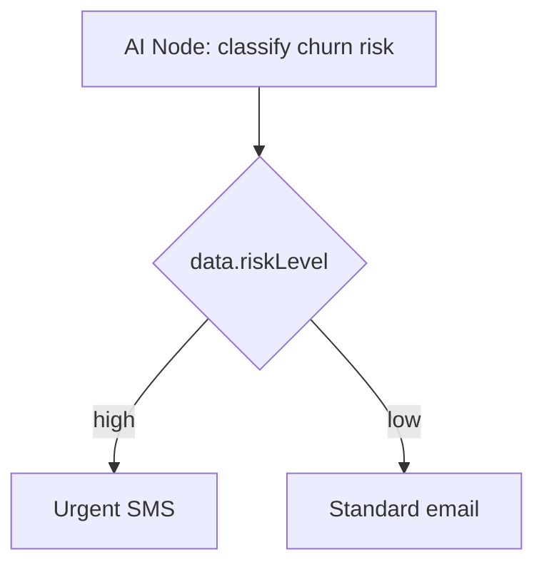

O **Nó de IA** chama um LLM configurado (OpenAI ou Anthropic) no meio da execução do workflow. Use-o para cópia dinâmica, classificação de usuários, pontuação de intenções e ramificação não determinística.

<Callout type="info">
  Esta é a **IA em tempo de execução nos workflows**. Para a *criação* de
  modelos assistida por IA no editor do painel, consulte [Geração de conteúdo
  por IA](/docs/platform/features/ai-content).
</Callout>

## Configuração

| Campo         | Descrição                                                                |
| ------------- | ------------------------------------------------------------------------ |
| `prompt`      | Template Handlebars com contexto de assinante + trigger                  |
| `responseKey` | Chave para armazenar a saída do LLM em `ctx.data` (padrão: `aiResponse`) |
| `conditions`  | [Condições de etapa](/docs/platform/features/step-conditions) opcionais  |

## Exemplo: linha de assunto personalizada

Prompt:

```
Write a short email subject line for {{ subscriber.externalId }} about order {{ data.orderId }}.
Tone: friendly, under 60 characters. Return only the subject text.
```

Template de canal de email seguinte:

```html
Subject: {{ aiResponse }}
```

## Exemplo: ramificação de risco de rotatividade (churn-risk)



O prompt retorna o contexto estruturado mesclado via `responseKey`. Anexe [condições de etapa](/docs/platform/features/step-conditions) nos nós seguintes com chave em `data.riskLevel`.

## Configuração do provedor

Configure as chaves de API da OpenAI ou Anthropic em **Integrations → AI Providers**. O uso de tokens é rastreado por execução para análise de custo.

## Guardrails

- Tempo limite de solicitação por nó
- Caminho de fallback se o LLM falhar (use condições em ramificação alternativa)
- Limites de custo configuráveis por nível de plano da organização

## Relacionado

- [Geração de conteúdo por IA](/docs/platform/features/ai-content)
- [Condições de Passo](/docs/platform/features/step-conditions)
- [Nó de Busca HTTP](/docs/platform/features/http-fetch-node)

---
