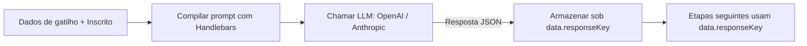
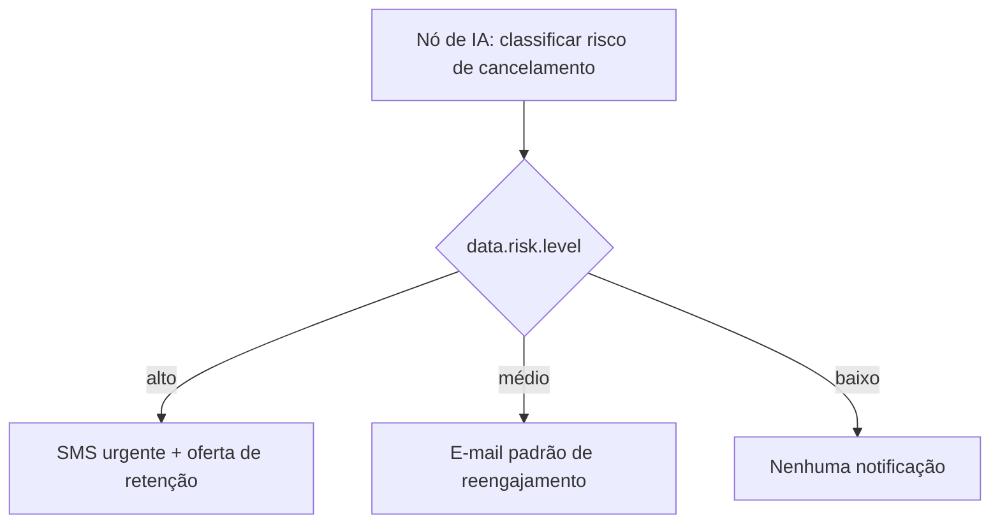

# Nó de Workflow de IA

O **Nó de IA** chama um LLM configurado (OpenAI ou Anthropic) durante a execução do workflow. O prompt é compilado com o contexto dos dados do inscrito ativo + disparo, e a resposta é armazenada novamente em `data` para modelos (templates) e condições seguintes.

<Callout type="info">
  Esta é a **IA em tempo de execução nos workflows** — para a *criação* de modelos assistida por IA
  no editor do painel de controle, consulte [Geração de conteúdo por
  IA](/docs/platform/features/ai-content).
</Callout>

## Como Funciona



O LLM é instruído por meio de um prompt de sistema fixo a sempre retornar um **objeto JSON válido**. A resposta é analisada e armazenada sob `data.<responseKey>`.

## Configuração

| Campo         | Tipo   | Obrigatório | Descrição                                                                                       |
| :------------ | :----- | :---------- | :---------------------------------------------------------------------------------------------- |
| `prompt`      | string | ✅          | Modelo Handlebars com o contexto do inscrito + dados do disparo                                 |
| `responseKey` | string | —           | Chave para armazenar a saída JSON do LLM sob `data.*`. O padrão é `ai`                          |
| `conditions`  | object | —           | [Condições de etapa](/docs/platform/features/step-conditions) opcionais para limitar a execução |

<Callout type="info">
  **`responseKey` Padrão**: Se não for especificado, a resposta do LLM será armazenada sob
  `data.ai`. A chave deve começar com uma letra e conter apenas letras, números e sublinhados
  (`[a-zA-Z][a-zA-Z0-9_]*`).
</Callout>

## Exemplo: Linha de Assunto Personalizada

**Prompt do Nó de IA:**

```
Write a short email subject line for {{ subscriber.first_name }} about order {{ data.orderId }}.
Tone: friendly, under 60 characters.
Return a JSON object: { "subject": "<subject line here>" }
```

**Modelo de e-mail seguinte** (referenciando `data.ai.subject`):

```html
Subject: {{ data.ai.subject }}
<p>Olá {{ subscriber.first_name }}, seu pedido {{ data.orderId }} está confirmado!</p>
```

Ou com um `responseKey: "copy"` personalizado:

```html
Subject: {{ data.copy.subject }}
```

## Exemplo: Ramificação por Risco de Cancelamento (Churn)



**Prompt:**

```
Based on last active date {{ data.lastActiveAt }} and plan {{ data.plan }},
classify this user's churn risk.
Return JSON: { "level": "high" | "medium" | "low", "reason": "<brief reason>" }
```

**Condição de etapa no nó de SMS** (baseada em `data.risk.level`):

```json
{
  "logic": "AND",
  "rules": [{ "variable": "data.risk.level", "operator": "equals", "value": "high" }]
}
```

## Configuração do Provedor

Configure as chaves de API da OpenAI ou Anthropic em **Integrations → AI Providers** no painel de controle. O uso de tokens é rastreado por execução de workflow para fins de análise de custos.

- **OpenAI**: Defina sua `OPENAI_API_KEY` por meio da integração do painel de controle.
- **Anthropic**: Defina sua `ANTHROPIC_API_KEY` por meio da integração do painel de controle.

Se nenhuma chave de provedor de IA estiver configurada, o nó de IA será ignorado e registrará `AI_NODE_FAILED` com o motivo `No AI provider API key configured`.

## Tratamento de Erros e Proteções

- **Nenhuma chave de API configurada**: A etapa é ignorada, `data.<responseKey>` é definido como `null` e é registrado `AI_NODE_FAILED`
- **Tempo limite (timeout) do LLM**: A etapa é ignorada, `data.<responseKey>` é definido como `null` e é registrado `AI_NODE_FAILED`
- **Resposta JSON inválida**: Armazenada como está; os modelos seguintes devem lidar com isso de forma segura usando blocos condicionais `{{#if data.ai}}`
- **Limites de custo**: Configuráveis por nível de plano da organização nas configurações do painel de controle

## Workflow-as-code

```ts
import { defineWorkflow } from '@nexus-signal/node';

defineWorkflow('payment.overdue')
  .addHttpFetch({
    url: 'https://api.billing.com/invoices/{{ data.invoiceId }}',
    method: 'GET',
    responseKey: 'invoice',
  })
  .addAiNode({
    prompt:
      'Classify urgency for invoice {{ data.invoice.amount }} due {{ data.invoice.dueDate }}. Return JSON: { "level": "low" | "medium" | "high" }',
    responseKey: 'risk',
  })
  .addChannel('EMAIL')
  .addChannel('SMS', {
    conditions: {
      logic: 'AND',
      rules: [{ variable: 'data.risk.level', operator: 'equals', value: 'high' }],
    },
  })
  .toDefinition();
```

## Relacionado

- [Geração de conteúdo por IA](/docs/platform/features/ai-content)
- [Condições de etapa](/docs/platform/features/step-conditions)
- [Nó HTTP Fetch](/docs/platform/features/http-fetch-node)
- [Workflow-as-code](/docs/sdk/workflow/workflow-as-code)
