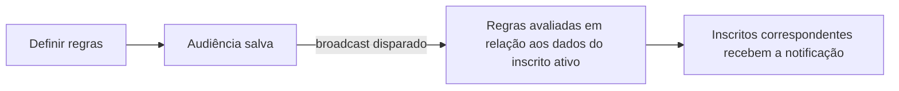

# Audiências e Segmentação

As **Audiências** são segmentos dinâmicos nomeados, definidos por regras de filtro aplicadas a campos dos inscritos. A contagem de membros é atualizada automaticamente à medida que os dados dos inscritos mudam — sem necessidade de manutenção manual de listas.

## Como as Audiências Funcionam

As regras de audiência são avaliadas **no momento do envio** (quando um broadcast é disparado), e não no momento da criação. Isso significa que um inscrito que aderir ao seu plano `"growth"` hoje será incluído na audiência correspondente quando você realizar o envio amanhã.



## Campos Filtráveis

As regras de audiência podem filtrar com base nos seguintes campos do inscrito:

| Campo                | Tipo     | Exemplos de valores            |
| :------------------- | :------- | :----------------------------- |
| `email`              | string   | `"user@example.com"`           |
| `phoneNumber`        | string   | `"+14155552671"`               |
| `locale`             | string   | `"en"`, `"es"`, `"pt"`, `"ja"` |
| `timezone`           | string   | `"America/New_York"`           |
| `globalUnsubscribed` | boolean  | `true`, `false`                |
| `externalId`         | string   | `"user_42"`                    |
| `createdAt`          | datetime | string ISO 8601                |

<Callout type="warn">
  Campos de propriedades personalizadas dos inscritos (por exemplo, `properties.plan`) **não** são
  diretamente filtráveis nas regras de audiência. Os filtros de audiência estão limitados aos campos
  padrão dos inscritos listados acima.
</Callout>

## Operadores Suportados

| Operador                     | Funciona em                                      |
| :--------------------------- | :----------------------------------------------- |
| `equals` / `not_equals`      | Todos os campos de string e booleano             |
| `contains` / `not_contains`  | Campos de string                                 |
| `starts_with` / `ends_with`  | Campos de string                                 |
| `is_empty` / `is_not_empty`  | Campos de string                                 |
| `is_true` / `is_false`       | Campos de booleano                               |
| `greater_than` / `less_than` | Campos de data/número (por exemplo, `createdAt`) |

No máximo 10 regras por audiência.

## Criar uma Audiência

**Painel de Controle**: Página de **Audiences** → **New Audience** → adicione as regras.

**API (Gerenciamento, chave `sk_*`):**

```http
POST /v1/management/audiences
Authorization: Bearer sk_prd_…
Content-Type: application/json
```

```json
{
  "name": "English locale subscribers",
  "description": "Subscribers whose locale is set to English",
  "filters": {
    "logic": "AND",
    "rules": [
      { "field": "locale", "operator": "equals", "value": "en" },
      { "field": "globalUnsubscribed", "operator": "is_false" }
    ]
  }
}
```

**API (Painel/Navegador, autenticação JWT):**

```http
POST /v1/audiences
Authorization: Bearer <jwt_token>
```

## Visualizar Membros

O painel exibe uma **contagem de membros em tempo real** à medida que você edita as regras. Você também pode buscar os membros por meio da API:

```http
GET /v1/audiences/:id/members?page=1&limit=50
Authorization: Bearer <jwt_token>
```

Retorna uma lista paginada de inscritos que correspondem às regras atuais.

## Uso em Broadcasts

As audiências são usadas como alvo de destino para [Broadcasts](/docs/platform/features/broadcasts):

```json
{
  "name": "English User Re-engagement",
  "workflowId": "<workflow-uuid>",
  "audienceId": "<audience-uuid>",
  "scheduledAt": "2026-09-01T09:00:00Z"
}
```

<Callout type="info">
  Um broadcast **deve** possuir um `audienceId` atribuído antes de poder ser enviado. Tentar enviar
  um broadcast sem uma audiência retornará um erro `400`.
</Callout>

## Limites

| Limite                            | Valor |
| :-------------------------------- | :---- |
| Máximo de audiências por ambiente | 50    |
| Máximo de regras por audiência    | 10    |

## Relacionado

- [Broadcasts](/docs/platform/features/broadcasts)
- [API de Audiências](/docs/api/audiences)
- [API de Inscritos](/docs/api/subscribers)
