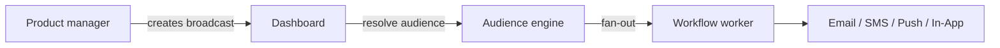

Os **broadcasts** permitem que as equipes de produto e marketing enviem anúncios, lançamentos de recursos e avisos de manutenção a partir do painel sem alterações de código.

## Como os broadcasts diferem dos disparadores (triggers)

|               | Disparador de evento (Trigger)    | Broadcast                      |
| ------------- | --------------------------------- | ------------------------------ |
| Iniciado por  | Código do seu backend             | Painel ou API de Gerenciamento |
| Destinatários | Lista explícita ou objetos        | Segmento de audiência          |
| Caso de uso   | Transacional, orientado a eventos | Anúncios, campanhas            |



## Criar um broadcast

Painel: **Broadcasts** → redigir fluxo de trabalho + audiência + agendamento.

API de Gerenciamento (usa a chave `sk_*`):

```http
POST /v1/management/broadcasts
Authorization: Bearer sk_prd_…
```

```json
{
  "name": "Q4 Product Update",
  "workflowId": "uuid",
  "audienceId": "uuid",
  "scheduledAt": "2026-08-01T09:00:00Z"
}
```

Enviar imediatamente:

```http
POST /v1/management/broadcasts/:id/send
```

Os usuários do painel também podem criar via `POST /v1/broadcasts` com autenticação JWT — consulte a [API de Broadcasts](/docs/api/broadcasts).

## Ciclo de vida do broadcast

| Status                 | Significado                        |
| ---------------------- | ---------------------------------- |
| `DRAFT`                | Composto, não enviado              |
| `SCHEDULED`            | Fila para envio futuro             |
| `SENDING`              | Envio em leque em progresso        |
| `COMPLETED`            | Todos os destinatários processados |
| `FAILED` / `CANCELLED` | Erro ou usuário cancelado          |

## Analytics

Estatísticas de entrega, abertura e clique por transmissão aparecem na visualização de detalhes do broadcast do painel.

## Relacionado

- [Guia do primeiro broadcast](/docs/platform/guides/first-broadcast)
- [Audiências](/docs/platform/features/audiences)
- [API de Broadcasts](/docs/api/broadcasts)
