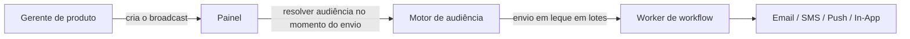

# Broadcasts

Os **Broadcasts** permitem que as equipes de produto e marketing enviem anúncios, lançamentos de recursos e avisos de manutenção a partir do painel de controle — sem a necessidade de qualquer alteração de código. Eles utilizam as [Audiências](/docs/platform/features/audiences) como alvo de destino dos destinatários e executam qualquer workflow existente.

## Como os Broadcasts Diferem dos Gatilhos (Triggers)

|                       | Disparador de evento (Trigger)    | Broadcast                                  |
| :-------------------- | :-------------------------------- | :----------------------------------------- |
| **Iniciado por**      | Código do seu backend             | Painel de controle ou API de Gerenciamento |
| **Destinatários**     | Assinantes explícitos ou objetos  | Segmento de audiência (obrigatório)        |
| **Tempo de Execução** | Imediato (assíncrono 202)         | Imediato ou agendado                       |
| **Caso de Uso**       | Transacional, orientado a eventos | Anúncios, campanhas, reengajamento         |



## Ciclo de Vida do Broadcast

| Status      | Significado                                                                               |
| :---------- | :---------------------------------------------------------------------------------------- |
| `DRAFT`     | Composto, mas ainda não enviado. Pode ser editado ou excluído.                            |
| `SCHEDULED` | Enfileirado para envio em uma data futura (`scheduledAt`). Pode ser cancelado ou editado. |
| `SENDING`   | Envio em leque em andamento. Não pode ser editado ou excluído.                            |
| `COMPLETED` | Todos os destinatários processados. Falhas parciais ainda resultam em `COMPLETED`.        |
| `FAILED`    | Falha em todos os lotes de destinatários.                                                 |
| `CANCELLED` | Cancelado manualmente por um usuário (a partir do estado `SCHEDULED` ou `SENDING`).       |

<Callout type="info">
  Os broadcasts são alterados permanentemente para `FAILED` apenas quando **todos** os destinatários
  falham. Se pelo menos um destinatário receber a mensagem, o status final será `COMPLETED`.
</Callout>

## Criar um Broadcast

**Painel de Controle**: **Broadcasts** → **New Broadcast** → selecione o workflow + audiência → defina o agendamento.

**API de Gerenciamento (`sk_*` — para automações de backend):**

```http
POST /v1/management/broadcasts
Authorization: Bearer sk_prd_…
Content-Type: application/json
```

```json
{
  "name": "Q4 Product Update",
  "workflowId": "<workflow-uuid>",
  "audienceId": "<audience-uuid>",
  "data": { "version": "4.0", "changelogUrl": "https://blog.example.com/q4" },
  "scheduledAt": "2026-08-01T09:00:00Z"
}
```

Omitir `scheduledAt` cria o broadcast como `DRAFT` (para envio manual posterior). Incluí-lo define imediatamente o status como `SCHEDULED`.

**API do Painel de Controle (autenticação JWT — para integrações de frontend):**

```http
POST /v1/broadcasts
Authorization: Bearer <jwt_token>
```

## Enviar Imediatamente

Envie um broadcast que esteja em `DRAFT` ou `SCHEDULED` agora:

```http
POST /v1/management/broadcasts/:id/send
Authorization: Bearer sk_prd_…
```

Ou através do painel de controle: abra a tela de detalhes do broadcast → **Send Now**.

## Cancelar um Broadcast

```http
POST /v1/broadcasts/:id/cancel
Authorization: Bearer <jwt_token>
```

Apenas broadcasts no estado `SCHEDULED` ou `SENDING` podem ser cancelados.

## Passando Dados para o Workflow

O campo `data` em um broadcast é passado como payload de disparo do workflow para cada destinatário. Use isso para conteúdos dinâmicos, como registros de alterações (changelogs), URLs ou códigos promocionais:

```json
{
  "data": {
    "promoCode": "LAUNCH40",
    "expiresAt": "2026-09-01"
  }
}
```

No modelo de e-mail do seu workflow: `{{ data.promoCode }}`, `{{ data.expiresAt }}`.

## Analytics

As estatísticas de entrega, abertura e cliques por broadcast aparecem na tela de detalhes do broadcast no painel de controle após o envio:

- `totalRecipients` — tamanho da audiência no momento do envio
- `deliveredCount` — aceito com sucesso pelo provedor
- `failedCount` — rejeições do provedor ou erros de processamento

## Limites

| Limite                                           | Valor                  |
| :----------------------------------------------- | :--------------------- |
| Máximo de broadcasts por ambiente                | 200                    |
| Tamanho do lote de envio (fan-out)               | 100 inscritos por lote |
| Intervalo de verificação de broadcasts agendados | A cada 60 segundos     |

## Relacionado

- [Guia do primeiro broadcast](/docs/platform/guides/first-broadcast)
- [Audiências](/docs/platform/features/audiences)
- [API de Broadcasts](/docs/api/broadcasts)
