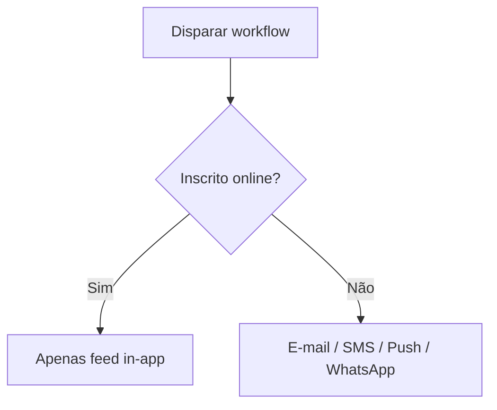

# Redução de Custos

O Nexus inclui mecanismos integrados de controle de custos projetados para eliminar automaticamente gastos desnecessários com notificações.

## Supressão por Presença

Enviar múltiplos alertas externos (SMS, push) quando um usuário já está utilizando ativamente sua aplicação é irritante para o usuário e um desperdício de orçamento de provedores.

Quando um inscrito possui uma conexão ativa de SDK cliente (React, Angular ou Headless JS), o Nexus o sinaliza como **online** e suprime os canais externos de saída, roteando a notificação **apenas para a caixa de entrada in-app**.



### Canais Suprimíveis

Por padrão, os seguintes canais são suprimidos se o inscrito estiver ativo:

- Push Mobile (`MOBILE_PUSH`)
- Web Push (`WEB_PUSH`)
- SMS (`SMS`)
- WhatsApp (`WHATSAPP`)

As notificações in-app nunca são suprimidas e sempre são entregues por meio da conexão WebSocket.

### Como a Presença é Rastreada

1. O SDK do lado do cliente abre uma conexão WebSocket e envia um ping de batimento cardíaco (heartbeat) para `/realtime` a cada **40 segundos**.
2. O Redis armazena a chave de conexão `presence:sub:<subscriberId>` com um **tempo de vida (TTL) estrito de 45 segundos**.
3. Antes de despachar uma etapa suprimível, o worker do workflow consulta o Redis. Se a chave existir, a etapa é pulada.
4. As execuções suprimidas são registradas sob a etapa de ciclo de vida `PRESENCE_SUPPRESSION` com o status `SKIPPED_BY_PREFERENCE`.

<Callout type="info">
  Você pode ativar ou desativar essa supressão por etapa de canal no editor de workflows marcando a
  caixa de seleção **Suppress when subscriber is online**, ou no workflow-as-code configurando
  `suppressWhenOnline` nas opções.
</Callout>

## Modo Sandbox (Desenvolvimento)

Testar workflows de notificação com provedores reais (por exemplo, Twilio, SendGrid) incorre em custos transacionais e traz o risco de enviar textos de teste para usuários reais.

No ambiente de **Development**, o Nexus isola todos os canais externos utilizando um **Simulador Sandbox** virtual. As chamadas de API de saída são simuladas (mocked), e o conteúdo gerado, payloads e resultados de renderização são armazenados diretamente nos logs de desenvolvimento.

- Visualize e revise e-mails exatos, payloads de SMS e formatos JSON do WhatsApp no painel de controle.
- Nenhuma credencial de API é necessária para a realização de testes.
- Consulte [Modo Sandbox](/docs/platform/features/sandbox) para ver a configuração.

## Roteamento Ponderado de Provedores

Distribua o tráfego de entrega entre múltiplos provedores na mesma camada de canal (por exemplo, 70% SendGrid, 30% Resend). Isso é útil para:

- Dividir gastos entre os provedores.
- Migração gradual de provedores.
- Distribuição de riscos.

**Atualizar pesos de roteamento via API:**

```http
PUT /v1/integrations/weights/:layer
Authorization: Bearer <jwt_dashboard_token>
Content-Type: application/json

{
  "weights": {
    "sendgrid": 70,
    "resend": 30
  }
}
```

- `:layer`: Deve ser um entre `email`, `sms`, `whatsapp`, `push`, `webhook`, `slack`, `discord` ou `ms_teams`.
- **Restrição**: A soma de todos os pesos de provedores em uma camada **deve somar exatamente 100**.

## Failover por Disjuntor (Circuit Breaker)

Quando o endpoint de um provedor rejeita requisições repetidamente (5 erros consecutivos em uma janela de 60 segundos), o disjuntor do provedor se abre (estado `OPEN`). O tráfego é automaticamente redirecionado para provedores alternativos na camada, evitando o desperdício de tentativas de envio em endpoints de API inativos.

## Relacionado

- [Smart send-time](/docs/platform/features/smart-send-time) — otimização de tempo de envio
- [Análise de custos](/docs/platform/features/cost-analytics) — medindo a economia
- [Digest e Throttle](/docs/platform/features/digest-throttle) — regras de agrupamento e limites
