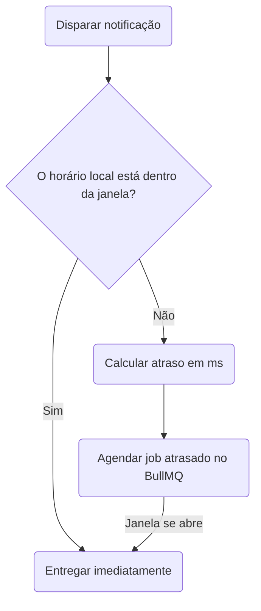

# Janelas de Entrega

O nó de **Janela de Entrega** (Delivery Window) verifica o horário local do inscrito antes de despachar as notificações subsequentes no fluxo. Se o horário atual estiver fora da janela permitida (por exemplo, no meio da noite), o Nexus pausa a execução e agenda um job atrasado para retomar quando a janela se abrir.



## Configuração

Ao definir um nó de Janela de Entrega no canvas ou por meio do workflow-as-code, especifique os seguintes parâmetros:

| Campo         | Tipo    | Obrigatório | Descrição                                                                                                       |
| :------------ | :------ | :---------- | :-------------------------------------------------------------------------------------------------------------- |
| `windowStart` | string  | ✅          | Horário de início no formato `HH:MM` (24 horas, por exemplo, `"09:00"`)                                         |
| `windowEnd`   | string  | ✅          | Horário de término no formato `HH:MM` (24 horas, por exemplo, `"21:00"`)                                        |
| `urgent`      | boolean | —           | Defina como `true` para ignorar completamente a verificação da janela para alertas críticos. O padrão é `false` |

## Como o Fuso Horário do Inscrito é Resolvido

O horário local do inscrito é determinado na seguinte ordem de prioridade:

1. A propriedade `timezone` passada no objeto do inscrito no momento do disparo:
   ```ts
   recipients: [{ externalId: 'user_42', timezone: 'America/New_York' }];
   ```
2. A propriedade `timezone` armazenada no perfil do inscrito no banco de dados.
3. Fallback para **`UTC`** se nenhum fuso horário for resolvido ou se a string fornecida não for um identificador IANA válido.

## Estados de Execução e Ciclo de Vida

A etapa da janela de entrega registra os seguintes eventos no histórico de execução:

### 1. Retenção da Janela de Entrega (`DELIVERY_WINDOW_HOLD`)

Se o horário local do usuário estiver fora da janela permitida:

- O status muda para `QUEUED`.
- O BullMQ agenda um job atrasado com o `jobId: "deliveryWindow:<logId>:<nodeId>"` com o atraso calculado em milissegundos.
- Registra metadados exibindo:
  - `subscriberLocalTime`
  - `delayMs` (milissegundos restantes até a janela se abrir)
  - `resumeNodeId` (a próxima etapa no fluxo)

### 2. Aprovação da Janela de Entrega (`DELIVERY_WINDOW_PASS`)

Se o horário local do usuário estiver dentro da janela permitida, ou se `urgent` estiver configurado como `true`:

- O status permanece em `PROCESSING` (executa imediatamente).
- Registra `reason: "within_window"` ou `reason: "urgent_bypass"`.

## Exemplo de Workflow-as-code

```ts
import { defineWorkflow } from '@nexus-signal/node';

defineWorkflow('invoice.overdue')
  .addDeliveryWindow({
    windowStart: '09:00',
    windowEnd: '18:00',
    urgent: false,
  })
  .addChannel('SMS')
  .toDefinition();
```

## Relacionado

- [Smart send-time](/docs/platform/features/smart-send-time) — otimiza _qual_ é a melhor hora; a janela de entrega define as horas _permitidas_
- [API de Inscritos](/docs/api/subscribers) — configurando fusos horários de usuários
- [Workflow-as-code](/docs/sdk/workflow/workflow-as-code)
