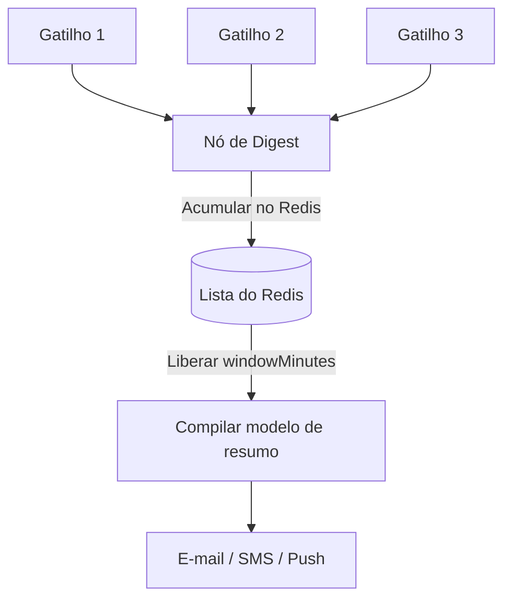
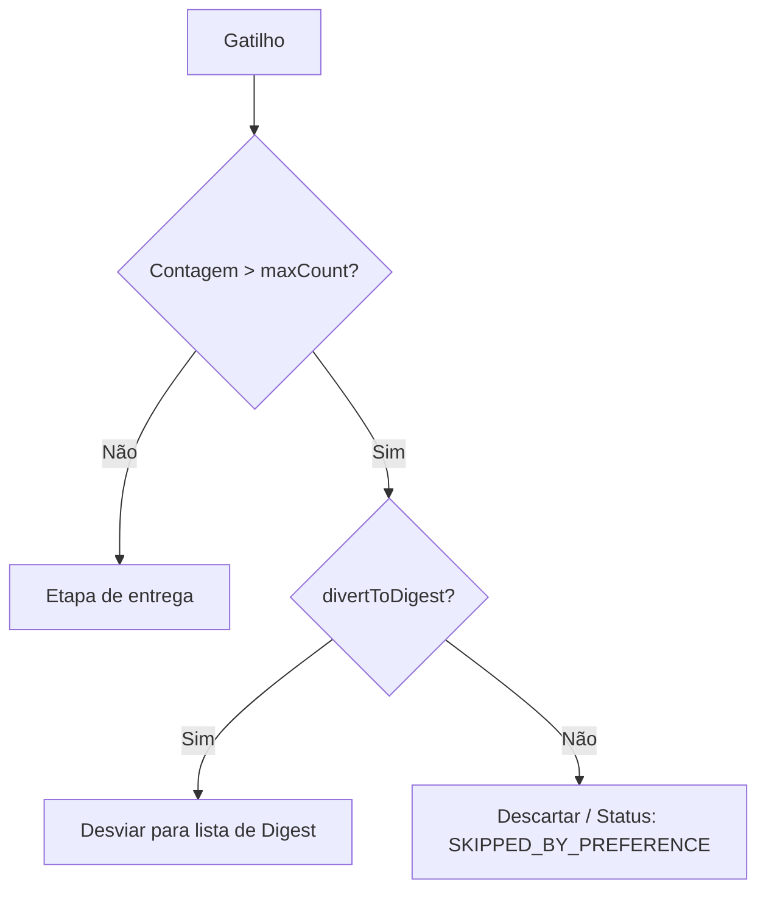

# Nós de Digest e Throttle

O Nexus inclui gerenciamento de estado integrado para **agrupar notificações barulhentas** (Digest) e **limitar a taxa de mensagens** (Throttle) no nível do inscrito, utilizando o Redis como coordenador em tempo real.

---

## Nó de Digest

O nó de **Digest** intercepta a execução do workflow, armazena o contexto do gatilho em uma lista do Redis e atrasa o despacho subsequente. Quando o cronômetro configurado expira, o Nexus libera a lista do Redis e despacha uma única notificação consolidada contendo todos os eventos agrupados.



### Configuração

| Campo           | Tipo   | Padrão | Descrição                                                                                         |
| :-------------- | :----- | :----- | :------------------------------------------------------------------------------------------------ |
| `windowMinutes` | number | `30`   | O tamanho da janela deslizante em minutos para coletar os eventos de disparo antes de liberá-los. |

### Como Funciona

1. Quando um disparo atinge o nó de digest, o worker insere `{ logId, at, data }` na chave do Redis `digest:<workflowId>:<subscriberId>:<nodeId>`.
2. O status do log é definido como `QUEUED_IN_DIGEST` e a execução é adiada (`deferred: true`). O ciclo de vida registra `DIGEST_HELD`.
3. Um job atrasado do BullMQ é agendado com o `jobId: "digest:<workflowId>:<nodeId>"` correspondente aos `windowMinutes` definidos.
4. Quando o job é executado, ele limpa e lê a lista, atualiza o ciclo de vida para `DIGEST_FLUSH` e injeta um objeto `digest` consolidado no contexto do Handlebars:

```json
{
  "digest": {
    "count": 3,
    "items": [
      { "logId": "log-1", "at": "2026-07-28T21:00:00Z", "data": { "comment": "Nice post!" } },
      { "logId": "log-2", "at": "2026-07-28T21:01:00Z", "data": { "comment": "Love this!" } }
    ],
    "nodeId": "digest-node-id",
    "windowMinutes": 30
  }
}
```

### Formatação do Modelo de Resumo

Em seu modelo de canal de e-mail ou push subsequente, você percorre a lista `digest.items` usando o helper Handlebars `{{#each}}`:

```html
<h3>You have {{ digest.count }} new updates</h3>
<ul>
  {{#each digest.items}}
  <li>On {{ at }}: {{ data.comment }}</li>
  {{/each}}
</ul>
```

---

## Nó de Throttle

O nó de **Throttle** limita a taxa de envio de notificações rastreando a frequência de entrega no Redis. Se um inscrito receber mais do que `maxCount` mensagens dentro de `windowSeconds`, as mensagens excedentes serão descartadas ou desviadas para um digest.



### Configuração

| Campo            | Tipo    | Padrão  | Descrição                                                                               |
| :--------------- | :------ | :------ | :-------------------------------------------------------------------------------------- |
| `maxCount`       | number  | `3`     | Quantidade máxima permitida de notificações na janela.                                  |
| `windowSeconds`  | number  | `60`    | Duração da janela do limite de taxa em segundos.                                        |
| `divertToDigest` | boolean | `false` | Se `true`, o excedente limitado pela taxa é agrupado em um digest em vez de descartado. |

### Como Funciona

1. Cada execução incrementa a chave de contagem de throttle no Redis. No primeiro incremento, a expiração da chave é configurada para `windowSeconds`.
2. **Abaixo do limite**: A execução registra `THROTTLE_PASS` e continua imediatamente.
3. **Acima do limite**:
   - **`divertToDigest: false`**: A execução é descartada. O status do log é definido como `SKIPPED_BY_PREFERENCE` e registra a etapa de ciclo de vida `THROTTLE_LIMIT`.
   - **`divertToDigest: true`**: A execução é redirecionada para uma lista de digest no Redis. O status do log muda para `QUEUED_IN_DIGEST` e registra `DIGEST_HELD`. Um job do BullMQ é agendado com `jobId: "throttle-digest:<workflowId>:<nodeId>"` para liberar o digest quando a janela expirar.

## Exemplo de Workflow-as-code

```ts
import { defineWorkflow } from '@nexus-signal/node';

// Workflow regular com digest
defineWorkflow('comments.digest')
  .addDigest({ windowMinutes: 15 })
  .addChannel('EMAIL')
  .toDefinition();

// Workflow com throttle e desvio de excedente
defineWorkflow('payment.alerts')
  .addThrottle({
    maxCount: 2,
    windowSeconds: 300,
    divertToDigest: true,
  })
  .addChannel('SMS')
  .toDefinition();
```

## Relacionado

- [Workflows](/docs/platform/concepts/workflows)
- [Pipeline de entrega](/docs/platform/concepts/delivery-pipeline)
- [Workflow-as-code](/docs/sdk/workflow/workflow-as-code)
