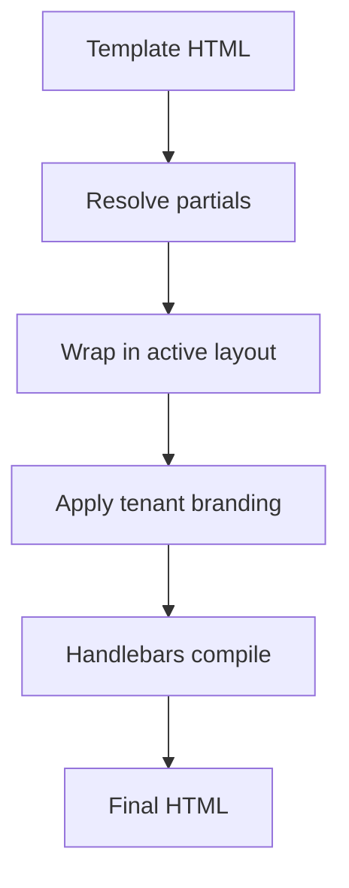

Os **layouts de email** envolvem todos os templates de email em uma estrutura HTML compartilhada (cabeçalho, rodapé, estilos). As **parciais** (partials) são fragmentos reutilizáveis do Handlebars referenciados em templates.

## Layouts

Os layouts definem a estrutura externa com um espaço para o conteúdo:

```html
<!DOCTYPE html>
<html>
  <body>
    
    <div class="content">{{{ content }}}</div>
    <footer>{{ branding.footerHtml }}</footer>
  </body>
</html>
```

Painel: **Templates → Layouts**. Um layout pode ser marcado como ativo por ambiente. As variáveis de marca do tenant são injetadas automaticamente quando um contexto de tenant é definido.

## Parciais (Partials)

Crie blocos reutilizáveis em **Templates → Partials**:

```html
<!-- partial: cta-button -->
<a href="{{ url }}" class="btn btn-primary">{{ label }}</a>
```

Referência em qualquer template de email:

```html
{{> cta-button url=data.checkoutUrl label="Complete purchase" }}
```

Altere a parcial uma vez — todos os templates que a utilizam são atualizados no próximo envio.

## Ordem de compilação



## Relacionado

- [Branding por tenant](/docs/platform/features/tenants)
- [API de layouts de email](/docs/api/email-layouts)
- [Plantilhas multi-idioma](/docs/platform/features/i18n)
