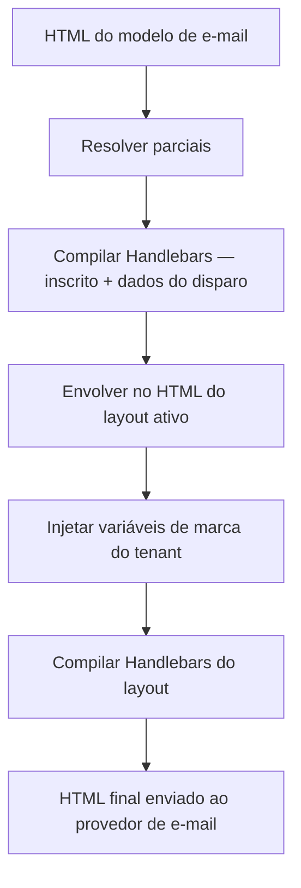

# Layouts de E-mail e Parciais

Os **layouts de e-mail** envolvem todos os modelos de e-mail em uma estrutura HTML compartilhada (cabeçalho, rodapé, estilos). As **parciais** (partials) são trechos reutilizáveis do Handlebars que podem ser referenciados em múltiplos modelos. Juntos, eles permitem manter uma identidade de marca consistente sem duplicar código HTML.

## Layouts de E-mail

Um layout define a estrutura HTML externa. O corpo do modelo compilado é injetado em `{{{ content }}}`:

```html
<!DOCTYPE html>
<html>
  <head>
    <meta charset="utf-8" />
    <style>
      /* seus estilos base */
    </style>
  </head>
  <body>
    <header>
      
    </header>
    <main>{{{ content }}}</main>
    <footer>{{{ footerHtml }}}</footer>
  </body>
</html>
```

<Callout type="info">
Use chaves triplas `{{{ content }}}` e `{{{ footerHtml }}}` para renderizar HTML sem escapar caracteres. Use chaves duplas `{{ logo }}` para strings de URL e outros valores escalares.
</Callout>

### Variáveis de Marca de Tenant em Layouts

Quando o disparo do seu workflow inclui um valor de `tenant`, os campos de marca do tenant são injetados diretamente no contexto do layout pelos seus nomes de campo:

| Variável de Layout   | Origem                         |
| :------------------- | :----------------------------- |
| `{{ logo }}`         | `tenant.branding.logo`         |
| `{{ primaryColor }}` | `tenant.branding.primaryColor` |
| `{{{ footerHtml }}}` | `tenant.branding.footerHtml`   |
| `{{ name }}`         | `tenant.name`                  |

Se nenhum tenant for definido no disparo, essas variáveis ficarão vazias e seu layout deve incluir valores alternativos padrão (fallbacks).

### Variáveis de Layout

Além do branding do tenant, você pode definir **variáveis estáticas personalizadas** no próprio layout (pares de chave-valor no painel de controle). Elas são mescladas ao contexto junto com o branding do tenant e os dados do inscrito.

## Parciais (Partials)

As parciais são trechos de HTML reutilizáveis registrados por nome. Crie-os em **Templates → Partials**:

```html
<!-- nome da parcial: cta-button -->
<a
  href="{{ url }}"
  style="display:inline-block; padding:12px 24px;
   background-color:{{ primaryColor }}; color:#fff; text-decoration:none;
   border-radius:4px;"
  >{{ label }}</a
>
```

Referencie em qualquer modelo ou layout de e-mail com:

```html
{{> cta-button url=data.checkoutUrl label="Complete purchase" }}
```

Altere a parcial uma única vez — todos os modelos que a utilizam serão atualizados no próximo envio.

## Ordem de Compilação



## Atribuir um Layout a um Workflow

No **Canvas do Workflow** no painel de controle:

1. Abra as configurações do workflow.
2. Selecione **Email Layout** — escolha entre os layouts do ambiente atual.
3. Salve — o layout se aplica a todas as etapas do canal de e-mail daquele workflow.

Um mesmo layout pode estar ativo em vários workflows. Alterar o HTML do layout atualiza todos os workflows que o utilizam no próximo envio.

## Relacionado

- [Marca por tenant](/docs/platform/features/tenants)
- [API de layouts de e-mail](/docs/api/email-layouts)
- [Modelos multilíngues](/docs/platform/features/i18n)
