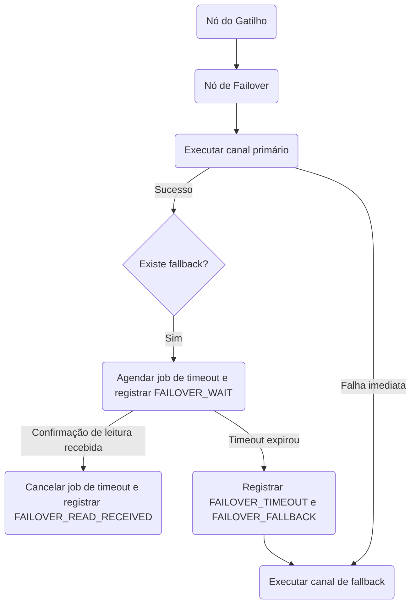

# Failover de Provedor

O nó de **Failover** garante que alertas críticos cheguem aos seus inscritos por meio da execução de ramificações alternativas de canais. O failover opera em dois modos: **failover imediato** em caso de falha do provedor e **failover com atraso (timeout)** se uma mensagem permanecer não lida.

## Configuração

Ao configurar um nó de Failover, especifique os seguintes parâmetros:

| Campo             | Tipo   | Obrigatório | Padrão | Descrição                                                                                       |
| :---------------- | :----- | :---------- | :----- | :---------------------------------------------------------------------------------------------- |
| `primaryChannel`  | string | ✅          | —      | Canal primário (por exemplo, `MOBILE_PUSH`, `EMAIL`)                                            |
| `fallbackChannel` | string | —           | —      | Canal de backup a ser usado se o primário falhar ou não for lido (por exemplo, `SMS`)           |
| `timeoutSeconds`  | number | —           | `120`  | Segundos a aguardar por uma confirmação de leitura antes de disparar o fallback (de 10 a 3600). |

## Caminhos de Execução

### 1. Failover Imediato (Queda do Provedor)

Se o envio pelo canal primário falhar (por exemplo, endereço de e-mail inválido ou erro de API do provedor) ou se o [disjuntor (circuit breaker)](/docs/platform/features/cost-reduction) do provedor primário estiver aberto:

- O Nexus registra a falha sob a etapa de ciclo de vida `FAILOVER_PRIMARY`.
- Se o circuito estiver aberto, o status é alterado para `FAILED_PROVIDER_DOWN` com o erro `provider_down`.
- O Nexus ignora imediatamente o tempo de espera e executa a etapa do `fallbackChannel`, registrando `FAILOVER_FALLBACK` com o motivo `circuit_open_primary` ou `primary_failed`.

### 2. Failover com Atraso (Alertas Não Lidos)

Se o canal primário realizar o envio com sucesso, mas houver um canal de fallback configurado:

1. **Agendar Monitoramento (Watch)**: O Nexus agenda um job atrasado no BullMQ chamado `failover:<logId>:<nodeId>` com o atraso configurado em `timeoutSeconds`.
2. **Gravar Metadados no Redis**: Os parâmetros de monitoramento são armazenados no Redis sob a chave `failover:meta:<logId>` (com tempo de vida TTL de `timeoutSeconds + 60`).
3. **Registrar WAIT**: A execução registra uma etapa de ciclo de vida `FAILOVER_WAIT` e altera o status do log para `QUEUED`.
4. **Resolução**:
   - **Caso A: Usuário lê a mensagem**: Se o usuário abrir ou ler a notificação antes do timeout, o evento de leitura vindo do WebSocket ou do SDK invocará `acknowledgeFailoverWatch`. Isso remove o job agendado no BullMQ, limpa os metadados do Redis, registra `FAILOVER_READ_RECEIVED` e retoma a execução subsequente do fluxo imediatamente.
   - **Caso B: Timeout expira**: Se o tempo limite expirar sem que haja uma confirmação de leitura (estados `READ` ou `OPENED`), o worker registrará `FAILOVER_TIMEOUT` e `FAILOVER_FALLBACK` (motivo: `read_timeout`), despachando em seguida o `fallbackChannel`.

## Testes com Modo Caos (Chaos Mode)

Para testar seus fluxos de failover sem a necessidade de simular quedas de provedores reais:

1. Navegue até **Integrations** no painel de controle.
2. Ative o **Chaos Mode** no provedor primário.
3. Dispare um workflow. O provedor simulará uma falha, e você poderá visualizar o failover imediato em execução em tempo real nos logs de auditoria do painel.

## Relacionado

- [Redução de custos e disjuntores (circuit breakers)](/docs/platform/features/cost-reduction)
- [Simulador Sandbox](/docs/platform/features/sandbox)
- [Workflow-as-code](/docs/sdk/workflow/workflow-as-code)
