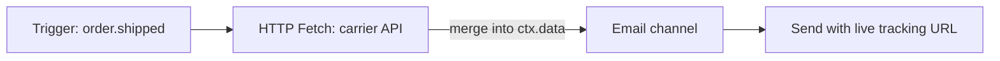

O nó **HTTP Fetch** faz uma solicitação HTTP durante a execução do fluxo de trabalho e mescla a resposta no contexto do workflow para as etapas seguintes.

## Por que buscar no momento do envio

Sem o HTTP Fetch, todos os dados devem ser passados no momento do disparo (trigger). Isso leva a valores desatualizados (URLs de rastreamento que mudam) ou payloads inflados. Busque dados dinâmicos quando a notificação for realmente enviada.



## Configuração

| Campo         | Descrição                                                                                      |
| ------------- | ---------------------------------------------------------------------------------------------- |
| `url`         | URL da solicitação — suporta Handlebars: `https://api.carrier.com/track/{{ data.trackingId }}` |
| `method`      | `GET` ou `POST`                                                                                |
| `headers`     | Pares opcionais de cabeçalho de chave-valor                                                    |
| `body`        | Template de corpo de POST (Handlebars)                                                         |
| `responseKey` | Chave de contexto para armazenar o JSON analisado (padrão: mesclado em `data`)                 |

## Exemplo

Busque o status de envio mais recente antes do email:

```
URL:    https://api.shipping.com/v1/shipments/{{ data.shipmentId }}
Method: GET
responseKey: shipment
```

Template de email:

```html
<p>Status: {{ shipment.status }}</p>
<a href="{{ shipment.trackingUrl }}">Rastrear pacote</a>
```

## Tratamento de erros

- Timeout configurável (padrão do worker)
- Buscas com falha são registradas no ciclo de vida da execução; configure caminhos de fallback com [condições de etapa](/docs/platform/features/step-conditions) ou nós de failover
- Lista de permissões (allowlist) de domínios por ambiente (segurança)

## Workflow-as-code

```ts
import { defineWorkflow } from "@nexus-signal/node";

defineWorkflow("order.shipped")
  .addHttpFetch({
    url: "https://api.carrier.com/track/{{ data.trackingId }}",
    method: "GET",
    responseKey: "tracking",
  })
  .addChannel("EMAIL");
```

## Relacionado

- [Workflows](/docs/platform/concepts/workflows)
- [Workflow-as-code](/docs/sdk/workflow/workflow-as-code)
