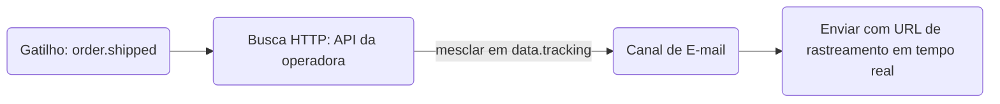

# Nó HTTP Fetch

O nó **HTTP Fetch** realiza uma solicitação HTTP externa durante a execução do workflow e mescla a resposta JSON ao contexto `data` do workflow. As etapas seguintes — modelos, condições e nós de IA — podem referenciar os dados buscados como `{{ data.<responseKey>.<field> }}`.

## Por que Buscar no Momento do Envio

Passar todos os dados no momento do disparo (trigger) possui limitações:

- As URLs de rastreamento podem mudar entre o disparo e a entrega.
- O status do pedido pode ser atualizado nos segundos entre a chamada de API e o envio da notificação.
- Payloads de disparo inflados com dados que podem nunca ser usados.

O HTTP Fetch resolve isso buscando dados em tempo real exatamente no momento em que a notificação está sendo montada.



## Configuração

| Campo         | Tipo             | Obrigatório | Descrição                                                                                                   |
| :------------ | :--------------- | :---------- | :---------------------------------------------------------------------------------------------------------- |
| `url`         | string           | ✅          | URL de solicitação — suporta Handlebars: `https://api.carrier.com/track/{{ data.trackingId }}`              |
| `method`      | `GET` \| `POST`  | —           | Método HTTP. O padrão é `GET`                                                                               |
| `headers`     | `{key, value}[]` | —           | Pares de cabeçalhos de chave-valor opcionais. Suporta Handlebars tanto no campo de chave quanto no de valor |
| `body`        | string           | —           | Modelo de corpo do POST (Handlebars). Enviado apenas para solicitações `POST`                               |
| `responseKey` | string           | —           | Nome da chave de contexto para armazenar a resposta JSON sob `data.*`. O padrão é `fetched`                 |

<Callout type="info">
  **`responseKey` Padrão**: Se você não especificar um `responseKey`, a resposta será armazenada sob
  `data.fetched`. A chave deve começar com uma letra e conter apenas letras, números e sublinhados
  (underscores).
</Callout>

## Limites

| Propriedade                            | Valor            |
| :------------------------------------- | :--------------- |
| Tempo limite de solicitação (timeout)  | 10 segundos      |
| Tamanho máximo da resposta             | 50 KB            |
| Comprimento máximo da URL              | 2.048 caracteres |
| Limite de cabeçalhos personalizados    | 10               |
| Tamanho máximo do corpo da solicitação | 10 KB            |

## Exemplo: Buscar Status de Envio em Tempo Real

**Configuração do nó:**

```
URL:         https://api.shipping.com/v1/shipments/{{ data.shipmentId }}
Method:      GET
responseKey: shipment
```

**Modelo de E-mail** (etapa seguinte):

```html
<p>Status: {{ data.shipment.status }}</p>
<a href="{{ data.shipment.trackingUrl }}">Rastrear pacote →</a>
```

<Callout type="warn">
Os dados buscados estarão sempre disponíveis como `data.<responseKey>` — e não diretamente como `{{ responseKey }}`. Isso ocorre porque todos os dados do disparo, incluindo os resultados do HTTP Fetch, são armazenados sob o namespace `data` no contexto do modelo.
</Callout>

## Tratamento de Erros

- Se a solicitação **expirar (timeout)** após 10 segundos, a execução continuará com `data.<responseKey>` definido como `null`
- Se o corpo da resposta **não puder ser analisado como JSON**, ele será armazenado como `{ "_raw": "<conteúdo em texto>" }`
- Buscas que falham registram `HTTP_FETCH_FAILED` no ciclo de vida da execução; configure caminhos de fallback com [condições de etapa](/docs/platform/features/step-conditions)
- A **lista de permissões (allowlist) de domínios** está disponível por ambiente para configurações focadas em segurança

## Workflow-as-code

```ts
import { defineWorkflow } from '@nexus-signal/node';

defineWorkflow('order.shipped')
  .addHttpFetch({
    url: 'https://api.carrier.com/track/{{ data.trackingId }}',
    method: 'GET',
    responseKey: 'tracking',
  })
  .addChannel('EMAIL')
  .toDefinition();
```

O modelo de e-mail para este workflow poderá referenciar `{{ data.tracking.estimatedDelivery }}`, `{{ data.tracking.status }}`, etc.

## Ramificação Condicional com Dados Buscados

Use [condições de etapa](/docs/platform/features/step-conditions) em um nó posterior para ramificar o fluxo com base no retorno da busca:

```json
{
  "logic": "AND",
  "rules": [{ "variable": "data.tracking.status", "operator": "equals", "value": "DELAYED" }]
}
```

Anexe isso a um nó de SMS para enviar um alerta de atraso somente quando a operadora relatar um atraso.

## Relacionado

- [Workflows](/docs/platform/concepts/workflows)
- [Condições de etapa](/docs/platform/features/step-conditions)
- [Nó de workflow de IA](/docs/platform/features/ai-workflow-node)
- [Workflow-as-code](/docs/sdk/workflow/workflow-as-code)
