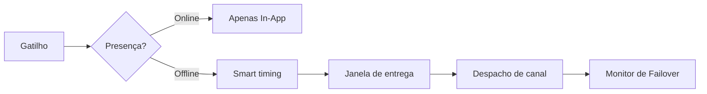

<Cards>
  <Card title="Redução de custos" href="/docs/platform/features/cost-reduction" description="Supressão de presença, sandbox, roteamento ponderado." />
  <Card title="Smart send-time" href="/docs/platform/features/smart-send-time" description="Entrega em horário de pico com IA por inscrito." />
  <Card title="Conteúdo com IA" href="/docs/platform/features/ai-content" description="Gere textos para todos os canais com um único prompt." />
  <Card title="Análise de custos" href="/docs/platform/features/cost-analytics" description="Rastreamento de gastos e alertas de orçamento." />
  <Card title="Janelas de entrega" href="/docs/platform/features/delivery-windows" description="Horários de silêncio com base no fuso horário." />
  <Card title="Modelos i18n" href="/docs/platform/features/i18n" description="Multilíngue a partir de um único fluxo." />
  <Card title="Digest e Throttle" href="/docs/platform/features/digest-throttle" description="Agrupamento de alertas e limites de taxa." />
  <Card title="Failover" href="/docs/platform/features/failover" description="Fallback automático de canal." />
  <Card title="Tópicos" href="/docs/platform/features/topics" description="Assinaturas baseadas em categorias." />
  <Card title="Agendamentos" href="/docs/platform/features/schedules" description="Gatilhos cron e avulsos." />
  <Card title="Sandbox" href="/docs/platform/features/sandbox" description="Teste sem gastos com provedores reais." />
</Cards>

## Nexus vs Plataformas Típicas

| Recurso | Nexus | Infraestrutura Típica |
|---------|-------|---------------|
| Supressão por presença | Sim | Raro |
| Envio inteligente com IA | Sim | Raro |
| Análise de custos de provedores | Sim | Não |
| BYOP markup zero | Sim | Frequentemente embutido |
| Geração de conteúdo por IA | Sim | Não |

## Como os recursos se conectam

