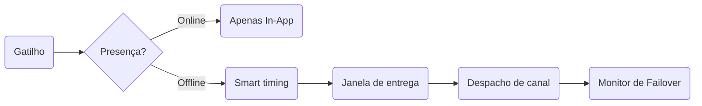

# Recursos

## Entrega e Confiabilidade

<Cards>
  <Card
    title="Redução de custos"
    href="/docs/platform/features/cost-reduction"
    description="Supressão de presença, sandbox, roteamento ponderado."
  />
  <Card
    title="Smart send-time"
    href="/docs/platform/features/smart-send-time"
    description="Entrega no horário de pico do inscrito baseada em IA."
  />
  <Card
    title="Janelas de entrega"
    href="/docs/platform/features/delivery-windows"
    description="Horários de silêncio cientes do fuso horário."
  />
  <Card
    title="Digest e Throttle"
    href="/docs/platform/features/digest-throttle"
    description="Agrupamento de alertas, limites de taxa."
  />
  <Card
    title="Failover"
    href="/docs/platform/features/failover"
    description="Fallback automático de canal."
  />
  <Card
    title="Sandbox"
    href="/docs/platform/features/sandbox"
    description="Teste sem gastos com provedores reais."
  />
</Cards>

## Inteligência de Workflow

<Cards>
  <Card
    title="Condições de etapa"
    href="/docs/platform/features/step-conditions"
    description="Regras booleanas em qualquer nó do workflow."
  />
  <Card
    title="Nó HTTP Fetch"
    href="/docs/platform/features/http-fetch-node"
    description="Dados de API em tempo real no meio do workflow."
  />
  <Card
    title="Nó de workflow de IA"
    href="/docs/platform/features/ai-workflow-node"
    description="Classificação e redação de texto por LLM em tempo de execução."
  />
  <Card
    title="Conteúdo com IA"
    href="/docs/platform/features/ai-content"
    description="Gere textos de modelos a partir de um prompt."
  />
</Cards>

## Mensagens de Produto

<Cards>
  <Card
    title="Objetos e suscrições"
    href="/docs/platform/features/objects-subscriptions"
    description="Envio em leque para todos os observadores de uma entidade."
  />
  <Card
    title="Audiências"
    href="/docs/platform/features/audiences"
    description="Segmentos dinâmicos de inscritos."
  />
  <Card
    title="Broadcasts"
    href="/docs/platform/features/broadcasts"
    description="Envios únicos a partir do painel de controle."
  />
  <Card
    title="Guias no produto"
    href="/docs/platform/features/guides"
    description="Banners, modais, tooltips."
  />
  <Card
    title="Marca por tenant"
    href="/docs/platform/features/tenants"
    description="White-label para clientes de SaaS B2B."
  />
  <Card
    title="Caixa de entrada rica"
    href="/docs/platform/features/rich-inbox"
    description="Abas, ações, atores, filtros por tag."
  />
</Cards>

## Conteúdo e Localização

<Cards>
  <Card
    title="Arquivos de tradução"
    href="/docs/platform/features/translations"
    description="Strings de localidade compartilhadas com {{ t 'key' }}."
  />
  <Card
    title="Layouts de e-mail e parciais"
    href="/docs/platform/features/email-layouts"
    description="Estruturas compartilhadas e blocos HTML reutilizáveis."
  />
  <Card
    title="Modelos multilíngues"
    href="/docs/platform/features/i18n"
    description="Variantes de localidade por canal."
  />
</Cards>

## Organização e Analytics

<Cards>
  <Card
    title="Tópicos"
    href="/docs/platform/features/topics"
    description="Grupos de preferências baseados em categorias."
  />
  <Card
    title="Agendamentos"
    href="/docs/platform/features/schedules"
    description="Gatilhos cron e disparos únicos."
  />
  <Card
    title="Análise de custos"
    href="/docs/platform/features/cost-analytics"
    description="Rastreamento de gastos e alertas de orçamento."
  />
</Cards>

## Nexus vs Plataformas Típicas

| Recurso                   | Nexus | Infraestrutura Típica   |
| :------------------------ | :---- | :---------------------- |
| Envio em leque de objetos | Sim   | Raro                    |
| Broadcasts pelo painel    | Sim   | Apenas Enterprise       |
| Nós HTTP Fetch / IA       | Sim   | Raro                    |
| Marca por tenant          | Sim   | Apenas Enterprise       |
| MCP + CLI                 | Sim   | Novidade em 2025+       |
| BYOP sem markup           | Sim   | Frequentemente embutido |

## Como os Recursos se Conectam

```mermaid
flowchart LR
  T(Gatilho) --> P{Presença?}
  P -->|Online| I(Apenas In-App)
  P -->|Offline| S(Smart timing)
  S --> W(Janela de entrega)
  W --> C(Despacho de canal)
  C --> F(Monitor de Failover)
```
