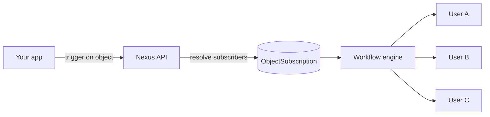

Os **objetos** são entidades de primeira classe (projetos, documentos, pedidos, canais) que os usuários assinam. Dispare um workflow com um destinatário de objeto e o Nexus envia em leque (fan-out) para todos os assinantes automaticamente.

## Por que os objetos são importantes

Sem objetos, cada trigger exige que seu backend consulte "quem está observando isso?" e passe uma lista completa de destinatários. Os objetos movem esse relacionamento para o Nexus.



## Criar um objeto

Painel: página **Objects**, ou API/SDK:

```ts
await nexus.objects.set({
  collection: "projects",
  externalId: "proj_alpha",
  name: "Project Alpha",
  properties: { status: "active", owner: "team-eng" },
});
```

As propriedades do objeto estão disponíveis em templates como `{{ object.name }}`, `{{ object.properties.status }}`.

## Gerenciar assinaturas

```ts
await nexus.objects.addSubscriptions("projects", "proj_alpha", {
  recipients: ["user_alice", "user_bob"],
});

await nexus.objects.removeSubscriptions("projects", "proj_alpha", ["user_bob"]);
```

## Disparar com envio em leque de objeto

Passe um objeto em vez de usuários individuais:

```ts
await nexus.workflows.trigger({
  workflowName: "project.updated",
  recipients: [{ collection: "projects", id: "proj_alpha" }],
  data: { changeType: "milestone_completed" },
});
```

O worker resolve todos os assinantes inscritos e executa o fluxo de trabalho para cada um.

## Preferências por objeto

Os assinantes podem silenciar um objeto específico enquanto mantêm outros ativos. As preferências são delimitadas no JSON de `preferences` do assinante sob as chaves do objeto.

## Relacionado

- [Guia de envio em leque de objetos](/docs/platform/guides/object-fanout)
- [API de Objetos](/docs/api/objects)
- [Objetos do Node SDK](/docs/sdk/backend/node)
