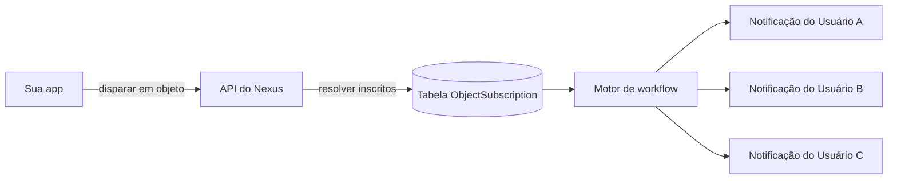

# Objetos e Suscrições

Os **Objetos** são entidades de primeira classe no Nexus — como projetos, documentos, pedidos ou qualquer recurso que seus usuários acompanhem. Quando você dispara um workflow com um objeto como destinatário, o Nexus resolve automaticamente todos os inscritos (subscribers) e executa o workflow para cada um deles.

## O Problema que os Objetos Resolvem

Sem os objetos, cada disparo em leque exige que seu backend execute as seguintes etapas:

1. Consultar seu banco de dados para responder: "Quem está acompanhando este recurso?"
2. Construir uma lista de IDs de destinatários.
3. Transmitir essa lista completa a cada chamada de gatilho.

Os objetos movem esse relacionamento para dentro do Nexus, permitindo que um único disparo entregue as notificações a todos os observadores de forma automática.



## Conceitos

| Termo                        | Descrição                                                                             |
| :--------------------------- | :------------------------------------------------------------------------------------ |
| **Collection (Coleção)**     | Um agrupamento lógico de tipos (por exemplo, `"projects"`, `"orders"`, `"channels"`). |
| **Object (Objeto)**          | Uma entidade única dentro de uma coleção, identificada por um `externalId`.           |
| **Subscription (Suscrição)** | Uma associação de um inscrito a um objeto com propriedades opcionais.                 |

## Criar ou Atualizar um Objeto

Os objetos passam por upsert — chamar `set` usando um `externalId` existente atualizará seus campos.

**Node SDK:**

```ts
await nexus.objects.set({
  collection: 'projects',
  externalId: 'proj_alpha',
  name: 'Project Alpha',
  properties: { status: 'active', owner: 'team-eng' },
});
```

**API de Gerenciamento (lado do servidor, chave `sk_*`):**

```http
PUT /v1/management/objects/projects/proj_alpha
Authorization: Bearer sk_prd_…
Content-Type: application/json

{
  "name": "Project Alpha",
  "properties": { "status": "active", "owner": "team-eng" }
}
```

<Callout type="info">
  **Nota sobre variáveis**: Como os objetos são resolvidos e desduplicados para os perfis dos
  inscritos no momento do disparo, as propriedades específicas do objeto não ficam automaticamente
  disponíveis nos contextos das variáveis dos modelos. Para exibir detalhes do objeto (como o nome
  ou status de um projeto) em suas notificações, passe-os no payload `data` do disparo.
</Callout>

## Gerenciar Suscrições

**Adicionar inscritos a um objeto:**

```ts
await nexus.objects.addSubscriptions('projects', 'proj_alpha', {
  recipients: ['user_alice', 'user_bob'],
  // ou: recipients: [{ externalId: 'user_alice' }]
});
```

**Remover inscritos de um objeto:**

```ts
await nexus.objects.removeSubscriptions('projects', 'proj_alpha', ['user_bob']);
```

<Callout type="info">
  Os destinatários já devem existir como **inscritos** no mesmo ambiente antes de poderem ser
  adicionados a um objeto. Use `nexus.subscribers.identify()` primeiro caso ainda não os tenha
  criado.
</Callout>

O campo `recipients` aceita strings simples de `externalId` ou objetos no formato `{ externalId: string }`.

## Disparar com Envio em Leque de Objeto

Passe um destinatário do tipo objeto usando `{ collection, id }` em sua chamada de disparo:

```ts
await nexus.workflows.trigger({
  workflowName: 'project.updated',
  recipients: [{ collection: 'projects', id: 'proj_alpha' }],
  data: { changeType: 'milestone_completed', updatedBy: 'sarah' },
});
```

O worker do workflow resolve todos os inscritos ativos de `proj_alpha` e executa uma instância do workflow para cada um. O contexto do inscrito (`subscriber.email`, `subscriber.locale`, etc.) fica disponível normalmente nos modelos.

## Mesclar Objetos e Inscritos

Uma única chamada de disparo pode incluir tanto objetos quanto inscritos individuais:

```ts
await nexus.workflows.trigger({
  workflowName: 'project.updated',
  recipients: [
    { collection: 'projects', id: 'proj_alpha' }, // envio em leque para todos os observadores
    { externalId: 'admin_user' }, // indivíduo explícito
  ],
  data: { changeType: 'status_change' },
});
```

## Propriedades de Suscrição por Objeto

Ao adicionar inscritos, você pode armazenar metadados específicos da assinatura:

```ts
await nexus.objects.addSubscriptions('projects', 'proj_alpha', {
  recipients: ['user_alice'],
  properties: { role: 'owner', notifyOnAll: true },
});
```

## Preferências por Objeto

Os inscritos podem silenciar um objeto específico enquanto mantêm as notificações ativas para outros. A preferência é delimitada sob a chave do objeto na matriz de preferências do inscrito — nenhuma alteração de código é necessária do seu lado.

## Limites da API

| Limite                                                 | Valor                  |
| :----------------------------------------------------- | :--------------------- |
| Máximo de objetos por ambiente                         | Configurável por plano |
| Máximo de suscrições por objeto                        | Configurável por plano |
| Máximo de destinatários por chamada `addSubscriptions` | 100                    |

## Relacionado

- [Guia de envio em leque de objetos](/docs/platform/guides/object-fanout)
- [API de Objetos](/docs/api/objects)
- [Node SDK](/docs/sdk/backend/node)
- [Broadcasts](/docs/platform/features/broadcasts)
