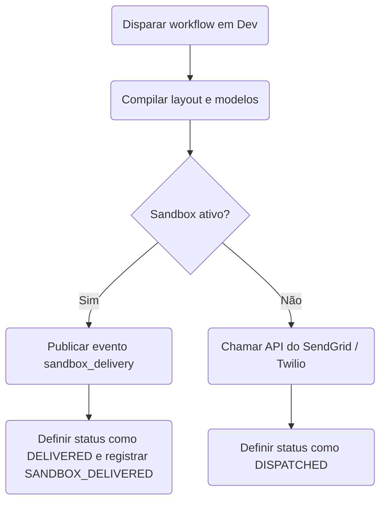

# Modo Sandbox

O **Modo Sandbox** é ativado automaticamente para todos os canais externos no ambiente de **Desenvolvimento** (Development). Em vez de fazer chamadas de API de saída para provedores como SendGrid ou Twilio, o Nexus intercepta o despacho e o encaminha por meio de um simulador de sandbox.

---

## Como o Simulador Sandbox Funciona

1. Quando um workflow atinge uma etapa de canal (por exemplo, e-mail, SMS, push, webhook), o contexto de execução é avaliado.
2. O compilador detecta que o nome do ambiente é `development` (`ctx.sandboxMode = true`).
3. O despacho de saída é roteado para o **Provedor Sandbox** (`sandbox`) em vez de integrações reais de operadoras.
4. O simulador publica um evento em tempo real do tipo `sandbox_delivery` no canal de pub/sub do Redis.
5. O log de execução atualiza o status diretamente para **`DELIVERED`** (em vez de `DISPATCHED`) e anexa a etapa de ciclo de vida `SANDBOX_DELIVERED`.
6. O corpo do payload compilado, linha de assunto e propriedades brutas são salvos em `responseMeta.outbound` com a marcação `sandbox: true`.



---

## Console Sandbox do Painel de Controle

Você pode visualizar e testar as entregas do sandbox no painel de controle:

1. Navegue até **Activities → Sandbox** no painel de controle.
2. A página estabelece uma conexão WebSocket e escuta por eventos do tipo `sandbox_delivery`.
3. Você visualizará simulações em tempo real de:
   - Balões de SMS contendo o corpo da mensagem em formato bruto.
   - Telas de HTML exibindo os e-mails compilados.
   - Banners de notificações push.
   - Payloads do Slack e MS Teams.

Isso permite testar a tipografia, a substituição de variáveis do Handlebars, as parciais de layouts e os fluxos de lógica em tempo real, tudo sem incorrer em custos com os provedores reais.

---

## Modo Caos (Testes de Indisponibilidade)

Simule a indisponibilidade das APIs dos provedores diretamente no seu ambiente de desenvolvimento para testar como seus workflows lidam com quedas:

1. Navegue até **Integrations** no painel de controle.
2. Selecione qualquer cartão de integração e ative o **Chaos Mode** para a opção `on` (isso configura `environment.chaosMode = true`).
3. Quando você dispara um workflow em desenvolvimento, o despachante do provedor intercepta a chamada e força um erro de simulação `503 Service Unavailable`, retornando:
   ```json
   { "error": "Chaos mode simulated failure" }
   ```
4. Isso aciona os caminhos de [failover](/docs/platform/features/failover) do workflow ou os disjuntores de resiliência imediatamente, permitindo que você depure as ramificações de fallback no log de auditoria.

## Comportamentos por Ambiente

| Canal                 | Desenvolvimento (Sandbox)  | Homologação / Produção         |
| :-------------------- | :------------------------- | :----------------------------- |
| **In-App Inbox**      | Entrega real via WebSocket | Entrega real via WebSocket     |
| **E-mail**            | Sandbox (simulado)         | Envio real via SMTP / API      |
| **SMS e WhatsApp**    | Sandbox (simulado)         | Envio real via Twilio / Sinch  |
| **Push Mobile e Web** | Sandbox (simulado)         | Envio real via FCM / APNs      |
| **Webhooks e Chat**   | Sandbox (simulado)         | Envio real via Slack / Discord |

---

## Relacionado

- [Ambientes](/docs/platform/getting-started/environments)
- [Failover de provedor](/docs/platform/features/failover)
- [Início Rápido](/docs/platform/getting-started/quickstart)
