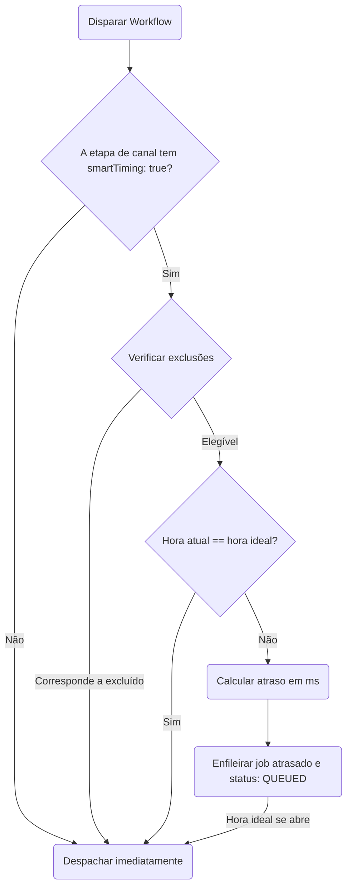

O **Smart Send-Time** é um recurso de aprendizado de máquina (machine learning) que descobre em qual momento cada inscrito tem maior probabilidade de ler ou abrir as mensagens. Ele atrase o envio automaticamente até a hora local de pico do inscrito, aumentando as taxas de leitura e minimizando a fadiga de notificações.

---

## Como Funciona

1. **Rastrear o Engajamento**: O Nexus monitora os eventos `READ` e `OPENED` nos logs de execução de cada inscrito (com análise retrospectiva de 60 dias).
2. **Calcular a Matriz de Pontuação**: Um serviço de pontuação em segundo plano recalcula uma matriz de engajamento horário (24 horas × 7 dias) no fuso horário local do inscrito a cada **6 horas**.
3. **Salvar no Redis**: A hora de pico de engajamento calculada é armazenada no Redis sob a chave `engagement:scores:<subscriberId>`.
4. **Avaliar no Envio**: Quando uma etapa de canal com o agendamento inteligente ativado é executada:
   - Se a hora atual já for a hora ideal, a execução continua imediatamente, registrando `SMART_TIMING_PASS` com o motivo `already_optimal`.
   - Se não for a hora ideal, o Nexus calcula os milissegundos restantes até o próximo evento daquela hora, agenda um job atrasado no BullMQ chamado `smartTiming:<logId>:<nodeId>`, altera o status do log para `QUEUED` e registra `SMART_TIMING_HOLD`.



---

## Exclusões e Alternativas (Fallbacks)

### Hora Padrão (Fallback Hour)

Se um inscrito não possuir histórico de engajamento suficiente (menos de **5 eventos registrados**), o modelo de envio adota o valor padrão de **10:00 da manhã no horário local** (registrando o motivo `fallback`).

### Exclusões de Execução

O agendamento inteligente é desativado de forma automática para:

- **Canais excluídos**: As etapas de In-App (`IN_APP`) e Webhook (`WEBHOOK`) são entregues imediatamente.
- **Estruturas de workflow**: Qualquer workflow que contenha um nó de [Janela de Entrega](/docs/platform/features/delivery-windows) em qualquer ponto de seu canvas é excluído da otimização inteligente de horário.
- **Gatilhos agendados**: Workflows iniciados a partir de agendamentos cron.
- **Sinalização aplicada**: Se o agendamento inteligente já tiver sido aplicado anteriormente na mesma execução de workflow.

---

## Configuração no Canvas

Para ativar o horário de envio inteligente:

1. Clique em qualquer nó de canal (Email, SMS, Push, WhatsApp, Chat) no canvas do workflow.
2. Na barra lateral direita, ative o botão **AI Send Time**.
3. Salve o workflow.

## Exemplo de Workflow-as-code

Nas definições de TypeScript, passe `smartTiming: true` na configuração do canal:

```ts
import { defineWorkflow } from '@nexus-signal/node';

defineWorkflow('marketing.newsletter')
  .addChannel('EMAIL', {
    smartTiming: true,
  })
  .toDefinition();
```

## Relacionado

- [Janelas de entrega](/docs/platform/features/delivery-windows) — horários estáticos de silêncio (as janelas de entrega têm precedência se ambas estiverem definidas no workflow)
- [Redução de custos](/docs/platform/features/cost-reduction) — combine o agendamento inteligente com a supressão de presença
- [API de Inscritos](/docs/api/subscribers) — configurando fusos horários de inscritos
