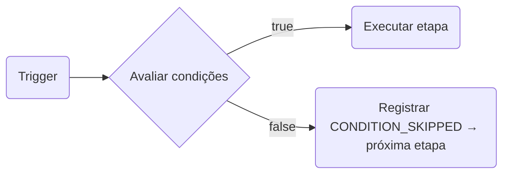

# Condições de Etapa

As **condições de etapa** permitem anexar regras de filtro a qualquer nó no canvas do workflow. Se as condições forem avaliadas como `false`, a etapa será **ignorada** (skipped) e a execução continuará para o próximo nó — nenhum erro é gerado, nenhuma nova tentativa ocorre.

## Como as Condições Funcionam

Quando o mecanismo de workflow atinge uma etapa que possui condições configuradas, ele avalia todas as regras em relação ao contexto de execução ativa **antes** de executar a etapa. As etapas ignoradas são registradas com `CONDITION_SKIPPED` na árvore do ciclo de vida da execução.



## Estrutura da Condição

```json
{
  "logic": "AND",
  "rules": [
    { "variable": "data.amount", "operator": "greater_than", "value": 500 },
    { "variable": "subscriber.locale", "operator": "equals", "value": "en" }
  ]
}
```

- `logic`: `"AND"` (todas as regras devem ser válidas) ou `"OR"` (basta que uma única regra seja válida)
- `rules`: Array de objetos de regra, cada um contendo `variable`, `operator` e `value`

## Namespaces de Variáveis Suportados

As variáveis são resolvidas a partir do contexto de execução ativa no momento em que a etapa é executada. Isso significa que dados enriquecidos por etapas anteriores (como o retorno de um HTTP Fetch) estão disponíveis.

| Namespace      | Exemplos de variáveis                                            | Origem                                                     |
| :------------- | :--------------------------------------------------------------- | :--------------------------------------------------------- |
| `data.*`       | `data.amount`, `data.plan`, `data.status`                        | Payload do gatilho + retorno do HTTP Fetch / Nó de IA      |
| `subscriber.*` | `subscriber.email`, `subscriber.locale`, `subscriber.externalId` | Registro do inscrito                                       |
| `env.*`        | `env.name`                                                       | Nome do ambiente atual (`development`, `production`, etc.) |

<Callout type="warn">
  Apenas `data.*`, `subscriber.*` e `env.*` são suportados. Variáveis como `tenant.*` ou `object.*`
  não são resolvidas nas condições de etapa.
</Callout>

## Operadores Suportados

| Operador                 | Funciona em         | Descrição                                                      |
| :----------------------- | :------------------ | :------------------------------------------------------------- |
| `equals`                 | String, número      | Igualdade estrita de strings após coerção                      |
| `not_equals`             | String, número      | Negação de `equals`                                            |
| `greater_than`           | Número              | Comparação `>`                                                 |
| `greater_than_or_equals` | Número              | Comparação `>=`                                                |
| `less_than`              | Número              | Comparação `<`                                                 |
| `less_than_or_equals`    | Número              | Comparação `<=`                                                |
| `contains`               | String              | Correspondência de substring                                   |
| `not_contains`           | String              | Correspondência de substring invertida                         |
| `starts_with`            | String              | Correspondência de prefixo                                     |
| `ends_with`              | String              | Correspondência de sufixo                                      |
| `is_empty`               | String, array, null | `null`, `""` ou `[]`                                           |
| `is_not_empty`           | String, array, null | Não vazio                                                      |
| `in_list`                | String              | O valor está em uma lista separada por vírgulas ou em um array |
| `not_in_list`            | String              | O valor não está na lista                                      |
| `regex_match`            | String              | Testa em relação a uma expressão regular                       |
| `is_true`                | Booleano            | `true`, `"true"` ou `1`                                        |
| `is_false`               | Booleano            | `false`, `"false"`, `0` ou `null`                              |

## Uso no Canvas

1. Clique em qualquer nó no canvas do workflow.
2. Abra o painel **Conditions** na barra lateral direita.
3. Adicione regras usando o seletor de campos, o menu suspenso de operadores e o campo de valor.
4. Escolha a lógica **AND** ou **OR**.

As regras entram em vigor no próximo disparo do workflow — nenhuma nova implantação é necessária.

## Usando Condições com Dados Dinâmicos

Após uma etapa de **HTTP Fetch** ou **Nó de IA**, seus retornos ficam disponíveis sob `data.*` para condições seguintes. Por exemplo, se uma etapa de HTTP Fetch usar `responseKey: "invoice"`, você pode condicionar uma etapa de e-mail ao `data.invoice.status`:

```json
{
  "logic": "AND",
  "rules": [{ "variable": "data.invoice.status", "operator": "equals", "value": "overdue" }]
}
```

## Exemplo de Workflow-as-Code

```ts
import { defineWorkflow } from '@nexus-signal/node';

defineWorkflow('invoice.reminder')
  .addChannel('EMAIL')
  .addChannel('SMS', {
    conditions: {
      logic: 'AND',
      rules: [
        { variable: 'data.amount', operator: 'greater_than', value: 500 },
        { variable: 'subscriber.locale', operator: 'equals', value: 'en' },
      ],
    },
  })
  .toDefinition();
```

A opção `conditions` está disponível em todos os métodos de criação de etapas: `addChannel`, `addDelay`, `addDigest`, `addThrottle`, `addHttpFetch` e `addAiNode`.

## Relacionado

- [Workflows](/docs/platform/concepts/workflows)
- [Nó de Busca HTTP](/docs/platform/features/http-fetch-node)
- [Nó de Fluxo de IA](/docs/platform/features/ai-workflow-node)
- [Workflow-as-code](/docs/sdk/workflow/workflow-as-code)
