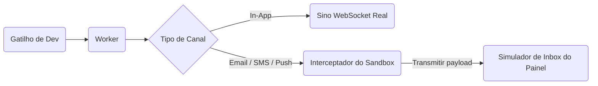
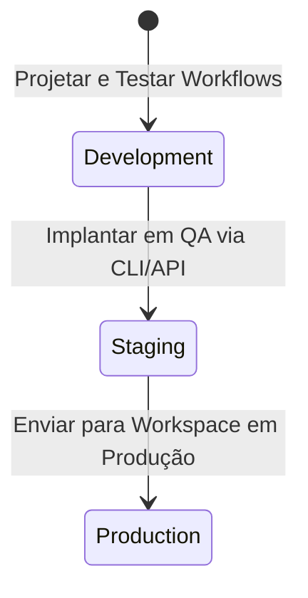

# Ambientes e Escopos

Cada espaço de trabalho (workspace) do Nexus Signal é dividido em **três ambientes completamente isolados**: **Development**, **Staging** e **Production**.

Cada ambiente opera como uma partição lógica independente de banco de dados, o que significa que os workflows, modelos, inscritos, preferências, tópicos e configurações de tenants **não cruzam essas fronteiras**.

---

## Matriz de Ambientes

| Recurso                      | Development                                                 | Staging                                                 | Production                                         |
| :--------------------------- | :---------------------------------------------------------- | :------------------------------------------------------ | :------------------------------------------------- |
| **Chaves de API**            | `pk_dev_*` / `sk_dev_*`                                     | `pk_stg_*` / `sk_stg_*`                                 | `pk_prd_*` / `sk_prd_*`                            |
| **Envio de Saída**           | **Interceptação do Sandbox** (APIs de operadoras simuladas) | Envio por operadoras reais (Postmark, Twilio, SendGrid) | Envio por operadoras reais (Usuários reais)        |
| **Entrega In-App**           | WebSockets ao vivo para sessões ativas de clientes          | WebSockets ao vivo para sessões ativas de clientes      | WebSockets ao vivo para sessões ativas de clientes |
| **Escopo do Banco de Dados** | Isolado                                                     | Isolado                                                 | Isolado                                            |
| **Modo Caos (Failover)**     | Habilitado (Permite simular indisponibilidade do provedor)  | Desabilitado                                            | Desabilitado                                       |

---

## Modo de Desenvolvimento e Sandbox

O ambiente de **Development** foi projetado para integrações locais e testes automatizados.

Para economizar créditos de operadoras e evitar o envio acidental de mensagens para usuários reais durante o desenvolvimento, os nós de saída (E-mail, SMS, Push, WhatsApp, plataformas de Chat) são direcionados diretamente para um **sandbox virtual** em vez de realizar chamadas para as APIs externas dos provedores.

- **Simulador de Inbox**: No painel de controle, você pode visualizar o HTML completamente compilado, o texto do SMS ou o payload JSON como apareceriam para o usuário.
- **Ignorar o Sandbox**: Se precisar testar uma entrega real em Desenvolvimento (por exemplo, testar um layout de e-mail real no seu cliente), ative a opção **Integrations → Development Integrations → Bypass Sandbox** para esse provedor.

---

## Fluxo de Promoção do Workspace

Para implantar alterações do ambiente de Desenvolvimento para a Produção, use nosso pipeline de promoção em vez de replicar os layouts manualmente:

### Promovendo Workflows como Código (Recomendado)

Ao definir suas árvores de etapas dentro do seu repositório, seu pipeline de promoção é gerenciado automaticamente por meio de ramificações do git:

1. **Branch de Dev**: Execute `npx nexus-signal sync --env dev` no seu workspace local.
2. **Branch Principal (Main)**: Dispare `npx nexus-signal sync --env prd` a partir do seu pipeline de CI/CD após a mesclagem (merge).

Para mais detalhes, consulte a documentação de [Workflow-as-Code](/docs/sdk/workflow/workflow-as-code).

---

## Separação de Inscritos

Os inscritos são totalmente isolados em sandbox. Um inscrito criado com `externalId: usr_99` usando a chave `sk_dev_*` **não existe** no ambiente `sk_prd_*`.

- Certifique-se de que o gatilho de integração do seu servidor crie ou registre o perfil do inscrito sempre que alternar entre ambientes.
- Teste as preferências e tópicos de forma independente em cada etapa.
