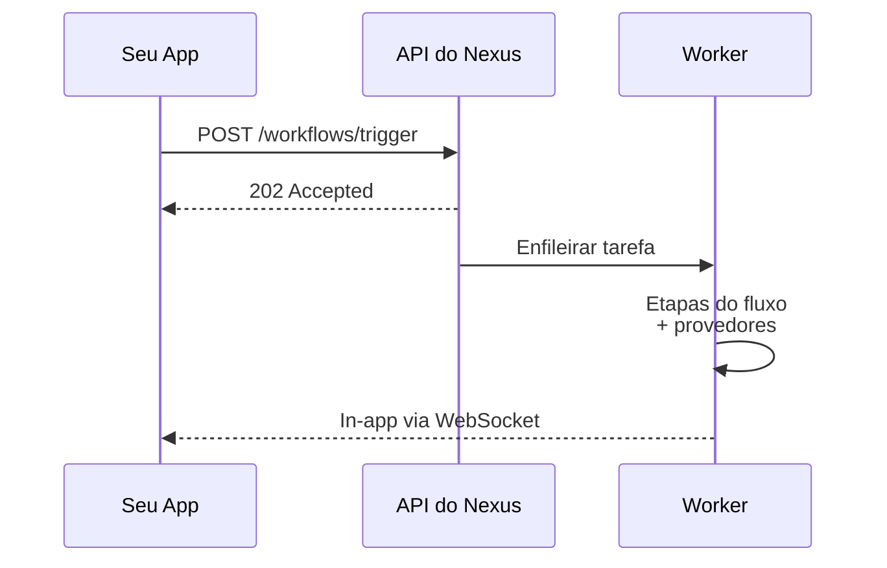

Bem-vindo ao Nexus Signal. Esta seção guiará você do zero até um gatilho funcional em três etapas: **espaço de trabalho → provedores → acionamento do SDK**.

<Cards>
  <Card
    title="Início Rápido"
    href="/docs/platform/getting-started/quickstart"
    description="Primeiro acionamento em menos de 5 minutos."
  />
  <Card
    title="Ambientes"
    href="/docs/platform/getting-started/environments"
    description="Chaves de Dev, Staging e Produção."
  />
  <Card
    title="Autenticação"
    href="/docs/platform/getting-started/authentication"
    description="Chaves secretas, chaves públicas e HMAC."
  />
</Cards>

## Pré-requisitos

- Uma conta no Nexus Signal ([cadastre-se gratuitamente](https://app.nexussignal.dev))
- Node.js 18+ para o SDK de servidor
- Pelo menos uma conta de provedor ativa (SendGrid, Resend, Twilio, etc.)

## Como a entrega funciona

Cada entrega é registrada com estados de ciclo de vida completos para depuração e análise.
