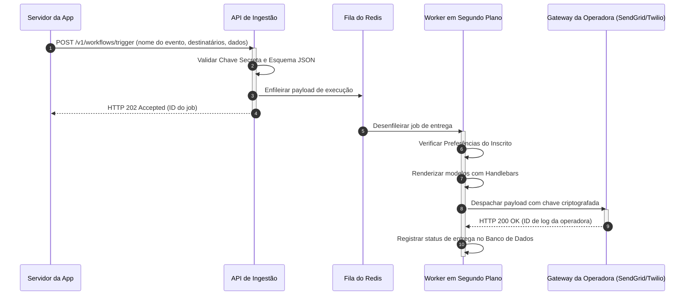

# Primeiros Passos

Bem-vindo ao **Nexus Signal**. Esta seção guiará você desde a criação de uma conta nova até o disparo do seu primeiro fluxo de trabalho (workflow) de notificações multicanal.

Para começar, você passará por três etapas principais:

1. **Configuração do Espaço de Trabalho**: Criar seu workspace e recuperar as chaves de API do seu ambiente.
2. **Configuração de Provedores**: Conectar as chaves das suas operadoras (SendGrid, Twilio, Resend, etc.) no painel de controle.
3. **Disparo de Eventos**: Emitir um payload POST da sua aplicação de backend usando os nossos SDKs.

---

<Cards>
  <Card
    title="Guia de Início Rápido"
    href="/docs/platform/getting-started/quickstart"
    description="Dispare seu primeiro workflow e verifique os logs de entrega em menos de 5 minutos."
  />
  <Card
    title="Ambientes e Escopos"
    href="/docs/platform/getting-started/environments"
    description="Gerencie workspaces isolados para as etapas de Desenvolvimento, Staging e Produção."
  />
  <Card
    title="Autenticação e Segurança"
    href="/docs/platform/getting-started/authentication"
    description="Configure chaves secretas do servidor, chaves públicas do cliente e assinaturas HMAC seguras."
  />
</Cards>

---

## Pré-requisitos

Antes de iniciar sua integração, certifique-se de que você possui:

- Uma **conta no Nexus Signal**: Inscreva-se gratuitamente no [Painel de Controle do Nexus](https://app.nexussignal.dev).
- **Node.js 18+** (ou ambientes de backend compatíveis) para executar os SDKs do lado do servidor.
- **Chaves de provedores ativas**: Credenciais para pelo menos um canal de entrega (por exemplo, e-mail via SendGrid, SMS via Twilio, push via Firebase Cloud Messaging).

---

## O Fluxo de Integração

O Nexus opera de forma assíncrona. Sua aplicação envia eventos para nossa API, que os enfileira instantaneamente para execução em segundo plano:

```mermaid
sequenceDiagram
    autonumber
    participant App as Servidor da App
    participant API as API de Ingestão
    participant Q as Fila do Redis
    participant Worker as Worker em Segundo Plano
    participant Carrier as Gateway da Operadora (SendGrid/Twilio)

    App->>API: POST /v1/workflows/trigger (nome do evento, destinatários, dados)
    activate API
    API->>API: Validar Chave Secreta e Esquema JSON
    API->>Q: Enfileirar payload de execução
    API-->>App: HTTP 202 Accepted (ID do job)
    deactivate API

    Q->>Worker: Desenfileirar job de entrega
    activate Worker
    Worker->>Worker: Verificar Preferências do Inscrito
    Worker->>Worker: Renderizar modelos com Handlebars
    Worker->>Carrier: Despachar payload com chave criptografada
    activate Carrier
    Carrier-->>Worker: HTTP 200 OK (ID de log da operadora)
    deactivate Carrier
    Worker->>Worker: Registrar status de entrega no Banco de Dados
    deactivate Worker
```

Cada etapa do ciclo de vida é observável em tempo real a partir das janelas de **Audit Logs** e **Debugger** do painel de controle.
