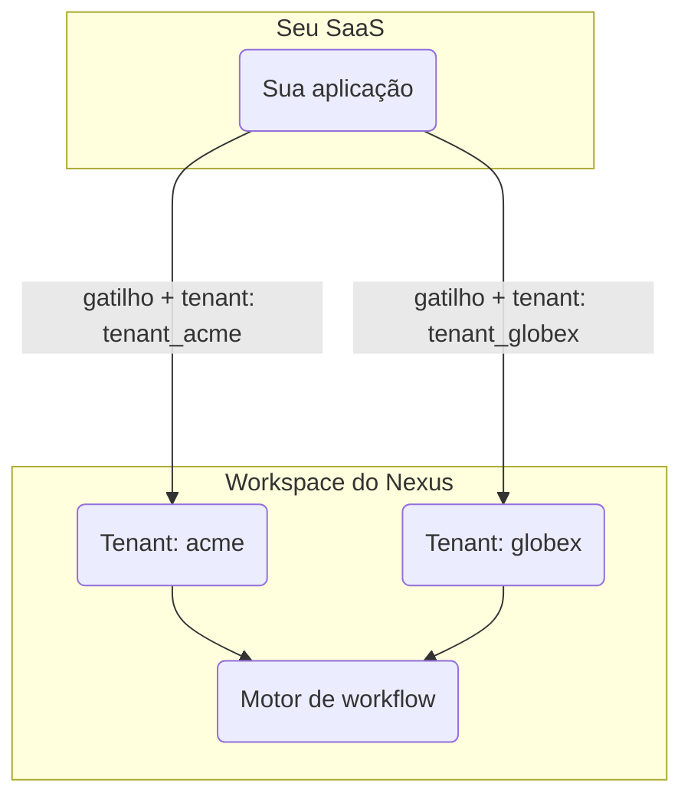

# Configuração Multi-Tenant B2B

Se o seu produto atende a várias empresas, o recurso de **Tenants** (inquilinos) do Nexus permite que cada cliente receba notificações com sua própria marca sem a necessidade de workspaces separados por cliente.

---

## Como Funciona



**Organização** = seu workspace do Nexus (um por produto).
**Tenant** = um de seus clientes B2B dentro desse workspace.

O campo `tenant` no payload do gatilho informa ao Nexus qual contexto de marca de cliente aplicar ao compilar a mensagem.

---

## Passo 1 — Registrar Tenants

Chame o método `upsert` do Node SDK sempre que uma nova empresa se cadastrar em sua aplicação:

```ts
import { NexusClient } from '@nexus-signal/node';

const nexus = new NexusClient({ secretKey: process.env.NEXUS_SECRET_KEY });

await nexus.tenants.upsert({
  externalId: 'tenant_acme',
  name: 'Acme Corp',
  branding: {
    logo: 'https://cdn.acme.io/logo.png',
    primaryColor: '#2563eb',
    footerHtml: '<p>© Acme Corp · <a href="mailto:support@acme.io">support@acme.io</a></p>',
  },
  properties: {
    planTier: 'enterprise',
  },
});
```

**Campos de `branding`** — quaisquer pares de chave-valor em formato de string que você deseja tornar acessíveis nos modelos. Chaves comuns:

| Chave          | Exemplo de valor               |
| :------------- | :----------------------------- |
| `logo`         | `https://cdn.acme.io/logo.png` |
| `primaryColor` | `#2563eb`                      |
| `companyName`  | `Acme Corp`                    |
| `footerHtml`   | `<p>© Acme Corp</p>`           |

> **Nota:** O objeto `branding` é um `Record<string, string>` flexível — você pode definir quaisquer chaves e referenciá-las nos modelos como `{{ branding.yourKey }}`.

---

## Passo 2 — Utilizar Marca nos Layouts de E-mail

Crie um [layout de e-mail](/docs/platform/features/email-layouts) que referencie as chaves de marca do tenant:

```html
<header>
  
</header>

<main style="color: {{ branding.primaryColor }}">{{{ content }}}</main>

<footer>{{{ branding.footerHtml }}}</footer>
```

Quando um disparo inclui um valor de `tenant`, o compilador de modelos injeta automaticamente o objeto de marca do tenant correspondente no contexto do Handlebars.

---

## Passo 3 — Disparar com Contexto de Tenant

Passe o `externalId` do tenant no campo `tenant` de cada disparo direcionado aos usuários daquela empresa:

```ts
await nexus.workflows.trigger({
  workflowName: 'invoice.sent',
  tenant: 'tenant_acme',
  recipients: [{ externalId: user.id }],
  data: {
    invoiceId: 'INV-001',
    amount: '$500',
  },
});
```

> O campo `tenant` deve corresponder ao `externalId` usado na chamada de `upsert` — e não ao UUID interno do banco de dados.

---

## Passo 4 — Delimitar o Feed de Notificações In-App

Quando sua aplicação exibir uma central de notificações delimitada por tenant, filtre o feed do SDK usando o UUID do banco de dados do tenant:

```http
GET /v1/sdk/notifications?subscriberExternalId=user_42&tenantId=<tenant-uuid>
x-nexus-public-key: pk_prd_your_public_key
```

<Callout type="info">
  O parâmetro `tenantId` na consulta do SDK é o **UUID** interno do tenant (obtido nas respostas de
  listagem), e não a string `externalId`. Use a [API de Tenants](/docs/api/tenants) ou a API de
  Gerenciamento para recuperá-lo.
</Callout>

---

## Passo 5 — Testar com Dois Tenants antes da Produção

1. Crie dois tenants de teste (`tenant_acme`, `tenant_globex`) com valores de marcas diferentes em **Development**.
2. Dispare o mesmo workflow duas vezes — uma vez para cada tenant — para o mesmo inscrito.
3. Confirme se cada e-mail exibe o logotipo e o rodapé corretos na visualização do Sandbox.
4. Promova para **Production** apenas depois que o branding estiver renderizando corretamente.

---

## Checklist de Integração

<Steps>
  <Step>
    Registre cada tenant no momento do cadastro do cliente — sincronize o `externalId` com o ID da
    empresa no seu banco de dados.
  </Step>
  <Step>
    Faça o upload dos ativos de marca para uma CDN HTTPS acessível publicamente. O Nexus não hospeda
    imagens.
  </Step>
  <Step>
    Adicione o campo `tenant` em cada disparo executado para os usuários daquela empresa.
  </Step>
  <Step>
    Teste com dois tenants no ambiente de Desenvolvimento antes de colocar a aplicação no ar em
    Produção.
  </Step>
</Steps>

---

## Relacionado

- [Guia do recurso de marca por tenant](/docs/platform/features/tenants)
- [Layouts de e-mail](/docs/platform/features/email-layouts)
- [Referência da API de Tenants](/docs/api/tenants)
