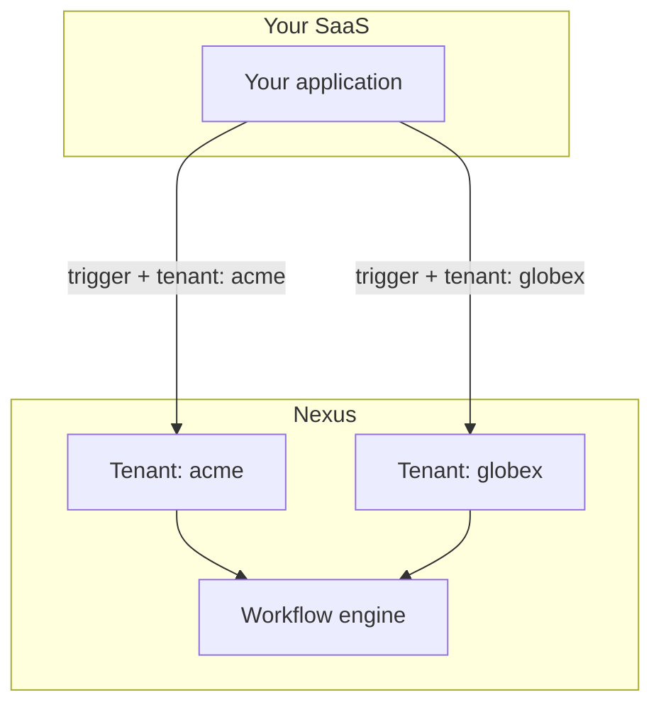

Se o seu produto atende a várias empresas (tenants), os **Tenants** do Nexus permitem que cada cliente receba notificações com sua própria marca sem workspaces separados do Nexus.

## Arquitetura



**Organização** = seu workspace do Nexus. **Tenant** = a empresa do seu cliente dentro desse workspace.

## Etapa 1 — Criar tenants

Quando um novo cliente se cadastrar em seu aplicativo:

```ts
await nexus.tenants.upsert({
  externalId: "tenant_acme",
  name: "Acme Corp",
  branding: {
    logoUrl: "https://cdn.acme.io/logo.png",
    primaryColor: "#2563eb",
    companyName: "Acme Corp",
    footerHtml: "<p>© Acme Corp · support@acme.io</p>",
  },
});
```

Campos de branding suportados: `logo`, `logoUrl`, `primaryColor`, `iconUrl`, `companyName`, `footerHtml`, `headerHtml`.

## Etapa 2 — Aplicar marca nos layouts de email

Crie um [layout de email](/docs/platform/features/email-layouts) que faça referência à marca:

```html

<div style="color: {{ branding.primaryColor }}">{{{ content }}}</div>
<footer>{{{ branding.footerHtml }}}</footer>
```

Quando um trigger inclui `tenant`, o compilador injeta a marca desse tenant automaticamente.

## Etapa 3 — Disparar com contexto de tenant

```ts
await nexus.workflows.trigger({
  workflowName: "invoice.sent",
  tenant: "tenant_acme",
  recipients: [{ externalId: user.id, email: user.email }],
  data: { invoiceId: "INV-001", amount: "$500" },
});
```

## Etapa 4 — Preferências por tenant (opcional)

Defina `preferenceDefaults` no tenant para controlar os padrões de ativação (opt-in/opt-out) para novos assinantes sob esse tenant.

## Etapa 5 — Filtrar feed in-app por tenant

Notificações do SDK suportam escopo de tenant via parâmetro de consulta:

```http
GET /v1/sdk/notifications?subscriberExternalId=user_42&tenantId=tenant_acme
```

Use isso quando seu aplicativo mostrar uma central de notificações delimitada por tenant.

## Checklist

<Steps>
  <Step>
    Crie o tenant no cadastro do cliente (sincronize `externalId` com seu banco
    de dados).
  </Step>
  <Step>
    Armazene ativos de marca (as URLs do logotipo devem ser HTTPS e acessíveis
    publicamente).
  </Step>
  <Step>Passe `tenant` em cada trigger para os usuários desse cliente.</Step>
  <Step>Teste em Desenvolvimento com dois tenants antes de Production.</Step>
</Steps>

## Relacionado

- [Branding por tenant](/docs/platform/features/tenants)
- [Layouts de Email](/docs/platform/features/email-layouts)
- [Tenants API](/docs/api/tenants)
