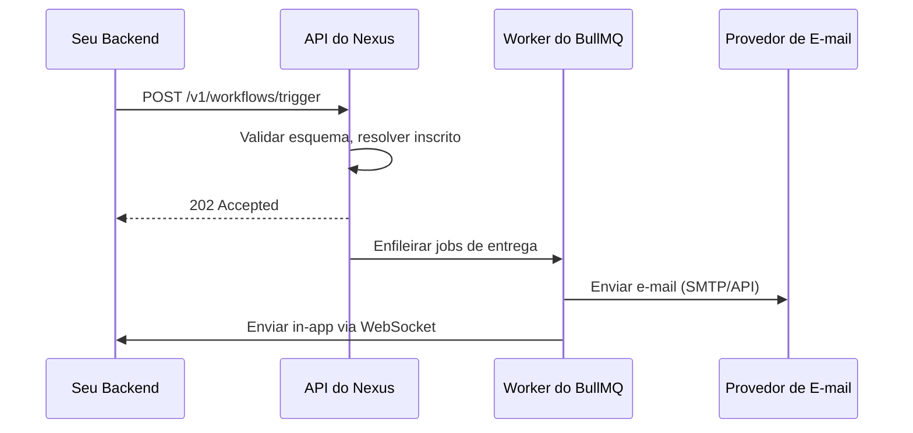

# Construa seu Primeiro Workflow

Este guia orientará você na criação de um workflow de boas-vindas **`user.signup`** que envia um e-mail e uma notificação in-app no momento em que um usuário se cadastra.

---

## Pré-requisitos

- Um workspace do Nexus Signal com pelo menos um ambiente ativo.
- SDK de Node instalado (`@nexus-signal/node`) e inicializado com uma chave secreta.
- Pelo menos um provedor de e-mail conectado em **Integrations**.

---

## Criar o Workflow [step]

No painel de controle, navegue até **Workflows** → **New Workflow**.

- **Nome:** `user.signup`
- **Canais:** Adicione um nó de **Email** e um nó de **In-App**

Seu canvas deve se parecer com:

```
Trigger → Email → In-App
```

> **Dica:** Ative **Suppress when online** no nó de Email se quiser pular o envio do e-mail quando o usuário estiver ativamente online em sua aplicação.

---

## Escrever os Modelos (Templates) [step]

Clique em cada nó de canal para abrir o editor de modelos.

**Modelo de E-mail (HTML):**

```html
<h1>Welcome, {{ data.name }}!</h1>
<p>Thanks for joining. Your account ID is <strong>{{ subscriber.externalId }}</strong>.</p>
<p><a href="{{ data.dashboardUrl }}">Go to your dashboard →</a></p>
```

**Modelo In-App:**

```json
{
  "title": "Welcome, {{ data.name }}!",
  "body": "Your account is ready. Click to explore.",
  "redirect": "{{ data.dashboardUrl }}"
}
```

Quando terminar, promova os modelos para o status **Production Active**.

---

## Criar um Inscrito de Teste [step]

No painel de controle: **Subscribers** → **Add Subscriber**

Preencha com:

- `externalId`: `test_user_01`
- `email`: `you@example.com`

> Os inscritos devem ser criados **antes** do disparo. O endpoint do gatilho identifica os destinatários pelo `externalId` — ele não registra novos usuários durante o disparo.

---

## Disparar a partir do seu Backend [step]

Instale e inicialize o SDK do Node:

```ts
import { NexusClient } from '@nexus-signal/node';

const nexus = new NexusClient({ secretKey: process.env.NEXUS_SECRET_KEY });
```

Execute o gatilho após o cadastro de um usuário:

```ts
await nexus.workflows.trigger({
  workflowName: 'user.signup',
  recipients: [{ externalId: 'test_user_01' }],
  data: {
    name: 'Test User',
    dashboardUrl: 'https://app.example.com/dashboard',
  },
});
```

> **Nota:** O array `recipients` aceita `externalId` ou `subscriberId` para identificar o destinatário. **Não** passe dados de contato diretos como `email` ou `phoneNumber` aqui — esses dados pertencem ao perfil do inscrito, e não ao payload do gatilho.

No ambiente de **Development**, os e-mails são interceptados na guia **Sandbox** — nenhum e-mail real é enviado.

---

## Adicionar o Sino In-App ao seu Frontend [step]

Instale o React SDK:

```bash
npm install @nexus-signal/react
```

Envolva sua aplicação e adicione o componente do sino:

```tsx
import { NexusProvider, NotificationCenterBell } from '@nexus-signal/react';

export function App() {
  return (
    <NexusProvider
      publicKey={process.env.NEXT_PUBLIC_NEXUS_PUBLIC_KEY!}
      subscriberId="test_user_01"
      hmacSignature={userSession.nexusHmac}
    >
      <NotificationCenterBell />
      {/* restante da sua app */}
    </NexusProvider>
  );
}
```

> **Segurança:** O `hmacSignature` deve ser gerado no lado do servidor usando sua **Chave Secreta** + o `externalId` do inscrito. Nunca calcule o HMAC no navegador. Consulte [Autenticação](/docs/platform/getting-started/authentication) para obter a fórmula do HMAC.

Dispare o gatilho novamente — o contador de notificações do sino será incrementado em tempo real via WebSocket.

---

## O que Acontece Internamente



---

## Próximos Passos

- Adicione [Smart Send-Time](/docs/platform/features/smart-send-time) ao e-mail para taxas de abertura ideais
- Atribua este workflow a um [Tópico](/docs/platform/features/topics) para controle de preferências pelo usuário
- Defina uma [Janela de Entrega](/docs/platform/features/delivery-windows) para evitar envios durante a noite
- Adicione uma [condição de etapa](/docs/platform/features/step-conditions) para pular o e-mail quando o usuário estiver no celular
