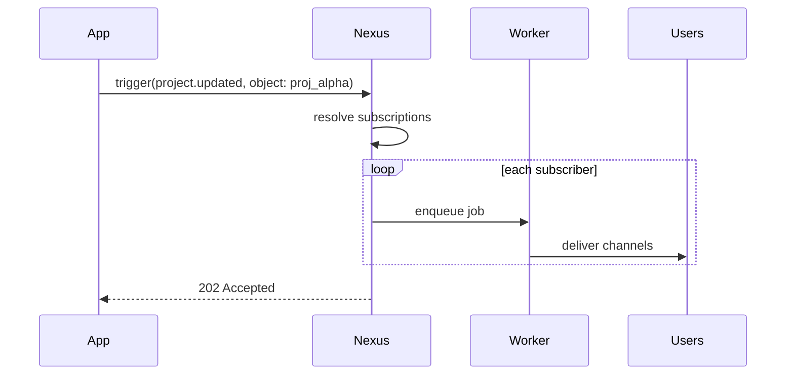

Este guia orienta sobre **objetos e assinaturas** de ponta a ponta: crie um objeto, inscreva usuários, dispare o envio em leque (fan-out) e use propriedades de objeto em templates.

## Cenário

Seu aplicativo tem projetos. Quando um projeto é atualizado, todos os membros da equipe que o observam devem ser notificados — sem que seu backend consulte uma tabela de `watchers`.

## Etapa 1 — Criar o objeto

Painel: **Objects** → criar coleção `projects`, ID `proj_alpha`.

Ou via Node SDK:

```ts
await nexus.objects.set({
  collection: "projects",
  externalId: "proj_alpha",
  name: "Project Alpha",
  properties: { status: "active", repo: "acme/alpha" },
});
```

## Etapa 2 — Inscrever usuários

Quando um usuário clica em "Observar projeto" no seu aplicativo:

```ts
await nexus.objects.addSubscriptions("projects", "proj_alpha", {
  recipients: [user.externalId],
});
```

Para cancelar a inscrição:

```ts
await nexus.objects.removeSubscriptions("projects", "proj_alpha", [
  user.externalId,
]);
```

## Etapa 3 — Criar um workflow

Crie `project.updated` no painel com canais In-App + Email. Use propriedades de objetos em templates:

```html
<p>Project <strong>{{ object.name }}</strong> was updated.</p>
<p>Status: {{ object.properties.status }}</p>
```

## Etapa 4 — Disparar com destinatário do objeto

```ts
await nexus.workflows.trigger({
  workflowName: "project.updated",
  recipients: [{ collection: "projects", id: "proj_alpha" }],
  data: { changeType: "milestone_completed", milestone: "v1.0" },
});
```

O Nexus resolve todos os assinantes e executa o fluxo de trabalho para cada usuário individualmente.



## Etapa 5 — Verificar a entrega

Verifique os **Audit Logs** no painel. Cada assinante recebe uma linha de log de execução separada.

## Dicas

- Use nomes de `collection` significativos (`issues`, `orders`, `channels`) — eles aparecem nos caminhos da API
- Propriedades de objeto podem direcionar [condições de etapa](/docs/platform/features/step-conditions): `object.properties.priority`
- Combine com [tópicos](/docs/platform/features/topics) para controle de preferência do usuário

## Relacionado

- [Objetos e Assinaturas](/docs/platform/features/objects-subscriptions)
- [API de Objetos](/docs/api/objects)
- [API de Workflows](/docs/api/workflows)
